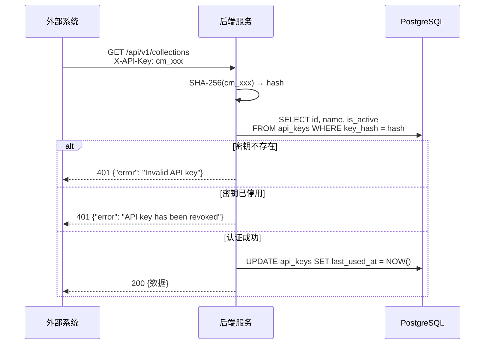
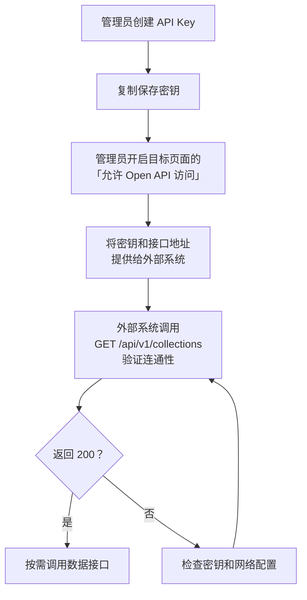

# Open API 接口文档

## 1. 概述

Open API 允许外部系统通过 API Key 认证方式，以 RESTful 接口读取系统中已授权开放的业务数据集合。

**Base URL：**

```
http://<host>:<port>/api/v1
```

默认开发环境为 `http://localhost:7001/api/v1`。

**数据格式：** 所有接口均返回 `application/json`。

**认证方式：** 通过 `X-API-Key` 请求头传递 API Key。

---

## 2. 认证

### 2.1 认证方式

所有 Open API 接口均需要在请求头中携带有效的 API Key：

```
X-API-Key: cm_xxxxxxxxxxxxxxxxxxxxxxxxxxxxxxxxxxxxxxxx
```

### 2.2 API Key 格式

| 属性 | 说明 |
|------|------|
| 前缀 | `cm_` |
| 长度 | 约 46 个字符 |
| 字符集 | URL 安全的 Base64 字符 |
| 示例 | `cm_A1b2C3d4E5f6G7h8I9j0K1l2M3n4O5p6Q7r8S9t0U1v2` |

### 2.3 认证流程



### 2.4 认证错误响应

| HTTP 状态码 | error | 触发条件 |
|-------------|-------|---------|
| 401 | `Missing API key` | 请求头未携带 `X-API-Key` |
| 401 | `Invalid API key` | API Key 无效（不存在） |
| 401 | `API key has been revoked` | API Key 已被管理员停用 |

---

## 3. 前置条件

调用 Open API 前需满足以下条件：

1. **创建 API Key** — 管理员在「系统配置 → 数据工具 → Open API」中创建
2. **开放数据集合** — 管理员在「页面配置」中勾选「允许 Open API 访问」

只有标记为 `api_public = true` 的数据集合才会对 Open API 可见。

---

## 4. 接口列表

| 方法 | 路径 | 说明 |
|------|------|------|
| GET | `/api/v1/collections` | 获取所有已开放的集合列表 |
| GET | `/api/v1/collections/{collection}` | 获取集合中的数据（分页） |
| GET | `/api/v1/collections/{collection}/{id}` | 获取单条记录详情 |
| GET | `/api/v1/collections/{collection}/schema` | 获取集合的字段定义 |

---

## 5. 接口详情

### 5.1 获取集合列表

获取所有已开放 Open API 访问的数据集合。

**请求**

```
GET /api/v1/collections
```

**请求头**

| 名称 | 必填 | 说明 |
|------|------|------|
| X-API-Key | 是 | API 密钥 |

**响应 — 200**

```json
{
  "data": [
    {
      "collection": "inspection-cases",
      "name": "巡检用例",
      "description": "巡检用例数据表"
    },
    {
      "collection": "devices",
      "name": "设备台账",
      "description": "设备基础信息"
    }
  ]
}
```

**响应字段说明**

| 字段 | 类型 | 说明 |
|------|------|------|
| `data` | array | 集合列表 |
| `data[].collection` | string | 集合标识（用于后续接口的路径参数） |
| `data[].name` | string | 集合显示名称 |
| `data[].description` | string | 集合描述 |

---

### 5.2 获取集合数据（分页）

获取指定集合中的所有记录，支持分页。

**请求**

```
GET /api/v1/collections/{collection}?page=1&pageSize=20
```

**路径参数**

| 名称 | 类型 | 说明 |
|------|------|------|
| collection | string | 集合标识（来自集合列表接口） |

**查询参数**

| 名称 | 类型 | 默认值 | 说明 |
|------|------|--------|------|
| page | integer | 1 | 页码（从 1 开始） |
| pageSize | integer | 20 | 每页条数（最大 100） |

**响应 — 200**

```json
{
  "data": [
    {
      "id": "a1b2c3d4",
      "caseName": "登录功能验证",
      "priority": "high",
      "status": "active",
      "createdAt": "2025-12-01T08:30:00.000Z"
    },
    {
      "id": "e5f6g7h8",
      "caseName": "数据导出测试",
      "priority": "medium",
      "status": "active",
      "createdAt": "2025-12-02T10:15:00.000Z"
    }
  ],
  "pagination": {
    "page": 1,
    "pageSize": 20,
    "total": 128,
    "totalPages": 7
  }
}
```

**响应字段说明**

| 字段 | 类型 | 说明 |
|------|------|------|
| `data` | array | 记录列表 |
| `data[].id` | string | 记录唯一标识 |
| `data[].*` | any | 业务字段（根据集合配置而定） |
| `data[].createdAt` | string | 创建时间（ISO 8601 UTC） |
| `pagination.page` | integer | 当前页码 |
| `pagination.pageSize` | integer | 每页条数 |
| `pagination.total` | integer | 总记录数 |
| `pagination.totalPages` | integer | 总页数 |

**错误响应**

| HTTP 状态码 | error | 触发条件 |
|-------------|-------|---------|
| 404 | `Collection not found or not public` | 集合不存在或未开放 API 访问 |

---

### 5.3 获取单条记录

根据记录 ID 获取单条记录的完整数据。

**请求**

```
GET /api/v1/collections/{collection}/{id}
```

**路径参数**

| 名称 | 类型 | 说明 |
|------|------|------|
| collection | string | 集合标识 |
| id | string | 记录 ID |

**响应 — 200**

```json
{
  "data": {
    "id": "a1b2c3d4",
    "caseName": "登录功能验证",
    "priority": "high",
    "status": "active",
    "description": "验证登录功能在各种场景下的行为",
    "tags": ["smoke", "login"],
    "createdAt": "2025-12-01T08:30:00.000Z"
  }
}
```

**错误响应**

| HTTP 状态码 | error | 触发条件 |
|-------------|-------|---------|
| 404 | `Collection not found or not public` | 集合不存在或未开放 API 访问 |
| 404 | `Record not found` | 记录 ID 不存在 |

---

### 5.4 获取集合字段定义

获取指定集合的字段配置信息，用于了解数据结构。

**请求**

```
GET /api/v1/collections/{collection}/schema
```

**路径参数**

| 名称 | 类型 | 说明 |
|------|------|------|
| collection | string | 集合标识 |

**响应 — 200**

```json
{
  "data": {
    "collection": "inspection-cases",
    "name": "巡检用例",
    "description": "巡检用例数据表",
    "fields": [
      {
        "fieldName": "caseName",
        "label": "用例名称",
        "type": "text",
        "required": true
      },
      {
        "fieldName": "priority",
        "label": "优先级",
        "type": "select",
        "required": true
      },
      {
        "fieldName": "status",
        "label": "状态",
        "type": "radio",
        "required": false
      },
      {
        "fieldName": "description",
        "label": "描述",
        "type": "textarea",
        "required": false
      },
      {
        "fieldName": "tags",
        "label": "标签",
        "type": "multiSelect",
        "required": false
      }
    ]
  }
}
```

**响应字段说明**

| 字段 | 类型 | 说明 |
|------|------|------|
| `data.collection` | string | 集合标识 |
| `data.name` | string | 集合显示名称 |
| `data.description` | string | 集合描述 |
| `data.fields` | array | 字段定义列表 |
| `data.fields[].fieldName` | string | 字段名（对应数据中的 key） |
| `data.fields[].label` | string | 字段显示名称 |
| `data.fields[].type` | string | 字段控件类型 |
| `data.fields[].required` | boolean | 是否必填 |

**字段控件类型枚举**

| type 值 | 说明 |
|---------|------|
| `text` | 单行文本 |
| `textarea` | 多行文本 |
| `number` | 数值 |
| `select` | 单选下拉 |
| `multiSelect` | 多选下拉 |
| `radio` | 单选按钮 |
| `checkbox` | 复选框 |
| `date` | 日期 |
| `datetime` | 日期时间 |
| `file` | 文件 |
| `image` | 图片 |
| `relation` | 多对多关联 |
| `reference` | 一对多引用 |
| `quoteSelect` | 引用选择 |
| `autoTimestamp` | 自动时间戳 |
| `autoSequence` | 自增序列 |

**错误响应**

| HTTP 状态码 | error | 触发条件 |
|-------------|-------|---------|
| 404 | `Collection not found or not public` | 集合不存在或未开放 API 访问 |

---

## 6. 使用示例

### 6.1 cURL

```bash
# 设置 API Key
API_KEY="cm_A1b2C3d4E5f6G7h8I9j0K1l2M3n4O5p6Q7r8S9t0U1v2"
BASE_URL="http://localhost:7001/api/v1"

# 1. 查看所有已开放的集合
curl -s -H "X-API-Key: $API_KEY" "$BASE_URL/collections" | jq

# 2. 获取第一页数据（默认每页 20 条）
curl -s -H "X-API-Key: $API_KEY" "$BASE_URL/collections/inspection-cases" | jq

# 3. 获取第 2 页，每页 50 条
curl -s -H "X-API-Key: $API_KEY" "$BASE_URL/collections/inspection-cases?page=2&pageSize=50" | jq

# 4. 获取单条记录
curl -s -H "X-API-Key: $API_KEY" "$BASE_URL/collections/inspection-cases/a1b2c3d4" | jq

# 5. 查看集合字段定义
curl -s -H "X-API-Key: $API_KEY" "$BASE_URL/collections/inspection-cases/schema" | jq
```

### 6.2 Python

```python
import requests

API_KEY = "cm_A1b2C3d4E5f6G7h8I9j0K1l2M3n4O5p6Q7r8S9t0U1v2"
BASE_URL = "http://localhost:7001/api/v1"
HEADERS = {"X-API-Key": API_KEY}


def get_collections():
    """获取所有已开放的集合"""
    resp = requests.get(f"{BASE_URL}/collections", headers=HEADERS)
    resp.raise_for_status()
    return resp.json()["data"]


def get_all_records(collection):
    """遍历分页获取集合中的所有记录"""
    all_records = []
    page = 1
    while True:
        resp = requests.get(
            f"{BASE_URL}/collections/{collection}",
            headers=HEADERS,
            params={"page": page, "pageSize": 100},
        )
        resp.raise_for_status()
        body = resp.json()
        all_records.extend(body["data"])
        if page >= body["pagination"]["totalPages"]:
            break
        page += 1
    return all_records


def get_record(collection, record_id):
    """获取单条记录"""
    resp = requests.get(
        f"{BASE_URL}/collections/{collection}/{record_id}",
        headers=HEADERS,
    )
    resp.raise_for_status()
    return resp.json()["data"]


def get_schema(collection):
    """获取集合字段定义"""
    resp = requests.get(
        f"{BASE_URL}/collections/{collection}/schema",
        headers=HEADERS,
    )
    resp.raise_for_status()
    return resp.json()["data"]


# ---- 使用示例 ----
if __name__ == "__main__":
    # 列出所有可用集合
    collections = get_collections()
    for c in collections:
        print(f"[{c['collection']}] {c['name']} - {c['description']}")

    # 获取第一个集合的所有数据
    if collections:
        name = collections[0]["collection"]
        records = get_all_records(name)
        print(f"\n共 {len(records)} 条记录")
        for r in records[:3]:
            print(f"  {r['id']}: {r}")
```

### 6.3 JavaScript / Node.js

```javascript
const API_KEY = "cm_A1b2C3d4E5f6G7h8I9j0K1l2M3n4O5p6Q7r8S9t0U1v2";
const BASE_URL = "http://localhost:7001/api/v1";

async function fetchAPI(path, params = {}) {
  const url = new URL(`${BASE_URL}${path}`);
  Object.entries(params).forEach(([k, v]) => url.searchParams.set(k, v));

  const resp = await fetch(url, {
    headers: { "X-API-Key": API_KEY },
  });

  if (!resp.ok) {
    const body = await resp.json();
    throw new Error(`${resp.status}: ${body.error}`);
  }
  return resp.json();
}

// 获取所有集合
async function getCollections() {
  const { data } = await fetchAPI("/collections");
  return data;
}

// 分页获取数据
async function getRecords(collection, page = 1, pageSize = 20) {
  return fetchAPI(`/collections/${collection}`, { page, pageSize });
}

// 获取所有数据（自动遍历分页）
async function getAllRecords(collection) {
  const all = [];
  let page = 1;
  while (true) {
    const body = await getRecords(collection, page, 100);
    all.push(...body.data);
    if (page >= body.pagination.totalPages) break;
    page++;
  }
  return all;
}

// 获取单条记录
async function getRecord(collection, id) {
  const { data } = await fetchAPI(`/collections/${collection}/${id}`);
  return data;
}

// 获取字段定义
async function getSchema(collection) {
  const { data } = await fetchAPI(`/collections/${collection}/schema`);
  return data;
}

// ---- 使用示例 ----
(async () => {
  const collections = await getCollections();
  console.log("可用集合:", collections);

  if (collections.length > 0) {
    const name = collections[0].collection;
    const records = await getAllRecords(name);
    console.log(`${name} 共 ${records.length} 条记录`);
  }
})();
```

### 6.4 Java

```java
import java.net.URI;
import java.net.http.*;
import com.google.gson.*;

public class OpenApiClient {
    private static final String API_KEY = "cm_A1b2C3d4E5f6G7h8I9j0K1l2M3n4O5p6Q7r8S9t0U1v2";
    private static final String BASE_URL = "http://localhost:7001/api/v1";
    private static final HttpClient client = HttpClient.newHttpClient();
    private static final Gson gson = new Gson();

    public static String get(String path) throws Exception {
        HttpRequest request = HttpRequest.newBuilder()
            .uri(URI.create(BASE_URL + path))
            .header("X-API-Key", API_KEY)
            .GET()
            .build();
        HttpResponse<String> response = client.send(request,
            HttpResponse.BodyHandlers.ofString());
        if (response.statusCode() != 200) {
            throw new RuntimeException("HTTP " + response.statusCode()
                + ": " + response.body());
        }
        return response.body();
    }

    public static void main(String[] args) throws Exception {
        // 获取集合列表
        String collections = get("/collections");
        System.out.println("集合列表: " + collections);

        // 获取数据（第 1 页，每页 20 条）
        String data = get("/collections/inspection-cases?page=1&pageSize=20");
        System.out.println("数据: " + data);

        // 获取字段定义
        String schema = get("/collections/inspection-cases/schema");
        System.out.println("字段定义: " + schema);
    }
}
```

---

## 7. 错误处理

### 7.1 统一错误格式

所有错误响应均为以下 JSON 格式：

```json
{
  "error": "错误描述信息"
}
```

### 7.2 错误码汇总

| HTTP 状态码 | error | 说明 |
|-------------|-------|------|
| 401 | `Missing API key` | 请求头缺少 X-API-Key |
| 401 | `Invalid API key` | API Key 不存在 |
| 401 | `API key has been revoked` | API Key 已被停用 |
| 404 | `Collection not found or not public` | 集合不存在或未开放 API |
| 404 | `Record not found` | 记录不存在 |

### 7.3 错误处理建议

```python
import requests

def safe_request(url, headers):
    resp = requests.get(url, headers=headers)
    if resp.status_code == 401:
        error = resp.json().get("error", "")
        if "Missing" in error:
            print("错误：未提供 API Key，请检查请求头")
        elif "Invalid" in error:
            print("错误：API Key 无效，请检查密钥是否正确")
        elif "revoked" in error:
            print("错误：API Key 已被停用，请联系管理员")
        return None
    elif resp.status_code == 404:
        print("错误：集合或记录不存在，请检查集合是否已开放 API 访问")
        return None
    resp.raise_for_status()
    return resp.json()
```

---

## 8. 接入流程



**步骤详解：**

1. 管理员登录系统，进入「系统配置 → 数据工具 → Open API」
2. 点击「创建 API Key」，输入名称，创建后**立即复制密钥**（仅此一次可见）
3. 进入「系统配置 → 平台管理 → 页面配置」，选择需要开放的页面
4. 在页面基本信息中开启「允许 Open API 访问」并保存
5. 将 API Key 和 Base URL 提供给外部系统开发者
6. 外部系统通过 `X-API-Key` 请求头调用接口

---

## 9. 安全注意事项

| 事项 | 说明 |
|------|------|
| 密钥保管 | API Key 创建后仅显示一次，请妥善保存 |
| 传输安全 | 生产环境务必使用 HTTPS，防止密钥泄露 |
| 最小开放 | 仅对必要的集合开启 Open API，遵循最小权限原则 |
| 定期轮换 | 建议定期创建新密钥并停用旧密钥 |
| 及时停用 | 不再使用的密钥应立即停用或删除 |
| 只读访问 | Open API 仅提供数据读取能力，不支持写入操作 |
| 速率限制 | 系统记录每个密钥的最后使用时间，管理员可据此监控使用情况 |

---

## 10. 常见问题

**Q: 如何判断哪些集合已开放 API 访问？**

调用 `GET /api/v1/collections` 即可获取所有已开放的集合列表。未开放的集合不会出现在返回结果中。

**Q: 能否通过 API 写入数据？**

不能。Open API 当前仅支持只读操作（GET），不提供创建、更新、删除接口。如需写入数据，请使用 ETL 管道功能。

**Q: 分页的最大 pageSize 是多少？**

每页最多返回 100 条记录。超过 100 的 pageSize 值会被自动截断为 100。

**Q: 关联字段和引用字段在 API 中如何返回？**

关联字段（relation）的数据存储在独立的关联表中，Open API 返回的是记录 JSONB 中的原始数据，不包含关联记录的详情。引用字段（reference）返回的是父记录的 ID，引用选择（quoteSelect）返回的是 ID 数组。

**Q: 时间字段的格式是什么？**

所有时间字段统一返回 UTC 时区的 ISO 8601 格式：`2025-12-01T08:30:00.000Z`。

**Q: API Key 泄露了怎么办？**

立即登录系统，在「Open API」管理页面停用该密钥，然后创建一个新密钥分发给外部系统。
