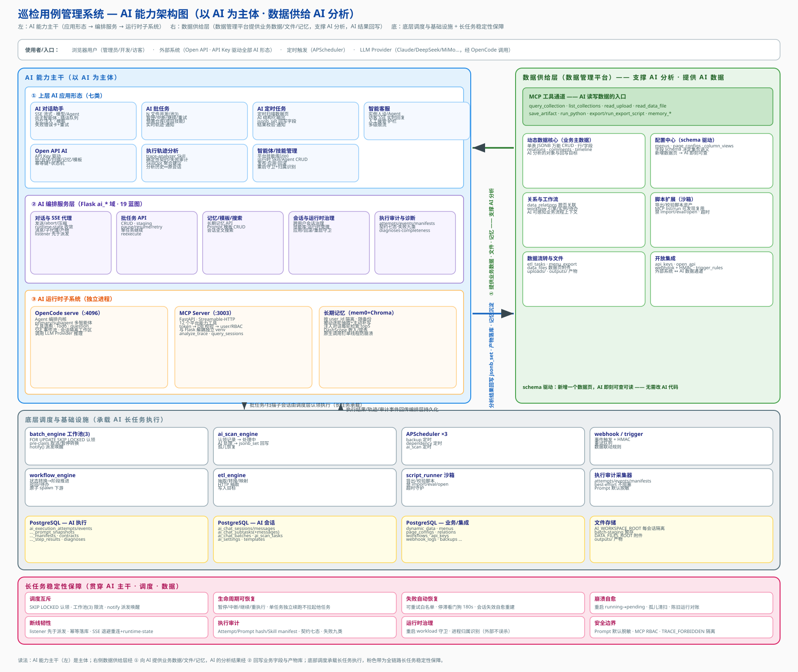
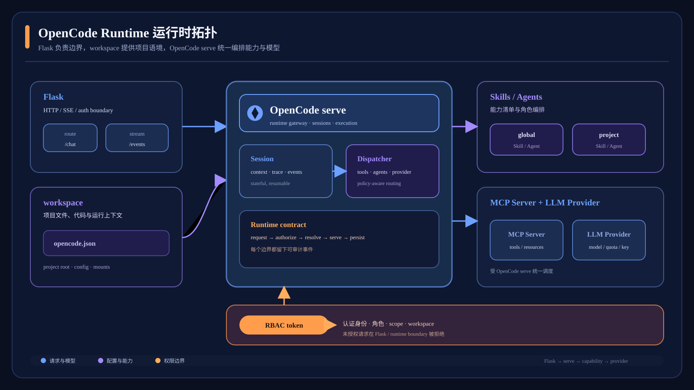
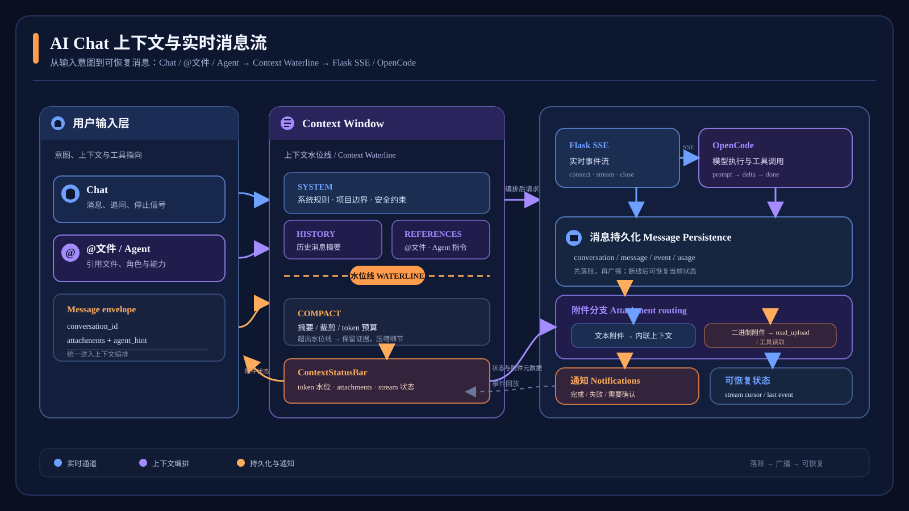
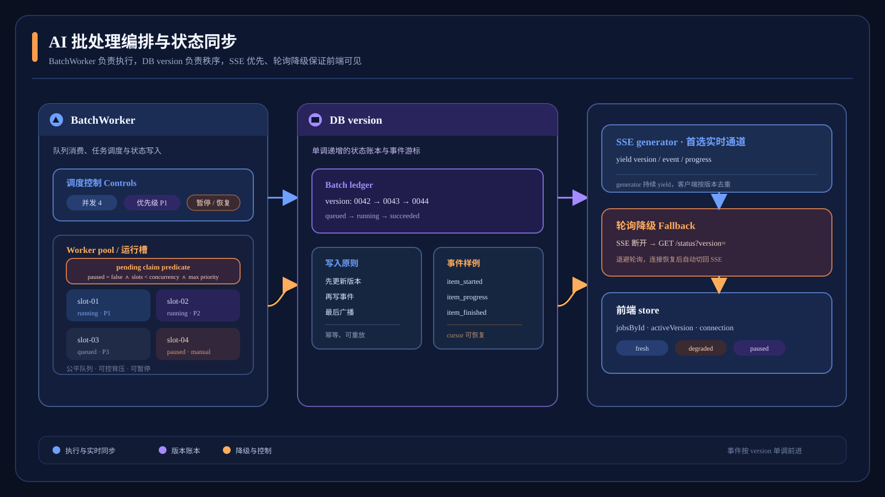
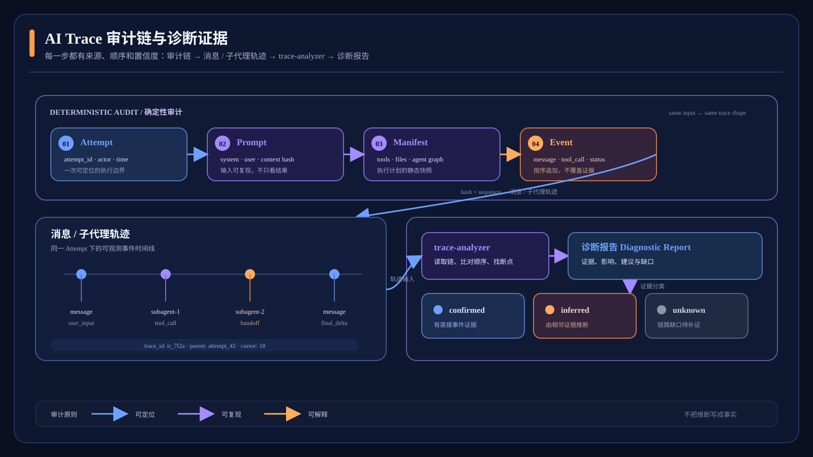
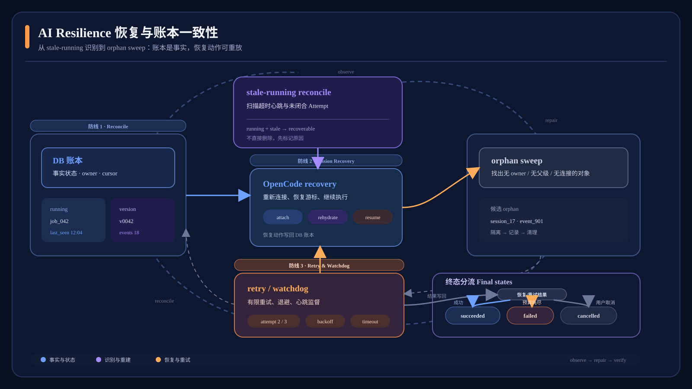

# 域⑨ AI 智能助手

> **唯一权威设计入口。** 本文统一描述 AI 对话、批任务、定时扫描、OpenCode/MCP 运行时、执行审计、轨迹分析、长期记忆和容灾恢复。专题文档与归档文档保留追溯价值，但实现状态、表结构和接口以本文及当前代码为准。
>
> 状态标记：`[已实现]` 表示当前代码、迁移或测试已经提供；`[部分实现]` 表示主链路可用但仍有边界；`[规划]` 表示设计已定义但当前代码尚未提供；`[受限]` 表示能力存在明确的模型、运行时或部署约束。规划内容不得作为当前接口、表或行为使用。

## 目录

1. [能力总览、职责与边界](#1-能力总览职责与边界)
2. [模块组成和总体架构](#2-模块组成和总体架构)
3. [外部子系统与 OpenCode/MCP/Agent/Skill 运行时](#3-外部子系统与-opencodemcpagentskill-运行时)
4. [数据模型与执行审计事实层](#4-数据模型与执行审计事实层)
5. [Chat、上下文、文件引用、Plan、权限、通知和消息可读性](#5-chat上下文文件引用plan权限通知和消息可读性)
6. [批任务实时进度、SSE、并发、优先级、暂停/恢复与编排](#6-批任务实时进度sse并发优先级暂停恢复与编排)
7. [定时 AI 流水线和结构化回写](#7-定时-ai-流水线和结构化回写)
8. [执行轨迹、trace-analyzer、Skill 调用、失败诊断、证据和建议](#8-执行轨迹trace-analyzerskill-调用失败诊断证据和建议)
9. [容灾、恢复、重试、看门狗和孤儿清扫](#9-容灾恢复重试看门狗和孤儿清扫)
10. [长期记忆、MCP 工具、关键接口和安全隔离](#10-长期记忆mcp-工具关键接口和安全隔离)
11. [实现/规划矩阵、验收标准和演进方向](#11-实现规划矩阵验收标准和演进方向)
12. [迁移来源与专题文档索引](#12-迁移来源与专题文档索引)

---

## 1. 能力总览、职责与边界

### 1.1 域⑨定位

AI 智能助手是平台与 AI 运行时之间的唯一业务桥梁，提供三种核心执行形态：

| 形态 | 目标 | 当前状态 |
|---|---|---|
| 交互式 Chat | 多会话、流式回答、工具调用、子代理、文件和制品 | `[已实现]` |
| AI 批任务 | N 个文件或 API 输入分别建立子会话，统一编排、重试、暂停和恢复 | `[已实现]`；实时聚合 SSE 与优先级仍为 `[规划]` |
| 定时 AI 流水线 | 认领数据记录，交给 AI 处理结构化 JSON，再安全回写业务字段 | `[已实现]` |

系统还支持智能客服、Open API AI 会话/批任务、平台 Skill/Agent 管理，以及管理员发起的执行轨迹分析。核心设计原则是：

1. **浏览器只访问 Flask。** 浏览器不直接连接 OpenCode、MCP 或 LLM Provider。
2. **Flask 是网关和事实编排层。** 负责身份、会话令牌、SSE 代理、消息持久化、批任务调度和业务回写。
3. **OpenCode 是 Agent 运行时。** 负责 Agent/子代理编排、工具调用、Skill 解释、Todo、question、SSE 和模型调用。
4. **MCP 是能力边界。** 平台数据、文件、导出、记忆和轨迹查询通过独立 MCP Server 暴露，并在工具入口实施 RBAC。
5. **事实层与推理层分离。** 数据库事件、Prompt hash、配置、工具状态和契约判定由代码产生；“为什么失败”和优化建议由 `trace-analyzer` Skill 推理，但必须引用事实证据。
6. **能力通过 Skill 扩展。** 新增 Skill/Agent 主要通过 OpenCode 配置和工作区注入生效，前端使用通用工具/消息渲染，不为每个 Skill 增加专用页面。

### 1.2 主要应用与支撑能力

| 应用 | MCP 数据 | 记忆 | Agent/Skill | 批调度 | 结构化回写 | 执行审计 |
|---|:---:|:---:|:---:|:---:|:---:|:---:|
| AI Chat | 是 | 是 | 是 | 否 | 否 | 是 |
| AI 批任务 | 是 | 受限 | 是 | 是 | 否 | 是 |
| 定时 AI 扫描 | 是 | 否 | 是 | 是 | 是 | 是 |
| 智能客服 | 只读白名单 | 是 | 是 | 否 | 否 | 是 |
| Open API AI | 是 | 是 | 是 | 是 | 按接口 | 是 |
| 轨迹分析 | 只读轨迹 | 可选 | `trace-analyzer` | 否 | 否 | 分析自身也审计 |

### 1.3 边界与不变量

- Flask 通过用户 JWT、会话级 opaque token 和管理员权限检查访问不同资源；MCP 通过 opaque token 反查平台用户和角色。
- 会话工作区默认位于仓库外的 `AI_WORKSPACE_ROOT`，防止 OpenCode 内置文件工具从仓库根扫描其他会话上传物。
- 批子会话消息和状态由 BatchWorker 落库；交互 Chat 的服务端 listener 在浏览器断开后仍继续持久化。
- 批任务 `status` 是由子任务状态和计数派生的业务状态；暂停的实现同时使用批状态 `paused` 和子任务 `pause_requested/status='paused'`，不把未来的 `progress_version` 当成已存在字段。
- 审计采集默认 best-effort，不得阻塞主链路；`EXECUTION_AUDIT_STRICT=1` 仅用于测试时把采集失败升级为异常。
- 无数据时输出 `unknown_due_to_missing_data`，不得把 Todo 自报、Skill 注入或缺失事件冒充执行事实。



**图用途：** 全局总览图用于说明 AI 应用、Flask 服务、OpenCode/MCP、数据管理平台和调度引擎之间的边界；本章的五张专题图分别解释具体运行链路。

---

## 2. 模块组成和总体架构

### 2.1 分层架构

```text
┌──────────────────────────── 浏览器 / Vue ────────────────────────────┐
│ AiChatView · 批任务页 · 扫描管理 · 管理审计抽屉 · 运行时管理页       │
└──────────────────────────────┬─────────────────────────────────────┘
                               │ REST + SSE（仅 Flask）
┌──────────────────────────────▼─────────────────────────────────────┐
│ Flask AI 网关                                                     │
│ ai_chat · ai_chat_batches · ai · ai_scan_tasks · ai_session_admin │
│ ai_opencode_admin · ai_skills · ai_memory_internal · open_api_*    │
└───────────────┬──────────────────────────┬─────────────────────────┘
                │ HTTP/SSE                  │ SQL / 事务
┌───────────────▼──────────────┐    ┌──────▼──────────────────────────┐
│ OpenCode serve :4096         │    │ PostgreSQL + 文件存储            │
│ Agent/Skill/工具/LLM/SSE     │    │ 业务 JSONB、会话、批任务、审计   │
└───────────────┬──────────────┘    └──────▲──────────────────────────┘
                │ Streamable HTTP MCP      │
┌───────────────▼──────────────┐           │
│ MCP Server :3003             │───────────┘
│ token → user/RBAC → tool    │
└──────────────────────────────┘
```

### 2.2 Flask 蓝图和工具模块

| 模块 | 当前职责 |
|---|---|
| `ai_chat` | 会话 CRUD、发送、SSE 代理、runtime-state、文件/Skill、命令、制品、问答、压缩、关闭/重开/清空 |
| `ai_chat_batches` | 批任务创建、暂存上传、详情、取消、暂停/恢复、失败重试、追加、子任务继续/重执行 |
| `ai` | AI 设置、长期记忆列表/补写/删除、外部 MCP Server 管理 |
| `ai_scan_tasks` | 扫描任务定义、手动运行、扫描产物导入 |
| `ai_session_admin` | 管理员跨用户会话、轨迹分析触发、分析历史 |
| `ai_opencode_admin` | 全局 Skill/Agent 文件 CRUD、加载状态、重启治理 |
| `ai_memory_internal` | MCP 到 Flask 的内部记忆和运行时 Skill 事件通道 |
| `utils/execution_audit.py` | Attempt、Prompt 快照、Manifest、不可变事件采集 |
| `utils/trace_auditor.py` | 契约/Todo/工具证据的确定性审计报告 |
| `utils/batch_engine.py` | BatchWorker、认领、OpenCode 轮询、进度持久化、暂停/恢复、重试和对账 |
| `utils/ai_scan_engine.py` | 记录认领、上下文构建、JSON 解析、`jsonb_set` 回写和孤儿处理 |
| `utils/memory.py` | mem0/Chroma 长期记忆，单线程原生调用约束 |

### 2.3 数据管理闭环

```text
菜单/页面/字段配置
       │ schema 驱动
       ▼
MCP list/query/read ──▶ OpenCode Agent ──▶ MCP 写/导出/产物
       ▲                                      │
       └──────── AI 扫描 JSON + jsonb_set 回写 ◀┘
```

新增动态数据页后，MCP 查询能力按配置发现集合、字段和权限，不需要为每个数据页修改 AI 代码。扫描写回只改变映射字段和状态字段，并递增业务数据 `version`；跨表副作用必须经受控 Skill/MCP 工具执行，不由扫描回写器猜测。

---

## 3. 外部子系统与 OpenCode/MCP/Agent/Skill 运行时



**图用途：** 展示 Flask、OpenCode、MCP、全局/工作区 Agent 与 Skill、LLM Provider 的加载边界和身份链路。

### 3.1 OpenCode serve

当前部署基线为 OpenCode **v1.15.1**（Windows/Linux 均按该版本验证）。默认地址 `http://127.0.0.1:4096`，由平台启动探测和可选自动拉起。

| 配置 | 默认/事实 | 说明 |
|---|---|---|
| `OPENCODE_BASE_URL` | `http://127.0.0.1:4096` | Flask 访问 serve 的地址 |
| `OPENCODE_BIN` | `opencode` | Windows 建议使用完整 `.exe` 路径 |
| `OPENCODE_SERVE_CMD` | 空 | 覆盖整条启动命令时使用 |
| `OPENCODE_SERVE_CWD` | 用户主目录 | 避免误读业务仓库的项目级配置 |
| `OPENCODE_AUTOSTART` | 开启 | `0` 时仅探测并告警 |
| `OPENCODE_GLOBAL_DIR` | `~/.config/opencode` | Windows 也使用该目录，不是 `~/.opencode` |
| `OPENCODE_RESTART_POLICY` | `manual` | 管理员保存后默认标记待重启 |
| `OPENCODE_MODEL` | 空 | 空值时由 OpenCode 选择 provider 默认模型 |

OpenCode 的关键实测契约：

- 会话通过 `POST /session?directory=<absolute workspace>` 创建；目录由 query 绑定。
- Prompt 调用必须显式传 `model={providerID, modelID}`；仅写 `opencode.json` 的 `model` 不保证本轮选择该模型。
- 事件通过工作区范围的 `/event?directory=` 订阅，事件名在 JSON 的 `type` 中，常见事件为 `message.updated`、`message.part.updated`、`session.idle`、`session.error`。
- `message.part.updated` 多为按 part id 的全量快照，前端按 part id 覆盖累积；`session.idle` 触发一轮收敛和输出刷新。
- OpenCode 全局 Skill/Agent 文件没有 CRUD API，也不热加载；文件写入后必须重启 serve 才能让运行时读取。
- 平台只允许重启自己拉起并记录 ownership 的 serve，外部进程不误杀。

### 3.2 全局和工作区 Skill/Agent 生效语义

**全局目录：**

```text
<OPENCODE_GLOBAL_DIR>/
├── skill/<name>/SKILL.md       # 平台管理的全局 Skill
├── skills/<name>/SKILL.md      # 历史复数目录，合并扫描
├── agent/<name>.md             # 全局 Agent
└── plugin/baize-trace.js       # SkillOpt 运行时事件插件
```

全局 Skill 的 `SKILL.md` 必须有 `description`，且 frontmatter 的 `name` 要与目录名一致；目录名、路径、符号链接和内容大小均由 `opencode_global.py` 校验。Agent frontmatter 支持 `name/description/mode/model/temperature/top_p/disable` 等字段。

**工作区注入：** 会话创建时服务端生成 `AGENTS.md`、`opencode.json`、`.gitignore`，并按需注入 `.opencode/skills/` 或预置仓库的 `.opencode/agent/`。`execution_audit.scan_workspace_manifests()` 只声明实际看到的文件为 `injected`；`runtime_loaded`、`selected`、`invoked` 分别需要运行时或选择证据，不得由注入推断。

**SkillOpt 插件：** Flask 启动时幂等写入 `baize-trace.js`，监听 `message.part.updated` 中的 Skill 工具调用和 `session.idle`，通过 `MCP_INTERNAL_TOKEN` 回连 `/ai/memory/internal/runtime-events`。运行时事件将 Skill 调用从 `inferred` 提升为 `confirmed`；上报失败不影响主执行。

### 3.3 MCP Server

MCP Server 是独立 FastAPI/Streamable-HTTP 进程，默认 `:3003`。每次调用按 `?token=` 取得会话 opaque token，再查询会话、用户和角色，构造 `ToolContext`。

当前注册表 `mcp-server/tools/__init__.py` 提供：

| 工具 | 当前能力 | 访问边界 |
|---|---|---|
| `list_collections` | 列出角色可见数据页 | RBAC |
| `query_collection` | 查询动态数据 | RBAC、只读 |
| `read_data_file` | 读取数据页文件字段 | 所属数据/权限 |
| `read_upload` | 读取当前会话上传文件 | 会话目录、大小限制 |
| `save_artifact` | 写入当前会话 `outputs/` | 会话工作区 |
| `run_python` | 在工作区执行 Python | guest/客服受限，非强沙箱 |
| `export_collection_excel` | 导出真实集合数据为 xlsx | RBAC |
| `list_export_scripts` | 列出可复用导出脚本 | RBAC |
| `run_export_script` | 执行已登记导出脚本 | RBAC/脚本约束 |
| `memory_search` / `memory_add` / `memory_delete` | 长期记忆检索、写入、删除 | 内部 Flask 单写方 |
| `analyze_trace` | 构建只读结构化轨迹、异常和部分评分 | 会话所有者或 admin |
| `query_sessions` | 查询历史会话用于成功案例对比 | 非 admin 仅本人 |

客服公开身份 `kefu-guest` 只允许 `query_collection`、`list_collections`、`read_upload`；其他角色还需经过具体工具的 RBAC 和业务归属检查。

### 3.4 Agent、子代理和 Skill

- 主 Agent 从 OpenCode `/agent` 列表取得，前端过滤内部 `compaction/title/summary` Agent。
- `@agent` mention 通过 `AgentPart` 传给 OpenCode；子代理记录在 `ai_chat_subtasks` 和 `ai_chat_subtask_messages`，当前支持递归轨迹分析。
- Skill 是 `SKILL.md` 指令，实际数据获取由 MCP 工具完成，推理由 Agent/LLM 完成。Skill 注入、运行时加载、被调用三者是不同事实。
- 交互 Chat、批任务、扫描和轨迹分析均可带 Agent/Skill；轨迹分析会话只 fail-closed 注入 `trace-analyzer`，不把所有 Skill 全量注入。

---

## 4. 数据模型与执行审计事实层

### 4.1 业务会话和批任务表

当前业务表以 `server/init_db.py` 为准：

| 表 | 关键字段和语义 |
|---|---|
| `ai_chat_sessions` | `id/user_id/title/opencode_session_id/workspace_path/session_token/token_expires_at/status`；批子会话还带 `batch_id/batch_seq/batch_input_file/continue_prompt/retry_count/cancel_requested/pause_requested`；扫描带 `scan_task_id/source_record_id`；Open API 带 `api_key_id`；审计迁移增加 `kind`，轨迹分析为 `trace_analysis` |
| `ai_chat_messages` | `session_id/role/content JSONB/meta JSONB`；content 是 typed parts，包含 text/file/tool_use/reasoning/subtask_use/run_result 等；meta 记录 `durationMs/tokensInput/tokensOutput/cost` |
| `ai_chat_subtasks` | 子代理 id、父会话/父子代理关系、Agent、prompt、状态和错误 |
| `ai_chat_subtask_messages` | 子代理完整消息与 `meta`，用 `seq` 确定顺序 |
| `ai_chat_session_files` | 工作区新增/修改文件的独立记录，供文件面板和导入使用 |
| `ai_chat_batches` | `name/prompt/template_id/agent/model/status/total/done/failed/created_at/completed_at`，另有扫描、Open API、预置仓库和回调字段；当前状态包括 `pending/running/paused/completed/partial/failed` |
| `ai_scan_tasks` | 集合、分支、状态字段和值、过滤、字段映射、调度间隔、每次记录数、Agent、最近运行信息 |
| `ai_settings` | LLM 查询配置、mem0 开关和嵌入模型、默认 Chat 模型、最大批子会话数、MCP 开关 |

**过时假设明确废止：** 当前没有用 `ai_chat_sessions.total_tokens` 作为累计 Token 真源，也没有当前 `ai_chat_audit_log` 表。Chat 用量由前端 `src/utils/aiUsage.ts` 从 `ai_chat_messages.meta` 派生；文件变更已有 `ai_chat_session_files`，执行审计使用下述七张事实表。

### 4.2 七张执行审计表

权威迁移为 [`server/migrations/2026_09_17_execution_audit_tables.py`](../../server/migrations/2026_09_17_execution_audit_tables.py)。迁移使用幂等 DDL，并在 Flask 启动时尝试执行；旧会话不回填虚假 Attempt，缺失项在报告中表达为数据不完整。

| # | 表 | 当前用途 |
|---:|---|---|
| 1 | `ai_execution_attempts` | 一次发送/重试/继续/恢复/重执行/分析尝试的生命周期；记录 source、父 Attempt、请求/生效 Agent/Model、resolution、Prompt hash/长度、工作区、状态、错误和时间 |
| 2 | `ai_execution_prompt_snapshots` | raw/effective Prompt hash、长度、增强项和上下文快照；默认只保留 hash/元数据，明文由 `EXECUTION_AUDIT_PROMPT_PLAINTEXT=1` 选择性开启 |
| 3 | `ai_execution_manifests` | 本次执行可见的 Skill/Agent/Guidance/MCP/工作区定义、来源、路径和 SHA256；分离 `injected/runtime_loaded/selected/invoked` |
| 4 | `ai_execution_events` | Attempt 内 append-only 事件，`event_seq` 唯一；记录 dispatch、tool、message、idle/error、Skill 事件及 message/part/tool/subtask 关联 |
| 5 | `ai_execution_contracts` | Skill/Agent/task_template 的结构化执行契约；`source` 为 `explicit` 或 `inferred`，显式契约可来自 Skill frontmatter `execution_contract` |
| 6 | `ai_execution_step_results` | 契约步骤的三方比对结果：契约要求、Todo 自声明、实际工具证据；保存状态、证据级别、置信度、耗时和引用 |
| 7 | `ai_execution_diagnoses` | 结构化诊断报告与分析任务行；关联目标会话、分析会话、Attempt、状态、完整度、报告 JSON 和请求者 |

### 4.3 Attempt 采集与接线

`utils/execution_audit.py` 在执行边界创建 Attempt，在会话收敛时关闭；当前接线覆盖：

- `routes/ai_chat.py`：交互发送前创建 `source_type=interactive` Attempt；记录 dispatch 成功/失败/恢复。
- `batch_engine._run_one`：批、扫描、Open API 子会话按每次执行创建 Attempt，继续/自动重试使用不同 operation。
- `kefu_public.py`：客服执行创建 Attempt。
- `ai_session_admin.py`：轨迹分析自身创建 `source_type=trace_analysis` Attempt。
- `chat_persist._run_listener`：事件和回合收敛补充事件、Skill 采集和 Attempt 完成状态。

默认配置：

| 环境变量 | 默认值 | 语义 |
|---|---:|---|
| `EXECUTION_AUDIT_ENABLED` | `1` | 关闭时不采集，不影响主执行 |
| `EXECUTION_AUDIT_STRICT` | `0` | 测试用，采集失败才抛错 |
| `EXECUTION_AUDIT_PROMPT_PLAINTEXT` | `0` | 默认不存 Prompt 明文 |
| `EXECUTION_AUDIT_EVENT_PLAINTEXT_DAYS` | `30` | SkillOpt 事件 payload 清空周期 |
| `EXECUTION_AUDIT_EVENT_ROWS_DAYS` | `180` | 事件行删除周期 |

### 4.4 确定性审计规则

#### 契约步骤七态

当前 `trace_auditor.py` 的状态集合以迁移和代码为准：

- `completed_confirmed`：契约期望工具存在成功工具证据。
- `completed_claimed`：Todo 声明完成但没有对应工具证据，置信度为 `0.4`，必须标注矛盾。
- `missing`：必需步骤没有 Todo 声明，也没有工具证据。
- `skipped`：保留的兼容状态，仅在报告/迁移数据中出现时照实展示；新判定不把“无契约”当 skipped。
- `out_of_order`：步骤证据早于其依赖步骤证据。
- `failed`：对应工具调用明确 error。
- `unknown_due_to_missing_data`：可选步骤或所需数据不足。

没有契约时，步骤审计为 `unknown_due_to_missing_data`/`no_contract`，不判定“遗漏”。Todo 是 Agent 自我声明，不是执行事实。

#### 工具失败与恢复

`trace_auditor.classify_failure()` 对 error 工具按错误文本、输入和耗时分类：

```text
invalid_input · permission_denied · resource_not_found · timeout
network_error · provider_error · tool_internal_error
upstream_dependency_error · context_overflow · unknown
```

每个失败包含 `tool/failure_type/input_preview/result_preview/duration_ms`、`evidence_refs` 和 confirmed 证据级别；随后检查同工具同参重试、参数变化、换策略和是否恢复。

#### 数据完整度

Attempt、Manifest、Event、effective model、Prompt hash、Todo snapshot、契约七项组成 `data_completeness.score`。任何缺失都进入 `limitations`，事实报告不以默认值补齐。

---

## 5. Chat、上下文、文件引用、Plan、权限、通知和消息可读性



**图用途：** 说明 Chat 的输入增强、上下文水位线、文件引用、消息/工具流、SSE 收敛和通知边界。

### 5.1 当前 Chat 主流程

1. `POST /ai/chat/sessions` 在仓库外创建工作区、数据库会话、opaque token、`opencode.json` 和 OpenCode 会话。
2. 发送前持久化 user message；附件文本（上限约 200KB）和 `@文件` 文本可由 Flask 内联，长期记忆检索结果作为参考块注入。
3. 创建 Execution Attempt 和工作区 Manifest，先挂 listener，再调用 OpenCode `prompt_async`，避免首条事件丢失。
4. 浏览器通过 Flask SSE 接收 `message.updated`、`message.part.updated`、`session.idle/error`；前端按 part id 合并 text/reasoning/tool，idle 后 REST 回填并刷新 outputs。
5. Tool 调用以自然语言摘要显示，原始输入/结果可展开且敏感字段脱敏；代码/文档 fence 可提取为制品卡，HTML/SVG 使用安全渲染路径，Python 运行结果作为 `run_result` 持久化。
6. SSE 断线指数退避重连；重连后调用 `runtime-state`，以服务端回合状态和已持久化消息收敛，而不是依赖浏览器一直在线。

### 5.2 F1-F10 状态矩阵

| 编号 | 能力 | 当前实现事实 | 状态 |
|---|---|---|---|
| F1 | Token 用量与上下文水位线 | `src/utils/aiUsage.ts` 从 assistant `meta` 派生当前上下文、累计 tokens、费用和速度；`ContextStatusBar.vue` 使用模型 `contextLimit`；`<70%/70%-90%/≥90%` 分级，危险时提供压缩按钮；不依赖 `total_tokens` 列 | `[已实现]` |
| F2 | `@` 文件路径和自动补全 | `fileMentions.ts`、`activeAtToken`、文件 palette 使用会话上传/产出列表；发送端 `inline_file_mentions` 内联可读文本，二进制或超限内容提示 Agent 使用工具；消息保留 `@path` chip 语义 | `[已实现]`；完整文件树目录节点仍可增强 |
| F3 | Diff 接受/拒绝 | 当前有 `/changes`、diff、预览和 `FileDiffView`，只能查看；没有当前 accept/reject 路由、审批状态持久化或 `ai_chat_audit_log` | `[规划]` |
| F4 | 流式自动滚动 | `useChatScroll` 以 80px 阈值判断贴底；贴底才跟随，上滑累计未读并显示回到底部入口 | `[已实现]` |
| F5 | Plan 模式 | OpenCode 有 `plan` Agent，Chat 已实时显示 Todo，但当前没有独立 Plan 开关、确认执行/修改/取消协议和模式持久化 | `[规划]` |
| F6 | 会话搜索 | `/ai/chat/sessions/search` 支持标题、文件、预览和消息 text；批任务可按 batch scope 搜索；前端 300ms debounce、Ctrl/Cmd+K、高亮 | `[已实现]` |
| F7 | 图片粘贴/拖拽上传 | 当前有文件选择器和统一上传接口；未发现 Chat 输入区 `paste/drop` 的图片处理和多模态能力门控 | `[规划]` |
| F8 | 工具权限管理 | MCP 有用户/RBAC 和客服只读白名单；当前没有会话级 `allow/ask/deny` 工具策略、tool permission 列或调用拦截询问流 | `[规划]` |
| F9 | 长任务完成通知 | `useTurnNotify` 使用 Notification API、30 秒阈值、页面失焦/隐藏门控、提示音和 Tab 未读角标；BatchWorker 也有站内完成通知 | `[已实现]` |
| F10 | 消息折叠 | ToolCallBubble、reasoning、文件组和侧栏已有折叠；Markdown 代码块当前显式 `code-foldable=false`，尚无按工具结果/代码/纯文本行数自动折叠的统一策略 | `[部分实现]`；自动阈值增强为 `[规划]` |

### 5.3 上下文与消息口径

- `contextTokens` 是最近完成回合的 `tokensInput + tokensOutput`，近似当前上下文占用；OpenCode 每步携带增长中的上下文，消息 meta 以回合聚合口径持久化。
- `totalTokens` 是消息 meta 的累计消耗，压缩后当前上下文可以下降但累计消耗不会因压缩归零。
- Provider 未声明上下文上限时，状态条显示 token 但不计算百分比；不得把未知上限伪装成百分比。
- `/compact` 调用 OpenCode `summarize`，后台线程执行，结果仍通过已有 listener/SSE 收敛。
- 旧文档提出的“把累计值写入 `ai_chat_sessions.total_tokens`”不是当前实现，不得在接口或迁移中采用。

### 5.4 文件、制品和变更边界

- 上传文件写入 `<workspace>/uploads/`；产物写入 `outputs/`；服务端文本内联是模型不可靠调用 MCP 时的可靠路径。
- OpenCode 内置 `read/glob/bash` 的 cwd 受 serve/本轮 directory 约束，不能把“Agent 能看到工作区”写成无条件事实；上传读取优先使用服务端内联或 `read_upload`。
- 制品预览和运行不等于自动执行。脚本运行由用户点击 `/run`，返回 stdout/stderr/超时和产出文件。
- 当前 diff 是观察能力；写入、删除和回滚没有用户审批门，F3 规划必须增加路径校验、回滚幂等和审计记录。

### 5.5 权限、Plan 与通知的规划边界

规划的 F5/F8 不能只在前端加开关：

- Plan 需要明确 `mode=plan` 或显式 `agent=plan`、计划消息格式、确认后的新回合和取消语义，并为确认动作创建新的 Attempt 关联。
- Tool permission 需要在 MCP/Flask 可验证的位置实施；只在 Vue 抽屉展示策略不能阻止 OpenCode 直接调用工具。
- Diff 审批需要区分仓库已有文件、工作区新增文件和产物文件，拒绝操作不得无条件对用户仓库执行 `git checkout`。

---

## 6. 批任务实时进度、SSE、并发、优先级、暂停/恢复与编排



**图用途：** 说明批任务从文件暂存、DB 认领、OpenCode 子会话、状态计数到前端刷新，以及规划中的 DB version + SSE 通道。

### 6.1 当前已实现的批任务流程

1. 前端把 N 个文件上传到按用户隔离的 staging，创建 `ai_chat_batches` 和 N 个 `pending` `ai_chat_sessions`。
2. BatchWorker 守护线程每次从 `ai_chat_sessions` 以 `FOR UPDATE SKIP LOCKED` 认领，当前 `MAX_CONCURRENT=3`，按 `created_at,batch_seq` FIFO。
3. 子任务准备独立工作区，复制输入文件，注入全局 Skill/预置仓库，校验主 Agent，创建 OpenCode session 并发送 prompt。
4. 完成判定以 OpenCode REST `list_messages` 的 assistant `finish + time.completed` 为准，而不是依赖一次性 `session.idle`；worker 约每 2 秒轮询、最多每 2.5 秒持久化进行中对话。
5. worker 是批子会话唯一状态/消息写入方；浏览器 SSE 不替代 worker 的完成判定。前端查看批子会话时优先使用会话 SSE，连接不可用则约 2.5 秒 REST 回填。
6. `done/failed/total` 派生批状态；子任务支持 `completed/failed/cancelled/paused/running/pending`。失败子任务不阻断同批其他子任务。

### 6.2 当前暂停、取消、继续和重执行

| 操作 | 当前语义 |
|---|---|
| 取消批次 | pending 子任务在下一个 dispatcher tick 落 `cancelled` 并计入 failed；running 子任务轮询发现 `cancel_requested` 后 abort；暂停子任务可同步转 cancelled |
| 暂停批次 | 路由置 `pause_requested` 并把批状态设为 `paused`；pending 子任务在认领前落 `paused`，running 子任务协作式 abort 后落 `paused`，不增加 failed |
| 批次恢复 | `paused/cancelled` 子任务回 `pending`；已有 OpenCode 会话的子任务注入 `RESUME_CONTINUE_PROMPT`，沿原会话/工作区续跑 |
| 单子任务恢复 | 仅把指定 `paused` 子任务回 `pending`，同批其他暂停/取消子任务不动 |
| 失败重试 | `failed` 子任务重置 `pending`，清理错误和对应失败计数；与 `resume` 的暂停/取消集合不同 |
| 重新执行 | 删除该子会话旧消息、清空 OpenCode session id，从原 prompt 全新执行 |
| 继续执行 | 保留历史和 OpenCode session，追加 continue prompt；不等价于重新执行 |

当前接口：

| 路由 | 状态 | 说明 |
|---|---|---|
| `POST /ai/chat/batches` | 已实现 | 创建批任务；当前接受 Agent/Model/预置仓库等字段，不接受批 priority |
| `GET /ai/chat/batches`、`/<id>` | 已实现 | 列表和详情 |
| `POST /<id>/cancel` | 已实现 | 协作式中断 |
| `POST /<id>/pause`、`POST /<id>/resume` | 已实现 | 批级暂停/恢复 |
| `POST /<id>/retry-failed` | 已实现 | 失败项重新排队 |
| `POST /<id>/sessions/<sid>/resume` | 已实现 | 单子任务继续 |
| `POST /<id>/sessions/<sid>/reexecute` | 已实现 | 单子任务从头重跑 |
| `POST /<id>/append` | 已实现 | 向现有批次追加输入 |
| `GET /ai/chat/batches/events` | 未实现 | DB version 聚合 SSE，见规划 |

### 6.3 当前实时性和轮询降级

当前前端 `src/stores/aiChatBatches.ts`：

- 批详情首载后约 5 秒 REST 轮询；批列表约 10 秒轮询。
- 可见批子会话的消息由 OpenCode 会话 SSE 实时渲染；SSE 未订阅或重连时约 2.5 秒 REST 回填。
- 浏览器隐藏时停止轮询，恢复可见时先补拉再继续。
- OpenCode SSE 只负责展示；BatchWorker 仍是消息、计数和状态事实源。

因此“批次计数由 DB version + 批次 SSE 在 2 秒内通知”目前不能写成已实现。

### 6.4 规划：DB version + 批量 SSE

规划新增字段和设置：

```sql
ALTER TABLE ai_chat_batches
  ADD COLUMN progress_version BIGINT NOT NULL DEFAULT 0,
  ADD COLUMN priority INT NOT NULL DEFAULT 0;
ALTER TABLE ai_settings
  ADD COLUMN batch_max_concurrent INT NULL;
```

`paused` 当前已经不是规划字段：批表状态和子会话 `pause_requested` 已实现。规划的 `progress_version` 语义是批次任一用户可见状态变化单调递增；所有计数、派生状态、运行中进度持久化和暂停/恢复写入都要和现有 UPDATE 同事务递增，不用触发器。

规划接口：

```text
GET  /ai/chat/batches/events?ids=<id1>,<id2>&access_token=<jwt>
POST /ai/chat/batches/<id>/pause       （当前已有 REST；SSE 只补实时广播）
POST /ai/chat/batches/<id>/resume      （当前已有 REST；SSE 只补实时广播）
```

规划 SSE 帧：

```text
event: batch_progress
data: {"batchId":"...","detail":{...get_batch_detail 同构快照}}

event: batch_done
data: {"batchId":"...","status":"completed|partial|failed"}

: ping
```

鉴权必须逐个校验批次归属；非归属 id 静默剔除，空 ids 最多订阅当前用户的有限活跃批次；终态或删除后发送最终帧并取消订阅，连接有硬上限和心跳。EventSource 断线仍回退当前 REST 轮询。

### 6.5 规划：并发和优先级

- 当前线程池容量和实际上限都固定为 3，环境变量/`ai_settings.batch_max_concurrent` 尚不存在。
- 规划采用固定线程池容量 16，dispatcher 每 tick 计算 `effective_concurrency - running`；取值优先级为 DB 设置 > 环境变量 > 默认 3，限制在 1-16。降低并发只影响新认领，不回收已运行子任务。
- 当前认领 SQL 是 `ORDER BY created_at,batch_seq`；`ai_chat_batches.priority` 未在当前 schema/repo/routes 中实现。
- 规划认领为 `COALESCE(b.priority,0) DESC, s.created_at, s.batch_seq`，必须 `LEFT JOIN` 批表以保持 standalone Open API 子会话行为，且只锁 `s` 行。
- 规划 priority 创建/PATCH 值需校验和 clamp；开放 API 暂不下放，若传入应明确 422，不能静默忽略。

### 6.6 批编排验收约束

实时 SSE 实施后必须验证：worker 落库到 UI 计数 ≤2 秒、断线回退轮询、不重复写消息、终态主动关流、非归属批次不泄漏。并发实施后必须验证运行时调节无需重启、调小不回收已运行任务、认领数不超限。优先级实施后必须验证高优先级插队和无批次 standalone 行为。暂停必须验证 running 自然/协作完成、pending 不出队、显式取消仍优先、恢复后唤醒。

---

## 7. 定时 AI 流水线和结构化回写

### 7.1 调度和认领

`ai_scan_scheduler.py` 启动 APScheduler，每分钟 tick；每个任务用进程内 lock 防并发实例，`_is_due()` 按任务 `scheduleIntervalMinutes` 判断是否到期。`ai_scan_engine.claim_records()` 以 `FOR UPDATE SKIP LOCKED` 认领 pending 数据行，并在同一事务中把状态字段改为 running、递增动态数据 `version`。

当前代码事实：`sweep_orphans()` 在扫描调度器启动时执行一次；当前 tick 本身不会每分钟再次调用该函数。因此“每分钟自动清扫扫描孤儿”属于容灾设计目标，不应冒充当前行为；可在后续将清扫作为独立的每分钟 job 接入。

### 7.2 上下文目录和 Prompt 契约

每条记录构造：

```text
scan-staging/<task_id>/<record_id>/
├── record.md
└── attachments/
```

`assemble_prompt()` 包含记录说明、附件位置、用户模板和 JSON 输出契约。字段映射的 `jsonKey` 被写入契约，模型必须在回复最后输出只包含映射键的 JSON code block。每条扫描记录成为一个批子会话，批次带 `scan_task_id`，子会话带 `source_record_id` 和配置 Agent。

### 7.3 解析、校验和回写

子会话完成回调 `on_child_finished()`：

1. 失败子会话把记录状态写成 `failed_value`。
2. 成功回复优先解析最后一个 JSON fence，失败时扫描最后一个平衡 JSON 对象。
3. 必需字段为空或解析失败，记录 `TV-04` 审计违规并写失败状态。
4. 将映射字段和完成状态嵌套为参数化 `jsonb_set` 更新，只修改目标记录，`version = version + 1`。
5. 更新后回读比对映射字段和状态；匹配 0 行或校验不一致记录 `TV-03`，按配置决定回滚/失败状态。
6. `output_file_field` 配置存在时，把子工作区 `outputs/` 导入 `data_files`，再把文件 uid/name 追加到业务记录文件字段。

跨表更新、通知、外部 API 和复杂副作用由 Skill 经 MCP 执行；扫描内建回写器只处理当前记录的结构化字段。

### 7.4 扫描失败边界

- JSON 外层合法但必需 key 缺失：`TV-04`，不是成功。
- 回写匹配 0 行、字段类型或回读值不符：`TV-03`，必须有证据引用。
- 批子会话失败与业务记录 running 状态必须最终收敛；当前启动清扫会把无 live pending/running 子会话的 running 记录恢复为 pending。
- 扫描不会使用真人会话的被动长期记忆抽取；`memory.extract_from_turn()` 跳过 `batch_id/scan_task_id` 非空会话。

---

## 8. 执行轨迹、trace-analyzer、Skill 调用、失败诊断、证据和建议



**图用途：** 说明 Attempt、Prompt/Manifest/Event、消息归一化轨迹、契约步骤、子代理递归和确定性审计之间的关系。

### 8.1 当前轨迹数据来源

不新增冗余 `ai_execution_traces` 表。`analyze_trace` 只读构建以下轨迹：

```text
ai_chat_sessions
 ├── ai_chat_messages.content[]  → text/tool_use/reasoning/subtask_use
 │   ai_chat_messages.meta       → durationMs/tokensInput/tokensOutput/cost
 ├── ai_chat_subtasks + subtask_messages → 子代理树和内部消息
 ├── ai_chat_session_files       → 工作区文件变更
 └── ai_execution_*              → Attempt、事件、契约和诊断事实
```

当前 MCP `analyze_trace` 支持 `session_id`、`include_subtasks`、`include_reasoning`、`include_subtask_details`；查询数据时检查会话所有权或 admin 权限。它返回 session/source/performance/tool_calls/subtasks/messages_summary/files_changed/anomalies/scores/todo_plan/execution_attempts。

`query_sessions` 支持 source、status、Agent、scan_task_id、batch_id、关键词、时间范围和 limit；非 admin 自动增加 `s.user_id = current_user` 条件，只返回有消息的终态会话。

### 8.2 trace-analyzer Skill 当前流程

平台 Skill 文件位于 `skills/trace-analyzer/SKILL.md`，管理员分析入口为 `POST /ai/chat/admin/sessions/v2/<sid>/analyze`。触发流程：

1. 预检 MCP `/health` 和内置 MCP 开关；不可用时 fail-fast。
2. 创建 `kind='trace_analysis'` 的分析会话和 `ai_execution_diagnoses` 任务行。
3. 只注入 `trace-analyzer` Skill，写入工作区 `opencode.json`，创建分析 Attempt/Manifest。
4. 发送包含目标会话、来源、状态、Agent 和错误摘要的 Prompt。
5. Agent 调用 `analyze_trace`；缺少 session id 时先用 `query_sessions` 找目标。
6. 审查工具循环、同参无效重试、错误工具调用、超时（>30s）、空输出、意外终止和子代理失败；必要时请求子代理详情。
7. 必须对比同类成功案例，不得只看失败轨迹下结论。
8. 输出中文结构化 JSON，并可经 `save_artifact` 保存报告；分析会话和原会话通过 `ai_execution_diagnoses.target_session_id/analysis_session_id` 关联。

### 8.3 证据分级

| evidence level | 适用事实 | 可否当作确定结论 |
|---|---|---|
| `confirmed` | 数据库列、不可变事件、工具状态/结果、运行时插件上报、明确 Prompt hash | 可以，必须带 evidence ref |
| `inferred` | Manifest 启发式 Skill 使用、消息模式推断、LLM 解释、成功案例类比 | 只能作为推断，必须说明依据 |
| `unknown_due_to_missing_data` | 没有契约、旧会话没有 Attempt/事件、运行时没提供生命周期事件、数据被截断 | 不可以猜测，附 limitations |
| `declared_plan` | Todo/todoread 快照中的 Agent 自声明 | 不是执行事实，只能参与三方比对 |

OpenCode 插件运行时事件可把 Skill `invoked` 从 inferred 升级到 confirmed；没有插件时 Manifest 注入不等于运行时实际调用。

### 8.4 当前确定性异常和评分边界

`mcp-server/tools/analyze_trace.py` 已实现：

- 连续三次同名同输入工具调用：`tool_loop`。
- error 后同参数同工具继续失败：`invalid_retry`。
- 工具耗时超过 30 秒：`timeout`。
- completed 但结果为空：`empty_output`。
- 工具后没有有效 assistant 文本：`unexpected_termination`。
- 子代理非 completed：`subtask_failed`；开启 `include_subtask_details` 时对子代理工具序列递归检测。

服务端确定性评分只计算任务完成、工具效率、资源效率和错误恢复四维，`instruction_adherence`/`reasoning_quality` 保留为空，整体 `status='partial'`，不能把四维归一化伪装成完整六维总分。Skill 可补充语义分析，但其结论是 inferred，必须保留服务端原始分数。

### 8.5 失败诊断和建议的实现状态

当前已实现：

- `trace_auditor.py` 从真实消息和审计事实构建契约报告、工具失败分类、恢复分析、Todo 计划和数据完整度。
- `ai_execution_diagnoses.report` 存储结构化报告，管理员可通过 execution-audit overview/report 接口查看。
- `trace-analyzer` Skill 通过 MCP 进行深度、多轮、只读分析。
- SkillOpt P2 迁移提供 `ai_skill_invocations` 和 `ai_suggestion_feedback`；运行时插件记录 confirmed 调用，启发式回合记录 inferred 调用，保留 30/180 天事件策略。
- 管理端已有 `/skill-analytics`、版本、建议反馈和效果查询接口，但 P2 迁移脚本需按部署流程执行，不能假定所有旧数据库已拥有这些表。

规划而非当前实现：

- 独立 `trace_engine.py/failure_detector.py/root_cause_classifier.py` 三层诊断编排模块。
- 独立分析仪表盘、物化视图成本/工具/失败趋势。
- 建议 `agent_switch/config_change/filter_adjust/field_mapping_fix` 的自动应用、频率限制和统一回滚。
- 自动给高严重度诊断创建深度分析任务；当前深度分析主要由管理员入口主动触发。
- OpenCode 原生 Skill load/invoke/step 事件把更多 Manifest 状态提升为 confirmed。

### 8.6 建议安全边界

- trace 工具只读，不允许通过分析过程修改业务数据。
- `prompt_rewrite`、`skill_update` 永远人工审核；任何自动应用必须有 `admin.ai_chat_admin` 或更细权限、操作日志、前后指标和回滚。
- 分析建议不得直接执行 `git checkout`、数据删除或跨用户查询。
- 业务结果正确性仍需扫描回读校验或领域校验器，不能仅凭 Agent 最终文字判定成功。

---

## 9. 容灾、恢复、重试、看门狗和孤儿清扫



**图用途：** 展示 DB 状态账本、启动恢复、运行中对账、OpenCode 会话重建、自动重试、看门狗和扫描记录恢复。

### 9.1 DB 是长任务账本

批任务的定义、顺序、输入和状态存于数据库，内存仅保存当前进程的 dispatcher/线程登记。服务重启时 `BatchWorker._restart_audit()` 将仍为 `running` 且属于批/Open API 的子会话重置为 `pending`，随后 dispatcher 重新认领。`FOR UPDATE SKIP LOCKED` 防止并发 worker 重复认领。

### 9.2 三层恢复防线

1. **启动/运行对账：** `_reconcile_stale_running()` 默认每 60 秒一轮；dispatcher 启动后首轮约一个等待周期内执行。对不在当前线程集合的 running 行：
   - 没有 OpenCode id：重排为全新执行；
   - OpenCode 返回 404：以“会话失效”准确失败；
   - OpenCode 整体不可达：跳过本轮，不批量误杀；
   - 会话仍存活：消耗重试预算，回 pending，注入 continue prompt，原会话续跑。
2. **派发期会话恢复：** `send_message` 失败时 `_recover_session()`/`_recover_session_and_resend()` 新建 OpenCode session，注入历史摘要，重发 Prompt 并更新绑定。
3. **失败分类重试和看门狗：** 瞬时 provider 错误、网络异常、`stalled (no progress)`、`tool stuck` 进入自动重试白名单；鉴权错误、用户中断、上下文超限、硬超时和未知失败不盲目重试。

### 9.3 无人值守看门狗

| 机制 | 当前默认 | 处理 |
|---|---:|---|
| question 自动拒绝 | 每 10 秒检查 | 批任务没有用户回答时自动 reject，让模型继续 |
| 工具卡死 | `AI_BATCH_TOOL_STALL_SEC=900` | 工具 name/status/output 签名冻结且无活跃子代理时 abort，原因 `tool stuck` |
| 整体无进展 | 180 秒 | 无新文本且无活跃工具时 abort，原因 `stalled (no progress)` |
| 单会话硬超时 | `AI_BATCH_SESSION_TIMEOUT_SEC=0` | 0 表示不设置；启用时到期失败且不自动当作可重试 |
| 自动重试 | `AI_BATCH_MAX_AUTO_RETRY=2` | 运行失败与对账重排共享 retry_count 预算 |
| 对账周期 | `AI_BATCH_RECONCILE_SEC=60` | 周期性检查进程遗留的 running 行 |

### 9.4 扫描记录级恢复

扫描认领时业务记录状态和 `dynamic_data.version` 在事务内更新。当前 `sweep_orphans()` 在扫描调度器启动时执行：将没有 pending/running 子会话的 running 业务记录回到 pending，下一次扫描可再次认领。运行中创建批次或 staging 失败时，`run_task()` 回滚本次已认领记录并清理 staging。

规划增强是把 `sweep_orphans()` 作为独立的每分钟调度 job，覆盖长期运行中断而非只覆盖后端重启。

### 9.5 SSE、listener 和备份恢复

- 交互 Chat listener 在 dispatch 前建立，浏览器关闭不丢消息；消息按 OpenCode message/part id 幂等 upsert。
- SSE 断线后前端指数退避重连，成功时 `runtime-state` 对账；错过 idle 时 REST 回放补齐。
- 批子会话的完成判定仍由 worker REST 轮询负责，不能用浏览器 SSE 作为唯一账本。
- 长期记忆 Chroma 目录 `MEM0_STORE_ROOT` 和业务文件 `DATA_FILES_ROOT` 纳入运维备份；恢复时必须与 PostgreSQL 引用一起还原，避免文件 uid 与向量事实不配套。
- OpenCode 重启管理在有 active workload 时应提示并遵循 ownership；外部监听进程绝不被平台强杀。

### 9.6 当前已知恢复边界

- 原地续跑依靠 Prompt 指示“已完成部分不要重做”，不是强幂等断点；敏感任务应在 Prompt 中要求先检查已有产物。
- OpenCode 会话 404 只能准确失败后人工重试/继续，不能伪造上下文恢复成功。
- 交互式 Chat 不由批 dispatcher 自动对账，依赖 listener、runtime-state 和用户可见的重试/继续。

---

## 10. 长期记忆、MCP 工具、关键接口和安全隔离

### 10.1 长期记忆

当前实现为可选 mem0 + Chroma + OpenAI 兼容嵌入/提炼：

- 数据按 `user_id` 过滤，固定 collection `memories`；存储根默认为 `~/.check-manage/mem0/`，可由 `MEM0_STORE_ROOT` 覆盖。
- `mem0_enabled` 默认关闭；未开启、无 API key、初始化失败或运行异常均降级为空操作，不阻塞 Chat。
- 真人 Chat 每轮 idle/persist 后后台抽取 `[user, assistant]`；批任务和扫描跳过被动抽取。
- `POST /ai/memories` 支持默认提炼和 `verbatim` 原样保存；GET/DELETE 先校验用户归属。
- Chroma/onnxruntime 可能有原生线程亲和，所有初始化、search/add/get/delete 钉在 `max_workers=1` 的专用 executor；不得把 mem0 单例直接跨请求线程调用。
- Flask 是唯一向量库写入方。MCP 的 `memory_add/delete` 通过内部端点回连 Flask，不允许 MCP 进程直接打开 Chroma。

### 10.2 当前接口分组

#### Chat 与会话

| 路由族 | 主要接口 | 权限 |
|---|---|---|
| `/ai/chat/sessions` | 创建、列表、搜索、重命名、消息 GET/POST、SSE、文件、产物、changes、diff、preview、run、compact、abort、question、close/reopen/clear/delete | login；写操作 `write_required`；SSE/download 使用 `login_required_sse` |
| `/ai/chat/agents`、`/models` | 读取 OpenCode Agent 和 Provider 模型 | login |
| `/ai/chat/sessions/<sid>/runtime-state` | SSE 重连后的服务端回合状态 | login |
| `/ai/chat/admin/sessions/v2` | 跨用户管理员列表、消息、文件和分析触发 | `admin.ai_chat_admin` |

#### 批任务、扫描和记忆

| 路由族 | 主要接口 | 权限 |
|---|---|---|
| `/ai/chat/batches` | CRUD、staging、cancel、pause/resume、retry-failed、append、子任务 resume/reexecute | login/owner |
| `/ai-scan-tasks` | 任务 CRUD、run-now、产物导入 | `admin.ai_scan` |
| `/ai/memories` | 当前用户记忆列表、补写、删除 | login/owner |
| `/ai/memory/internal/*` | MCP memory search/add/delete、runtime-events | `MCP_INTERNAL_TOKEN`，非浏览器接口 |
| `/ai/chat/admin/sessions/<sid>/execution-audit` | Attempt/Manifest/Event/报告总览 | `admin.ai_chat_admin` |
| `/ai/chat/admin/sessions/<sid>/execution-events` | 不可变事件查询 | `admin.ai_chat_admin` |
| `/ai/chat/admin/sessions/<sid>/execution-prompt` | Prompt 快照，需额外 `admin.ai_execution_prompt_read` | 额外权限并写操作日志 |
| `/ai/chat/admin/analyses/<id>` | 分析任务状态/报告 | `admin.ai_chat_admin` |

规划接口：批量 progress SSE、F3 diff 审批、F8 工具权限配置、分析仪表盘和自动建议应用；规划接口在落地前不得被客户端调用。

### 10.3 身份和安全隔离

1. **浏览器边界：** 浏览器只持有 Flask JWT；EventSource 无 header 时使用 `?access_token=`，不暴露 OpenCode/MCP token。
2. **会话 token：** opaque、每会话唯一、有 TTL，可吊销；删除会话先吊销/标记，再尽力清目录。
3. **MCP 身份链：** Flask token → workspace `opencode.json` 的 MCP URL → MCP 查会话/用户/role → tool RBAC；用户归属校验失败返回 404/forbidden，避免枚举。
4. **工作区：** 通过 `safe_resolve`、`secure_filename`、`commonpath` 防路径穿越；工作区、数据文件、mem0 默认均在仓库外。
5. **模型密钥：** Provider key 只保存在 OpenCode 全局配置或受控 AI 设置，不进 git、Prompt 或普通审计明文。
6. **Prompt 隐私：** 审计默认仅存 hash、长度和增强项；查看明文需专用权限并写 `operation_logs`。
7. **MCP 工具：** 查询/导出/脚本/记忆/轨迹均按角色、用户、会话和资源归属限制；`run_python` 当前不是强沙箱，生产部署需额外隔离。
8. **建议应用：** 任何自动配置/Skill/Prompt 修改必须人工权限、频率限制、操作记录和回滚；“分析报告建议”不是授权。

---

## 11. 实现/规划矩阵、验收标准和演进方向

### 11.1 能力状态矩阵

| 领域 | 已实现事实 | 当前缺口/规划 |
|---|---|---|
| Chat 基础 | 会话、SSE、工具、子代理、文件、制品、命令、压缩、搜索、通知 | F3 审批、F5 显式 Plan、F7 粘贴拖拽、F8 工具策略、F10 自动阈值折叠 |
| OpenCode 运行时 | v1.15.1、全局目录、工作区配置、Skill/Agent 管理、ownership 重启、运行时插件 | 原生 Skill 生命周期事件、真正热加载 |
| MCP | 数据/文件/脚本/导出/记忆/trace 工具注册和 RBAC | 更细的工具级权限询问、强沙箱 |
| 批任务 | DB 认领、3 并发、REST 完成判定、进度持久化、取消/暂停/恢复/失败重试/对账 | `progress_version`、批量 SSE、priority、运行时并发 |
| 扫描 | minute tick、记录认领、JSON 契约、jsonb_set、写后读校验、产物导入 | 运行中每分钟孤儿清扫、更多业务结果校验 |
| 审计 | 七张表、Attempt/Prompt/Manifest/Event、契约/Todo/步骤审计、报告 API | 更完整 runtime evidence、审计保留和跨域看板 |
| 轨迹分析 | `trace-analyzer` Skill、`analyze_trace/query_sessions`、owner/admin 隔离、规则异常和 partial 评分 | 三层诊断编排、物化统计视图、建议自动应用 |
| 记忆 | mem0/Chroma、用户隔离、Flask 单写方、单线程、可降级 | 记忆保留/导出/合规治理细化 |

### 11.2 当前验收清单

#### Chat

- [x] 浏览器只连 Flask，SSE 事件按会话/part 过滤并在 idle 后持久化。
- [x] F1 上下文用量来自消息 meta，模型未提供上限时不伪造百分比。
- [x] F2 文件 mention 做路径安全校验，文本可内联，二进制/超限不内联。
- [x] F4 上滑不会被流式输出拉到底部，80px 阈值内视为贴底。
- [x] F6 普通会话和批任务范围搜索均进行用户/批次归属过滤。
- [x] F9 页面隐藏且长回合结束时按权限发送浏览器通知；拒绝权限时仍可使用站内/Tab 降级。
- [ ] F3/F5/F7/F8 规划验收必须在对应后端边界实施后再执行，不以 UI mock 通过代替。

#### 批任务和容灾

- [x] `FOR UPDATE SKIP LOCKED` 防重复认领；worker 是批子会话唯一状态写入方。
- [x] 取消、暂停、恢复、失败重试、单子任务继续和重执行均有 owner 校验和状态边界。
- [x] OpenCode REST `finish + time.completed` 是完成判定，进度消息按 id 幂等落库。
- [x] 进程启动会重置 running 残账并进行 OpenCode 对账；可重试错误有共享预算。
- [x] question、工具卡死、整体停滞均有无人值守处理。
- [ ] DB version + 批量 SSE、优先级和运行时并发调整属于规划，落地后需增加断线降级、连接泄漏和抢占排序测试。

#### 扫描和审计

- [x] 扫描 JSON 契约、必需字段检查、参数化 `jsonb_set`、动态数据 version 和写后读校验。
- [x] 七张执行审计表可由幂等迁移创建；审计采集 best-effort 且有 Prompt 脱敏开关。
- [x] 无契约、旧会话缺事件和缺 Manifest 均输出 unknown/limitations。
- [x] trace 工具只读并验证所有者/admin；Skill 分析自身带 `trace_analysis` Attempt。
- [ ] 自动应用建议、完整六维语义评分和业务结果统一校验属于规划。

### 11.3 演进顺序

1. **先稳定事实层：** 完成审计迁移在部署流水线中的显式检查，补齐 audit/SkillOpt 迁移状态和保留策略监控。
2. **再改善批任务观测：** 实施 `progress_version`、批量 SSE、REST 回退和运行指标；保持 worker 事实源不变。
3. **随后补控制面：** F3 diff 审批、F5 Plan 确认、F8 工具策略；每项都必须在 Flask/MCP/审计层形成真正约束。
4. **最后增强分析：** runtime Skill 生命周期事件、三层诊断、成本/工具聚合、人工审核的建议效果追踪。
5. **长期隔离：** 为 `run_python` 和 OpenCode 工作区提供容器/进程级沙箱、资源配额、跨租户清理和合规保留策略。

### 11.4 迁移原则

- 以当前 schema、路由、测试和 [`2026_09_17_execution_audit_tables.py`](../../server/migrations/2026_09_17_execution_audit_tables.py) 为准；旧设计中不存在的表名/字段/接口标为规划而不是补写到当前事实。
- 旧会话不伪造 Attempt、事件、Prompt 或模型默认值；报告中的 `unknown_due_to_missing_data` 是稳定契约。
- 迁移新增列使用幂等 DDL；数据回写必须保留业务 `version` 和用户归属。
- 兼容前端优先新增接口和字段，不删除当前 REST 轮询，直到 SSE 主通道和断线降级稳定。

---

## 12. 迁移来源与专题文档索引

本文已吸收以下保留专题/归档文档的有效设计内容；它们不是当前实现的替代事实源：

| 来源 | 已迁移内容 | 关系 |
|---|---|---|
| [`13-AI批任务实时进度与编排设计.md`](./13-AI批任务实时进度与编排设计.md) | DB version + SSE 候选、动态并发、优先级、暂停语义、降级轮询和验收 | 批任务实时编排专题；其中 DB version/priority/动态并发为规划 |
| [`AI执行审计能力说明.md`](./AI执行审计能力说明.md) | Attempt、Prompt 快照、Manifest、事件、证据分级、契约七态、审计边界和 API | 当前审计事实层的主要说明 |
| [`AI批任务容灾与恢复机制.md`](./AI批任务容灾与恢复机制.md) | 状态账本、三层恢复、自动重试、看门狗、对账和扫描记录兜底 | 当前恢复语义；孤儿清扫频率以代码为准 |
| [`AI能力总览与长任务稳定性.md`](./AI能力总览与长任务稳定性.md) | 应用矩阵、长任务持久化、OpenCode/MCP、消息 listener、运营边界 | 能力总览来源 |
| [`OpenCode运行时依赖与部署.md`](./OpenCode运行时依赖与部署.md) | v1.15.1、全局目录、插件、工作区注入、生效/重启和 Windows 部署 | 运行时部署来源 |
| [`archive/ai-chat-design.md`](./archive/ai-chat-design.md) | Chat 早期目标、文件/制品、MCP 身份链路、OpenCode 事件实测和安全边界 | 已归档，本文为权威版本 |
| [`archive/inspection-skill-design.md`](./archive/inspection-skill-design.md) | Skill、渐进式上下文、专业知识分层、工具调用和巡检用例开发示例 | 应用 Skill 示例，不是平台运行时事实 |
| [`server/migrations/2026_09_17_execution_audit_tables.py`](../../server/migrations/2026_09_17_execution_audit_tables.py) | 七张执行审计表的字段、约束和幂等迁移 | 结构权威基线 |

### 12.1 专题图索引

| SVG | 用途 |
|---|---|
| [`./assets/ai-chat-context.svg`](./assets/ai-chat-context.svg) | Chat 上下文水位线、文件引用、消息流和通知 |
| [`./assets/ai-batch-orchestration.svg`](./assets/ai-batch-orchestration.svg) | 批任务、DB 版本号、SSE、并发、优先级、暂停/恢复 |
| [`./assets/ai-trace-audit.svg`](./assets/ai-trace-audit.svg) | Attempt、事件、轨迹树、确定性审计和 Skill 深度分析 |
| [`./assets/ai-resilience.svg`](./assets/ai-resilience.svg) | 状态账本、对账器、会话恢复、自动重试和孤儿清扫 |
| [`./assets/ai-opencode-runtime.svg`](./assets/ai-opencode-runtime.svg) | Flask、OpenCode、MCP、Agent/Skill、工作区配置和 LLM Provider |

五张图均为自包含 SVG；本文不依赖临时截图或图表占位文件。后续 README、专题迁移横幅和用户指南应链接本文对应章节，而不是把已迁移的旧专题重新声明为权威设计。

---

**文档维护约定：** 修改 AI 运行时、审计表、批状态机、扫描回写或安全边界时，先更新当前代码和迁移，再同步本文的实现/规划标记、接口表、验收条目和来源索引。