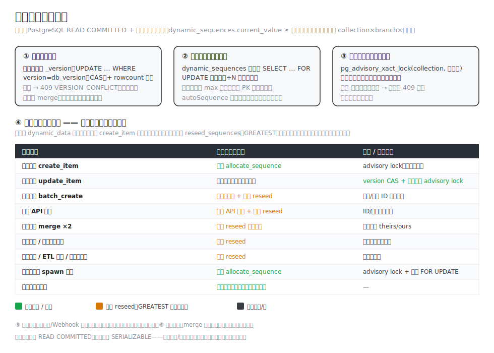
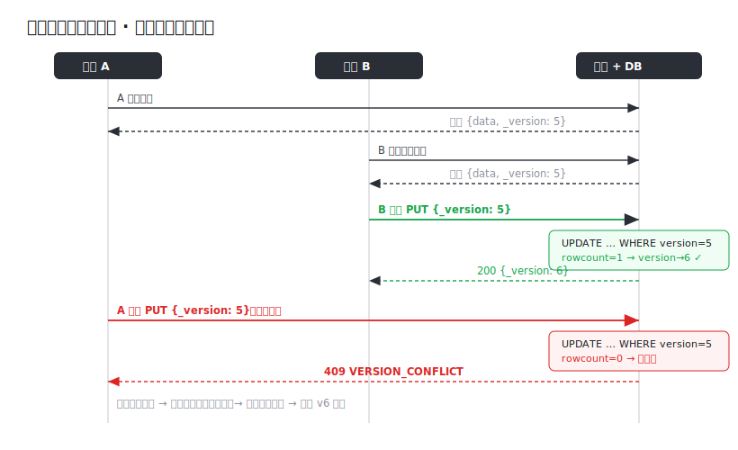
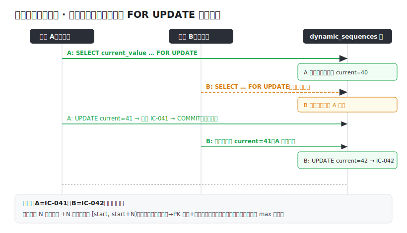
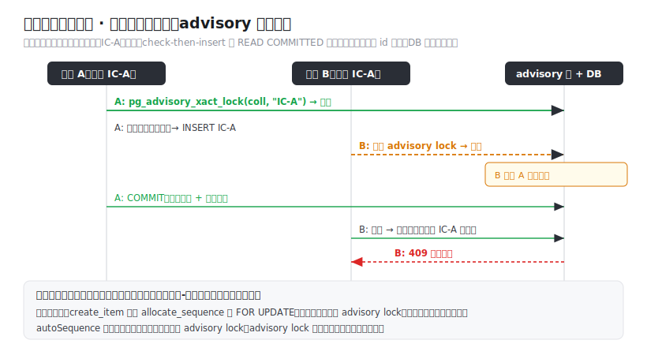

# 数据并发控制设计

> 本文是系统**数据并发一致性**的权威设计文档，覆盖所有写入路径的并发处理。
> 取代旧版 `archive/数据并发控制设计文档.md`（仅含早期的单记录乐观锁）。

## 1. 背景与目标

所有业务数据存于单表 `dynamic_data`（JSONB + `branch_id` + `version`），由通用 CRUD（`server/routes/dynamic.py`）+ 多条旁路（导入、开放 API、分支合并、备份还原、ETL、触发器、工作流）写入。多用户并发下若不控制，会出现三类问题：

- **丢失更新（Lost Update）**：A、B 读同一记录，B 先存、A 后存覆盖了 B。
- **重复序号（autoSequence）**：两个创建基于相同状态生成同一编号（如 `IC-006`）。
- **重复业务主键**：两个创建用相同手填主键，check-then-insert 竞态。

**目标**：在不牺牲并发度的前提下消除上述问题，并保证一条**全局不变式**：

> **`dynamic_sequences.current_value` ≥ 任何已写入的序号**（对每个 `collection × branch × autoSequence 字段`）。

## 2. 设计原则

- **隔离级别保持 READ COMMITTED**，不全局升 SERIALIZABLE——只在序号/主键热点用**定点锁**，避免全局事务重试的复杂度。
- **后端是标识的权威分配方**：autoSequence 由后端原子分配，客户端不再生成易冲突的标识。
- **统一守卫不变式**：凡写入 `dynamic_data` 的路径，要么经 `create_item` 原子分配，要么写后在**同一事务**调 `reseed_sequences`（GREATEST，只升不降），要么新分支首次分配时自播种。
- **定点锁三件套**：版本 CAS（更新）、计数行 `FOR UPDATE`（序号）、`pg_advisory_xact_lock`（手填主键）。



## 3. 场景一：单记录更新 · 乐观锁

`update_item` 用 `version` 列做乐观并发控制：

1. 读取时记录携带 `_version`；前端更新回传它（`pageConfig.ts` 从缓存取 `cached._version`）。
2. 后端 `UPDATE … SET version=db_version+1 WHERE id=… AND version=db_version`（CAS），并校验 `rowcount`：
   - `rowcount=1` → 成功，版本 +1；
   - `rowcount=0` → 期间被他人改过 → `409 VERSION_CONFLICT`。
3. 客户端 `_version` 与库不符也直接 409。
4. **字段级 merge**（`{**old, **new}`）：A、B 改**不同字段**时互不覆盖；改同一字段才以最后写入为准（且受版本校验保护）。

前端统一拦截 `409 VERSION_CONFLICT`（`src/views/dynamic/conflict.ts`）→ 提示「数据已被他人修改」+ 刷新拉取最新 → 用户基于最新值重做。



## 4. 场景二：并发创建 · 序号原子分配

autoSequence 由后端**原子分配**（`server/utils/sequences.py:allocate_sequence`）：

- 计数表 `dynamic_sequences(collection, branch_id, field_name, current_value, PK(三者))`。
- 分配在 `create_item` 内、同一事务：对计数行 `SELECT current_value … FOR UPDATE`（行锁串行化）→ `+N` 写回 → 返回连续区间 `[start, start+N)`，格式化（prefix + 补零）。
- **常态**：计数行已存在 → 单次 PK 查找 + 行锁，免全表扫描；**仅首次分配**按现有数据 max 播种（`先 upsert 零行再 FOR UPDATE`，消除首插竞态）。
- 前端不再生成 autoSequence；表单该字段只读显示「保存后生成」，保存后用后端返回值回填。



## 5. 场景三：并发创建 · 手填主键去竞态

手填（非序列）业务主键的 check-then-insert 在 READ COMMITTED 下会竞态（两个创建都查不到、都插入，技术行 `id` 不同 → DB 主键 `(id, branch_id)` 拦不住）。

- `create_item`/`update_item` 在唯一性检查**之前**取 `pg_advisory_xact_lock(hashtext(collection), hashtext(主键值))`（事务级、提交即释放，复合主键按拼接值）。
- 同一主键值的并发被串行化：后到者阻塞至先到者提交，再查即见 → `409 主键重复`。
- **锁顺序约定**：先 `allocate_sequence` 的计数行 `FOR UPDATE`、再取 advisory lock，全局一致顺序避免死锁。
- autoSequence 主键由 §4 原子分配天然唯一，**不**对其取 advisory lock。



## 6. 场景四：序号计数器全局不变式（所有写入路径）

§2 的不变式必须在**每一条**写 `dynamic_data` 的路径上成立。统一守卫：

| 写入路径 | 文件 | 守卫 |
|---------|------|------|
| 表单创建 `create_item` | `routes/dynamic.py` | 原子 `allocate_sequence` + 手填主键 advisory lock |
| 表单更新 `update_item` | `routes/dynamic.py` | version CAS；改主键时 advisory lock |
| 批量导入 `batch_create_items` | `routes/dynamic.py` | 保留导入值 + 写后 `reseed_sequences` |
| 开放 API `create_collection_item` | `routes/open_api.py` | 保留 API 供值 + 写后 reseed |
| 分支合并 ×2 `merge_project_version(_detailed)` | `utils/project_version.py` | 写后 reseed 目标分支 |
| 版本快照还原 `restore_from_project_version` | `utils/project_version.py` | 写后 reseed |
| 合并回滚 `_rollback_merge` | `utils/project_version.py` | 写后 reseed |
| 备份还原 `restore_backup` | `utils/backup.py` | 写后 reseed |
| 分支数据复制 `copy_data_to_branch` | `utils/version.py` | 写后 reseed |
| ETL 导入 `_step_save_to_collection` | `utils/etl_engine.py` | 写后 reseed |
| 触发器创建 `_execute_action` | `utils/trigger_engine.py` | 写后 reseed |
| 工作流 spawn 下游 | `utils/workflow_engine.py` | 复用 `allocate_sequence`（同 create_item） |
| 新建分支初始化 | `utils/project_version.py` | 计数行缺失 → 首次分配自播种 |

`reseed_sequences` 用 `INSERT … ON CONFLICT DO UPDATE SET current_value = GREATEST(current, max)` —— **只升不降**，幂等，绝不重用已删 ID；在调用方事务内执行，与写入原子。

## 7. 场景五：工作流推进 · 实例并发

工作流引擎（`utils/workflow_engine.py`）挂在 `update_item` 状态转换之后：

- **下游记录生成** `spawn_record` 复用 `allocate_sequence` + `acquire_pk_lock`，与 `create_item` 同等序号/主键一致性。
- **实例并发** `on_transition` 对实例行 `SELECT … FOR UPDATE`：同一实例的并发推进/回退被串行化，后到者读到已变更的 `current_stage_id`、转换不再匹配 → **不重复 spawn 下游**。

## 8. 场景六：关系一致性

`relation`/`reference`/`quoteSelect` 的关系写入（`data_relations`）与主数据 create/update **在同一事务**完成（`create_item`/`update_item` 内），保证数据与关系原子提交、一起回滚。

## 9. 场景七：分支锁定

`project_versions` 在 merge 准备期可**锁定分支**（`isLocked`/`lockedBy`/`lockedAt`）。`check_branch_lock` 在 create/update/batch 入口校验：分支被锁时拒绝修改（403），避免合并期并发写入造成不一致。

## 10. 场景八：触发器 / Webhook · 最终一致

触发器（跨集合 create/update/notify）与 Webhook 在**主事务提交后另起事务**执行（`fire_triggers`/`fire_webhooks` 的 after 时机）。这是**有意的最终一致**取舍：

- 主数据写入不被下游副作用阻塞；下游失败不回滚主操作（失败计日志 + 通知操作人）。
- 触发器创建的记录同样满足不变式（写后 reseed，见 §6）。
- Webhook 的 before 时机可**阻断**主操作（用于校验/否决），after 时机仅通知。

## 11. 锁与隔离级别总结

| 机制 | 作用域 | 解决 |
|------|--------|------|
| `version` CAS + rowcount | 单记录更新 | 丢失更新 |
| `dynamic_sequences` 行 `FOR UPDATE` | 单计数行 | 重复序号 |
| `pg_advisory_xact_lock(coll, pk)` | 同一主键值 | 重复手填主键 |
| `reseed_sequences`（GREATEST） | 旁路写入后 | 计数器陈旧 → 后续重号 |
| 实例行 `FOR UPDATE` | 工作流实例 | 重复 spawn |
| 分支锁 | 整分支 | 合并期并发写 |
| 同事务原子 | 主数据 + 关系 + 旁路 reseed | 部分写入 |

均维持 READ COMMITTED；锁是**定点**的（行/键级），不阻塞无关写入。

## 12. 关键文件

- `server/utils/sequences.py`：`allocate_sequence`、`reseed_sequences`、`seq_max_from_data`。
- `server/routes/dynamic.py`：`create_item`/`update_item`/`batch_create_items`、`acquire_pk_lock`、`check_primary_key_unique`。
- `server/utils/{project_version,backup,version,etl_engine,trigger_engine,workflow_engine}.py`：各旁路 reseed 接入。
- `src/stores/pageConfig.ts`（更新回传 `_version`）、`src/views/dynamic/conflict.ts`（409 统一处理）、`src/components/dynamic-form/controls/AutoSequence.vue`（只读「保存后生成」）。

## 13. 测试

后端 pytest 覆盖：乐观锁冲突、40 线程并发分配无重号、20 并发同主键恰 1 成功（`pg_sleep` 放大窗口证明锁是 load-bearing）、各旁路 reseed 防重号（导入/合并/还原/快照还原/回滚/ETL/触发器）、工作流 spawn 一致性、`_workflowComment` 不入库。`server/tests/test_sequences_*.py`、`test_create_concurrency.py`、`test_bypass_reseed.py`、`test_merge_sequence_reseed.py`、`test_version_restore_reseed.py` 等。

## 14. 运维 / 迁移

新增 `dynamic_sequences` 表。现有库需运行幂等迁移（先备份）：
```bash
cd server && python -m migrations.2026_06_13_dynamic_sequences
```
详见 `docs/data-migration-guide.md`。
