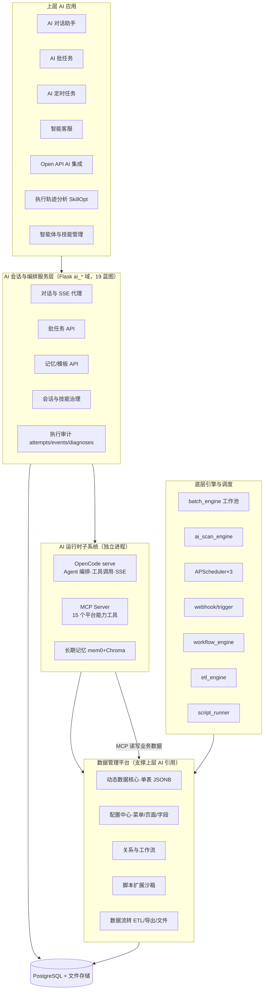

# AI 能力总览与长任务稳定性

**版本**：v1.0
**日期**：2026-09-18
**范围**：巡检用例管理系统全部 AI 能力——上层应用、编排服务、运行时子系统、数据支撑、底层调度
**配套架构图**：[功能架构图.svg](../功能架构图.svg)（已重构为「AI 能力为主体、数据管理支撑上层 AI 引用」视角）

---

## 1. 总览

系统是一套**配置驱动的数据管理平台 + 多形态 AI 应用**的组合体。AI 不是孤立功能，而是贯穿六类上层应用的执行引擎；数据管理平台（动态数据、配置中心、文件、集成）通过 **MCP Server** 把业务数据安全地暴露给 AI 读写，形成「数据 ↔ AI」双向闭环。



---

## 2. 上层 AI 应用（能力清单）

### 2.1 AI 对话助手（交互式会话）

| 能力域 | 内容 |
|---|---|
| 对话基础 | SSE 流式回复、模型选择（provider/model）、Agent 选择、@子智能体提及（AgentPart）、多会话并行、会话搜索（标题/文件/消息全文） |
| 上下文供给 | 附件文本内联（≤200KB）、@文件内容内联、长期记忆注入（每轮检索 top5）、导出意图兜底（AI 说 + 系统真做） |
| 运行中交互 | 插话队列（streaming 中发送→排队，idle 自动补发）、Todo 执行计划实时展示、交互式多选题工具（question）、子代理轨迹抽屉（5 层嵌套） |
| 工具与产物 | 工具调用气泡（自然语言摘要 + 状态文字 + 原始 JSON 可展开 + 敏感字段脱敏）、代码/文档产物卡（可运行）、工作区文件抽屉（uploads/outputs/变更）、Git 变更视图 |
| Prompt 工程 | Prompt 模板（搜索/收藏/最近使用/预览/插入，批任务同源）、/ 命令面板（OpenCode 命令 + 平台技能）、技能按会话上传（zip，中文名修复） |
| 上下文治理 | 会话压缩（/compact 后台线程）、会话生命周期（关闭/重开/清空/删除，运行中会话关闭先停回合） |
| 失败韧性 | 发送失败错误卡（结构化错误 + 一键重试 + 复制详情）、SSE 断线重连（指数退避 + runtime-state 服务端状态同步 + 消息补偿）、防重复提交 |
| 可审计 | 执行 Attempt（requested/effective agent+model、prompt hash、Skill manifest）、原始事件、契约步骤审计（见 §7.6） |

### 2.2 AI 批任务

- N 文件批量执行：staging 上传 → 每文件一个子会话，工作池并发（默认 3）限流；
- 批级配置：Agent、模型、预置仓库（provision，项目级 Agent/Skill 克隆进 `.opencode/`，失败降级全局 Agent 并提示）；
- 生命周期：**暂停（可续跑）/ 中断（可恢复）/ 单任务独立继续（原地续跑，不拉起其他任务）/ 重试失败 / 重新执行（清上下文）**；
- 观测：分组头进度、子会话行列表、实时会话视图（对话/工具/子代理全轨迹）、批管理页（跨用户治理、产物文件）；
- 完成通知（站内信 + 浏览器通知）。

### 2.3 AI 定时任务（扫描流水线）

- 定时/手动触发：认领数据页记录 → 逐条派发 AI（批任务通道）→ 模型输出**结构化 JSON** → `jsonb_set` **回写业务字段**（闭环）；
- 回写校验、失败分类、孤儿恢复、完成/失败站内通知；
- 与批任务共享全部生命周期语义（暂停/中断/继续）。

### 2.4 智能客服（kefu）

- 实例级人设（AGENTS.md 注入）+ 实例级 Agent/Model；
- 访客访客态会话、SSE 实时回复、人工接管、护栏（guardrail）；
- 限流（实例级 + 访客级 + IP 级）、内部记忆接口（独立 token 鉴权）。

### 2.5 Open API（AI 集成）

外部系统以 API Key 驱动全部 AI 形态：`open_api_batches` / `open_api_ai_sessions` / `open_api_scan_tasks` / `open_api_memories` / `open_api_prompt_templates`——批任务、会话、记忆、模板均有对外 REST 契约（幂等键、状态机、轮询端点）。

### 2.6 执行轨迹分析（Execution Auditor + SkillOpt）

- 管理员一键分析任意会话：`trace-analyzer` Skill + `analyze_trace` / `query_sessions` MCP 工具；
- **确定性审计层**（不依赖 LLM 的事实）：Execution Attempt（requested/effective agent+model、prompt hash、Skill manifest hash）、契约步骤七态判定（completed_confirmed / completed_claimed / missing / skipped / out_of_order / failed / unknown）、工具失败九类分类与恢复分析（同参重试/换策略/是否恢复）、子代理递归异常、`data_completeness`（数据不足输出 unknown，不伪造结论）；
- **SkillOpt 聚合**：按 Skill 名称 + hash 聚合调用/成功率/步骤完成率/异常率/时延，版本对比与证据化改进建议（第一版全部人工审核）；
- 轨迹分析会话打 `kind=trace_analysis` 标记，默认从普通列表隐藏，与原会话双向关联（分析历史区块 + 原会话横幅）。

### 2.7 智能体与技能管理

- 平台技能库（zip 上传、中文名修复、启停、按会话注入）；
- OpenCode 运行时管理：全局 Skill/Agent 文件 CRUD、在线编辑、平台技能发布、配置应用/回滚、**重启治理**（active-workload 守卫 + 进程归属识别，外部进程绝不误杀）；
- 权限细分 8 键（runtime_read / skill_write / agent_write / publish / apply / rollback / restart / force）。

---

## 3. AI 会话与编排服务层（Flask `ai_*` 域）

19 个蓝图构成 AI 的 HTTP 面（`/ai/*`、`/open_api/ai/*`、kefu）：

| 蓝图 | 职责 |
|---|---|
| `ai_chat` | 会话 CRUD、发送、SSE 代理、abort、文件/技能上传、变更/产物、子代理消息、runtime-state |
| `ai_chat_batches` | 批任务 CRUD、staging、pause/resume/retry/reexecute、单任务 resume |
| `ai` | AI 设置、长期记忆（列表/添加/删除） |
| `ai_chat_prompt_templates` | Prompt 模板 CRUD |
| `ai_scan_tasks` | 扫描任务定义/触发/记录 |
| `ai_batch_admin` `ai_session_admin` | 跨用户治理（列表/详情/消息/文件/分析触发） |
| `ai_skills` `ai_opencode_admin` | 平台技能库、OpenCode 运行时治理 |
| `ai_memory_internal` | MCP→Flask 内部记忆通道（独立 token） |
| `open_api_*` ×6 | 对外 AI REST（批/会话/扫描/记忆/模板/行操作） |
| `kefu_admin` `kefu_public` | 客服实例管理与访客会话 |

关键机制：**listener-before-dispatch**（先挂服务端持久化监听再派发，浏览器关闭不丢轨迹）；**SSE 代理**（浏览器只连 Flask，Flask 订阅 OpenCode）；**runtime-state 接口**（SSE 重连后以服务端回合状态收敛）。

---

## 4. AI 运行时子系统（独立进程）

### 4.1 OpenCode serve（:4096）

Agent 编排内核：primary/subagent 多智能体、工具调用、Todo、交互式 question、会话级工作区（`directory` 绑定）、SSE 事件流、LLM Provider 抽象（Claude / DeepSeek / MiMo 等可配）。每会话独立工作区 + `opencode.json`（MCP 接入点、默认模型）+ AGENTS.md 项目指导。

### 4.2 MCP Server（:3003，FastAPI + Streamable-HTTP）

向 Agent 暴露 **15 个平台能力工具**（opaque token → DB 校验 → user/RBAC 推导）：

| 工具 | 能力 | 数据来源（数据管理支撑点） |
|---|---|---|
| `list_collections` / `query_collection` | 发现/查询业务数据页 | menus + dynamic_data（单表 JSONB） |
| `read_data_file` | 读取数据页文件字段 | data_files |
| `download_field_files` | 按条件查询数据页并把文件/图片字段的文件批量下载到会话当前目录 | dynamic_data + data_files |
| `read_upload` | 读取会话上传文件 | workspace/uploads |
| `save_artifact` | 产出文件到 outputs/ | workspace |
| `run_python` | 沙箱执行 Python（可查 DB） | 只读连接 |
| `export_collection_excel` / `list_export_scripts` / `run_export_script` | Excel 导出与脚本复用 | export_scripts |
| `memory_search/add/delete` | 长期记忆读写 | mem0 + Chroma |
| `analyze_trace` / `query_sessions` | 轨迹分析与历史查询 | ai_chat_* + execution audit |

### 4.3 长期记忆（mem0 + Chroma）

按 `user_id` 隔离；被动逐轮抽取（turn 结束后台线程）+ 主动补写（抽屉/MCP）；DashScope 嵌入；**原生调用钉单线程**（chromadb/onnxruntime 线程亲和，防 SIGSEGV）；随备份。

---

## 5. 数据管理如何支撑上层 AI（核心闭环）

```text
配置驱动动态数据 ──MCP 工具──▶ AI Agent 读写业务数据
        ▲                            │
        └──── 扫描流水线 jsonb_set 回写 ◀┘（AI 结果落回业务字段）
```

1. **schema 驱动**：菜单/页面/字段配置既生成 UI 与 CRUD API，也决定 MCP 查询的集合语义——**新增一个数据页，AI 立即可查可读**，无需改 AI 代码；
2. **读路径**：`query_collection` 把 JSONB 行集投影为 Agent 可用的结构化结果（字段、分页、过滤）；
3. **写路径**：扫描流水线把 AI 结构化结论经 `jsonb_set` 精确回写目标字段（不动其它字段）；
4. **文件路径**：`data_files`（数据页附件）与 workspace `uploads/` 都可被 Agent 读取；产物写 `outputs/` 并回显产物卡；
5. **记忆路径**：用户偏好/事实沉淀为长期记忆，逐轮注入——跨会话个性化；
6. **脚本路径**：历史导出脚本可被 AI 发现并复用执行（export 系列 MCP 工具）；
7. **权限边界**：MCP token 推导用户与 RBAC，`analyze_trace/query_sessions` 已做 owner/admin 隔离（TRACE_FORBIDDEN），客服角色默认拒绝。

---

## 6. 底层引擎与调度

| 引擎/调度 | 形态 | 要点 |
|---|---|---|
| `batch_engine` | 守护线程 + `ThreadPoolExecutor(max_workers=3)` | `FOR UPDATE SKIP LOCKED` 认领、pre-claim 取消/暂停转换、`notify()` 唤醒派发 |
| `ai_scan_engine` | 认领记录 → 处理中 → AI 处理 → 回写 | `jsonb_set` 精确回写、孤儿恢复 |
| APScheduler ×3 | backup / dependency / **ai_scan** | 定时与间隔调度 |
| webhook / trigger | 事件触发 + HMAC + 重试 | 数据联动 |
| `workflow_engine` | 状态机推进/驳回 | 原子 spawn 下游 |
| `etl_engine` | 抽取/转换/映射/写入 | HTTP 抽取 |
| `script_runner` | 沙箱 | 禁 import/eval/open、超时 |
| 执行审计采集器 | best-effort 写入 | attempts/events/manifests，不阻塞主链路 |

---

## 7. 长任务稳定性保障（重点）

从「一次提交，跑几分钟到几十分钟」的视角，系统在六个层面保证长任务稳定：

### 7.1 调度与并发正确性

- **认领互斥**：`FOR UPDATE SKIP LOCKED` 认领 pending 子会话，多 worker/重启双启都不会重复执行；
- **并发限流**：工作池 `max_workers=3`，防 Provider 打爆；
- **pre-claim 状态转换**：排队中的取消/暂停请求在派发 tick 前落定，占位不占工作槽；
- **派发唤醒**：任何状态变更 `notify()` 立即唤醒派发线程（无轮询空转）。

### 7.2 生命周期语义（全部可恢复）

| 操作 | 语义 | 恢复路径 |
|---|---|---|
| 暂停 | 运行中协作式中断（不占失败计数） | 批级 resume / **单任务独立继续**（原地续跑） |
| 中断 | 排队直接取消、运行中协作中止、暂停转取消（计失败聚合） | resume 从原工作恢复 |
| 继续执行 | 复用原 OpenCode 会话 + 注入续跑提示词（`continue_prompt`），**保留全部历史与工作区** | — |
| 重新执行 | 删消息、清 OpenCode 会话、从头跑 | — |
| 重试失败 | failed → pending（可选原地续跑 `AUTO_RETRY_CONTINUE_PROMPT`） | — |

### 7.3 失败分类与自动恢复

- **可重试白名单**：停滞（`STALL_TIMEOUT=180s` 无新文本）、Provider 瞬时错误、网络异常 → 自动重试（`retry_count+1`，有原会话则原地续跑）；硬超时、鉴权错误、用户中断、上下文超限不重试；
- **停滞看门狗**：OpenCode 无输出超阈值即中断，专治"批任务一直待运行"；
- **会话失效自愈**：dispatch 报 RequestException → 新建 OpenCode 会话 + 注入历史 + 重发（交互与批任务双路径）；
- **Agent 前置校验**：未知/子代理作为主 Agent 直接 fail-fast，不再空转到看门狗。

### 7.4 崩溃与孤儿恢复

- **进程重启自愈**：启动时 `running → pending`（`_restart_audit`），派发线程自动重跑；扫描子任务孤儿清扫；
- **陈旧运行对账**：`_reconcile_stale_running` 周期对账；
- **运行中批任务删除治理**：先取消全部子任务、等待运行中落地（≤10s）再清理，Worker 写回前检查取消状态——不产生半清理状态。

### 7.5 持久化与断线韧性

- **双通道持久化**：服务端后台 listener（与浏览器解耦，关浏览器照常落库）+ 浏览器 SSE 代理互斥兜底；**listener-before-dispatch** 保证首条事件不丢；
- **幂等落库**：按 OpenCode message/part id upsert；continue 模式先拍 assistant 基线防旧消息误判；
- **REST 回填**：idle 时全量回放补 SSE 竞态缺口；
- **前端韧性**：SSE 指数退避重连 → 重连成功调 `runtime-state` 以服务端为准收敛（运行中续等、已结束补消息）；发送失败错误卡一键重试（清理孤儿消息）；运行中插话队列自动补发；
- **运行时治理**：重启前 active-workload 检查 + 进程归属识别（平台托管才可重启），外部实例绝不误杀。

### 7.6 可观测与执行审计（新）

- **Execution Attempt**：每次发送/重试/继续/重执行记录 requested vs effective Agent+Model（resolution 口径）、raw/effective prompt hash、增强项（记忆/附件/@提及）、workspace 与 Skill manifest（SHA256）；
- **不可变事件**：tool 状态推进、message 更新、idle/error 事件按 attempt 落 `ai_execution_events`；
- **确定性审计**：契约步骤七态（含"Todo 声称完成但无证据"）、工具失败九类分类 + 恢复分析（同参重试/换策略/是否恢复）、子代理递归异常、`data_completeness` 评分——**数据不足输出 unknown，不伪造结论**；
- **诊断报告**：结构化 JSON（execution/contract/tool_failures/step_completion/suggestions），管理页「执行审计」抽屉直读；
- **Prompt 默认脱敏**：只存 hash 与增强项，明文需专用权限 `admin.ai_execution_prompt_read` 并记审计。

### 7.7 长任务的"过程可解释"

- Todo 执行计划实时可见；子代理 5 层嵌套轨迹完整持久化、抽屉回看；工具调用自然语言摘要；扫描逐条结果回写可校验——长任务不再黑盒。

---

## 8. 能力矩阵（应用 × 支撑能力）

| 支撑能力 → | MCP 数据读写 | 记忆 | 技能/Agent | 模板 | 审计 | 批调度 | 回写 |
|---|:-:|:-:|:-:|:-:|:-:|:-:|:-:|
| AI 对话助手 | ✅ | ✅ | ✅ | ✅ | ✅ | — | — |
| AI 批任务 | ✅ | ✅ | ✅ | ✅ | ✅ | ✅ | — |
| AI 定时任务 | ✅ | — | ✅ | — | ✅ | ✅ | ✅ |
| 智能客服 | — | ✅ | ✅ | — | ✅ | — | — |
| Open API AI | ✅ | ✅ | ✅ | ✅ | ✅ | ✅ | — |
| 轨迹分析 | — | — | ✅ | — | ✅（自审计） | — | — |

---

## 9. 演进方向

1. **SkillOpt P2 剩余**：`ai_skill_invocations` 精确采集（runtime/plugin 事件证明 Skill 实际加载与调用）、版本 delta 看板、建议应用后的效果追踪；
2. **审计事件保留策略**：明文 30 天 / 摘要 180 天分层；
3. **OpenCode runtime 插件**：Skill load/invoke/step 原生事件，把 `invoked` 从 inferred 升级为 confirmed；
4. **业务结果校验器**：扫描回写后自动校验字段正确性（TV-03/TV-04 确定性覆盖）。

---

## 10. 相关文档

- 架构图：[功能架构图.svg](../功能架构图.svg)
- 执行审计与 SkillOpt 规格：[../superpowers/specs/2026-09-17-ai-execution-audit-skillopt-spec.md](../../superpowers/specs/2026-09-17-ai-execution-audit-skillopt-spec.md)
- 轨迹分析设计：[11-AI执行轨迹分析.md](./11-AI执行轨迹分析.md)
- 用户指南：[../user-guide/ai/assistant.md](../../user-guide/ai/assistant.md) 等
