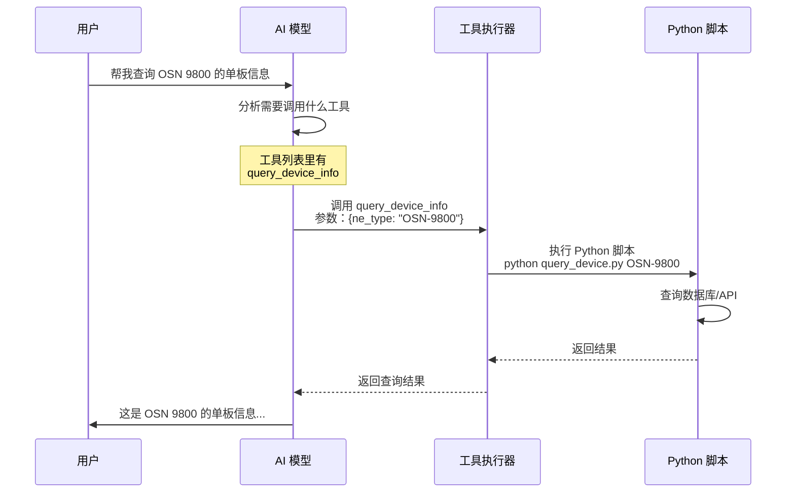

# 华为设备巡检用例开发 Skill 设计文档（已归档）

> 📦 **本文档已归档。** 这是平台 AI 能力的一个**具体应用示例**（巡检用例开发 Skill），
> 而非平台自身的功能设计，保留备查。平台 AI 子系统设计见 [`../09-AI智能助手.md`](../09-AI智能助手.md)。

> 版本：v0.2
> 创建日期：2026-03-09
> 状态：设计完成，准备开发

---

## 1. 项目概述

### 1.1 项目背景

华为波分设备巡检是一项复杂的工作，需要：
- 了解巡检框架的调度机制和执行流程
- 掌握设备相关的专业知识（设备型号、单板类型、业务配置等）
- 熟悉 MML 命令和模型数据表结构
- 编写符合框架规范的巡检用例代码

当前痛点：
- 大模型缺乏华为设备的专业知识
- 巡检框架的接口文档分散，检索困难
- 新手上手成本高，需要长时间学习
- 用例开发效率低，容易出错

### 1.2 Skill 目标

创建一个智能助手 Skill，能够：
1. **渐进式加载**业务知识到上下文，避免 token 浪费
2. **智能检索**接口文档、业务知识、MML 命令等
3. **理解框架**调度流程，生成符合规范的用例代码
4. **交互式引导**用户，通过提问和选项补充缺失信息
5. **最终目标**：用户输入需求，Skill 引导完成巡检用例开发

---

## 2. 核心概念（新手必读）

### 2.1 什么是 Skill？

**Skill** 是一个可以给 AI 助手（如 Claude Code、opencode）添加特殊能力的插件包。

**类比理解：**
```
AI 助手 = 一个聪明但没有专业知识的人
Skill   = 给这个人一本专业手册 + 一些工具
```

**Skill 的组成：**
```
skill 包/
├── SKILL.md           # 说明书：告诉 AI 这个 skill 能做什么
├── 代码/工具          # 实际执行任务的程序
└── 知识库/           # 专业知识文档
```

### 2.2 什么是渐进式加载？

**问题：** 如果把所有知识一次性给 AI，会超出 token 限制（比如 20 万 tokens）

**解决：** 像玩游戏加载地图一样，只加载当前需要的知识

**类比：**
```
❌ 错误方式：把整个图书馆的书都搬到桌上
✅ 正确方式：需要什么书，就从书架上取什么书
```

**实际例子：**

```
用户：我想开发一个光功率巡检用例

Step 1: AI 分析需求
  - 识别关键词："光功率"、"巡检用例"
  - 判断需要：框架基类知识 + 光功率相关接口

Step 2: 加载框架层知识（必须始终在上下文中）
  ┌────────────────────────────────┐
  │ InspectionCase 基类定义         │
  │ - execute() 方法               │
  │ - validate() 方法              │
  │ - report() 方法                │
  └────────────────────────────────┘

Step 3: 用户继续描述需求
  用户：针对 OSN 9800 设备

Step 4: 渐进式加载 OSN 9800 相关知识
  ┌────────────────────────────────┐
  │ OSN 9800 设备信息               │
  │ - 支持的单板类型               │
  │ - 光功率接口文档               │
  │ - 相关 MML 命令                │
  └────────────────────────────────┘

Step 5: AI 发现需要检查大小槽位转换
  - 检测到用例方案中提到"单板槽位"
  - 自动检索"槽位映射"相关 API 文档
  - 加载到上下文

Step 6: 生成代码
  - 使用已加载的所有知识
  - 生成符合规范的用例代码
```

**技术实现原理：**

```typescript
// 伪代码示例
class ContextManager {
  context = [];  // 当前上下文
  maxTokens = 200000;  // 最大 token 数
  
  // 渐进式加载知识
  async loadKnowledge(topic: string) {
    // 1. 检查知识是否已在上下文中
    if (this.context.includes(topic)) {
      return;  // 已存在，不需要加载
    }
    
    // 2. 从知识库检索
    const knowledge = await knowledgeBase.search(topic);
    
    // 3. 检查 token 是否超限
    if (this.getTokenCount() + knowledge.length > this.maxTokens) {
      // 4. 超限则淘汰最早的知识
      this.evictOldestKnowledge();
    }
    
    // 5. 加入上下文
    this.context.push(knowledge);
  }
}

// 使用示例
const ctx = new ContextManager();

// 用户输入后
ctx.loadKnowledge('光功率');      // 加载光功率知识
ctx.loadKnowledge('OSN-9800');    // 加载设备知识
ctx.loadKnowledge('槽位映射');    // 检测到需要时加载
```

---

## 3. 工具调用详解（新手必读）

### 3.1 大模型如何调用工具？

**核心概念：** AI 模型本身不能直接执行代码，但可以通过**工具定义**告诉它有哪些工具可用。

**工作流程：**



### 3.2 实际代码示例

#### 第一步：定义工具（告诉 AI 有什么工具可用）

```typescript
// tools.ts - 工具定义文件
export const tools = [
  {
    name: 'query_device_info',
    description: '查询设备信息（型号、单板、模块等）',
    parameters: {
      type: 'object',
      properties: {
        ne_type: {
          type: 'string',
          description: '网元类型，如 OSN-9800'
        },
        board_type: {
          type: 'string',
          description: '单板类型，如 SCC、XCS'
        }
      },
      required: ['ne_type']
    }
  },
  {
    name: 'query_mml_command',
    description: '查询 MML 命令的用法',
    parameters: {
      type: 'object',
      properties: {
        command_name: {
          type: 'string',
          description: 'MML 命令名称，如 cfg-get-board'
        }
      },
      required: ['command_name']
    }
  },
  {
    name: 'execute_python',
    description: '执行 Python 脚本',
    parameters: {
      type: 'object',
      properties: {
        script_path: {
          type: 'string',
          description: 'Python 脚本路径'
        },
        args: {
          type: 'array',
          items: { type: 'string' },
          description: '命令行参数'
        }
      },
      required: ['script_path']
    }
  }
];
```

#### 第二步：实现工具执行器（实际执行代码）

```typescript
// executor.ts - 工具执行器
import { exec } from 'child_process';
import axios from 'axios';

export class ToolExecutor {
  // 执行 Python 脚本
  async executePython(scriptPath: string, args: string[] = []): Promise<string> {
    return new Promise((resolve, reject) => {
      const command = `python ${scriptPath} ${args.join(' ')}`;
      
      exec(command, (error, stdout, stderr) => {
        if (error) {
          reject(new Error(`Python 执行失败：${error.message}`));
          return;
        }
        
        if (stderr) {
          reject(new Error(`Python 错误：${stderr}`));
          return;
        }
        
        resolve(stdout.trim());
      });
    });
  }
  
  // 查询设备信息（调用 HTTP API）
  async queryDeviceInfo(neType: string, boardType?: string): Promise<any> {
    const url = 'http://your-api-server/device/query';
    const params = { ne_type: neType, board_type: boardType };
    
    const response = await axios.get(url, { params });
    return response.data;
  }
  
  // 查询 MML 命令
  async queryMMLCommand(commandName: string): Promise<string> {
    // 从本地知识库读取
    const knowledgePath = `knowledge-base/mml-commands/${commandName}.md`;
    const content = fs.readFileSync(knowledgePath, 'utf-8');
    return content;
  }
}
```

#### 第三步：AI 使用工具（实际调用流程）

```typescript
// ai-handler.ts - AI 处理逻辑
import { ToolExecutor } from './executor';

export async function handleUserInput(
  userInput: string,
  context: any[]
): Promise<string> {
  // 1. 调用 AI 模型（带上工具定义）
  const response = await callLLM({
    messages: [
      { role: 'system', content: '你是一个巡检用例开发助手...' },
      { role: 'user', content: userInput }
    ],
    tools: tools,  // 告诉 AI 有哪些工具可用
    tool_choice: 'auto'  // 让 AI 自动决定调用哪个工具
  });
  
  // 2. 检查 AI 是否想调用工具
  if (response.tool_calls) {
    const toolCall = response.tool_calls[0];
    const executor = new ToolExecutor();
    
    // 3. 执行工具
    let result: any;
    
    if (toolCall.function.name === 'query_device_info') {
      const args = JSON.parse(toolCall.function.arguments);
      result = await executor.queryDeviceInfo(args.ne_type, args.board_type);
      
    } else if (toolCall.function.name === 'execute_python') {
      const args = JSON.parse(toolCall.function.arguments);
      result = await executor.executePython(args.script_path, args.args);
    }
    
    // 4. 把结果返回给 AI
    const finalResponse = await callLLM({
      messages: [
        ...context,
        { role: 'user', content: userInput },
        { role: 'tool', tool_call_id: toolCall.id, content: result }
      ]
    });
    
    return finalResponse.content;
  }
  
  return response.content;
}
```

---

## 4. 完整场景示例

### 场景：检查大小槽位转换

**用户需求：**
```
用户：帮我开发一个单板状态巡检用例，需要检查大小槽位的映射关系
```

**Skill 内部处理流程：**

```typescript
// 步骤 1: AI 分析需求
分析结果：
- 意图：开发巡检用例 ✓
- 关键词：单板状态、大小槽位映射
- 缺失信息：设备类型、具体检查项

// 步骤 2: 渐进式加载知识
加载清单：
1. InspectionCase 基类（已在上下文）
2. 单板状态相关接口 → 加载中...
3. 槽位映射 API 文档 → 加载中...

// 步骤 3: 向用户提问
AI: 好的，我来帮您开发单板状态巡检用例。
    需要确认几个信息：
    
    1. 请问是针对哪种网元类型？
       [1] OSN 1800  [2] OSN 8800  [3] OSN 9800
    
    2. 需要检查哪些槽位映射？
       [x] 逻辑槽位→物理槽位
       [x] 子架槽位→机框槽位
       [ ] 其他（请说明）

// 步骤 4: 用户回答
用户：OSN 9800，检查逻辑槽位到物理槽位的映射

// 步骤 5: 调用工具查询 API 文档
AI 决策：需要查询槽位映射的 API 文档

调用工具：
{
  name: 'execute_python',
  arguments: {
    script_path: 'python/query_slot_mapping.py',
    args: ['--ne-type', 'OSN-9800']
  }
}

Python 脚本执行：
```python
# query_slot_mapping.py
import requests

def query_slot_mapping(ne_type):
    # 调用专业知识接口
    response = requests.get(
        'http://api-server/device/slot-mapping',
        params={'ne_type': ne_type}
    )
    
    # 返回 API 文档中关于槽位映射的说明
    return response.json()['documentation']

if __name__ == '__main__':
    result = query_slot_mapping('OSN-9800')
    print(result)
```

返回结果：
```
OSN 9800 槽位映射规则：
- 逻辑槽位号 = 物理槽位号 - 1
- 主子架槽位范围：1-12
- 扩展子架槽位范围：13-24
- API: get_logical_slot(physical_slot: int) -> int
```

// 步骤 6: 生成用例代码
AI 使用已加载的所有知识：
- InspectionCase 基类结构 ✓
- 单板状态查询接口 ✓
- 槽位映射规则 ✓

生成代码：
```python
from inspection import InspectionCase, NE, InspectionResult

class BoardSlotInspection(InspectionCase):
    """单板槽位映射巡检用例"""
    
    static meta = {
        'name': '单板槽位映射检查',
        'ne_types': ['OSN-9800'],
        'interval': '1h'
    }
    
    async def execute(self, ne: NE) -> InspectionResult:
        results = []
        
        # 获取所有逻辑板
        logical_boards = await ne.get_logical_boards()
        
        for board in logical_boards:
            # 检查大小槽位转换
            logical_slot = board.slot
            physical_slot = logical_slot + 1  # 根据映射规则
            
            # 验证物理槽位是否存在
            exists = await ne.verify_physical_slot(physical_slot)
            
            results.append({
                'board': board.name,
                'logical_slot': logical_slot,
                'physical_slot': physical_slot,
                'valid': exists
            })
        
        return self.compile_result(results)
```

// 步骤 7: 输出给用户
AI: 已为您生成单板槽位映射巡检用例。
    
     代码要点：
     1. 使用 get_logical_boards() 获取所有逻辑板
     2. 根据 OSN 9800 的映射规则：物理槽位 = 逻辑槽位 + 1
     3. 调用 verify_physical_slot() 验证物理槽位是否存在
     
     请确认是否满足需求？
     [1] 确认  [2] 修改  [3] 重新生成
```

---

## 5. 系统架构

### 5.1 整体架构

```
┌─────────────────────────────────────────────────────┐
│                   用户界面层                         │
│         （自然语言输入 + 选项选择 + 多轮对话）          │
└─────────────────────────────────────────────────────┘
                          ↓
┌─────────────────────────────────────────────────────┐
│                  Skill 核心层                        │
│  ┌──────────┐  ┌──────────┐  ┌──────────┐          │
│  │ 意图识别  │  │ 上下文管理 │  │ 对话管理  │          │
│  └──────────┘  └──────────┘  └──────────┘          │
│  ┌──────────┐  ┌──────────┐  ┌──────────┐          │
│  │ 知识检索  │  │ 代码生成  │  │ 工具调用  │          │
│  └──────────┘  └──────────┘  └──────────┘          │
└─────────────────────────────────────────────────────┘
                          ↓
┌─────────────────────────────────────────────────────┐
│                   知识库层                           │
│  ┌──────────┐  ┌──────────┐  ┌──────────┐          │
│  │框架知识库 │  │接口知识库 │  │业务知识库 │          │
│  │ (L1)     │  │ (L2)     │  │ (L3)     │          │
│  └──────────┘  └──────────┘  └──────────┘          │
│                          ↓                          │
│              ┌──────────────────┐                   │
│              │   HTTP API 查询   │                   │
│              │  (专业知识接口)   │                   │
│              └──────────────────┘                   │
└─────────────────────────────────────────────────────┘
```

### 5.2 知识分层

| 层级 | 知识类型 | 内容示例 | 加载方式 |
|-----|---------|---------|---------|
| L1 | 框架层 | 调度流程、执行流程、基类、公共方法、用例组成、数据加载模块、处理建议模块、国际化模块 | 预先加载（始终在上下文） |
| L2 | 接口层 | 类定义、方法、参数、返回值 | 按需检索 |
| L3 | 业务层 | 设备/单板/模块信息、MML 命令、数据表 | 按需检索 + HTTP API |
| L4 | 用例层 | 历史用例、最佳实践 | 按需参考 |

---

## 6. 开发计划（新手友好版）

### Phase 0: 学习准备（1 周）

**目标：** 理解 skill 开发的基本概念

**任务清单：**
- [ ] 学习 opencode/claude code skill 规范
- [ ] 理解工具定义（tools）的 JSON Schema
- [ ] 学习 TypeScript 基础（如果不会的话）
- [ ] 学习 Python subprocess 调用

**学习资源：**
- opencode skill 文档：https://opencode.ai/docs/skills
- TypeScript 教程：https://www.typescriptlang.org/docs/
- Node.js child_process: https://nodejs.org/api/child_process.html

### Phase 1: 知识库建设（2 周）

**目标：** 整理巡检框架的专业知识

**任务清单：**
- [ ] 收集 L1 框架层知识（调度流程、执行流程、基类定义等）
- [ ] 整理 L2 接口文档（类定义、方法签名）
- [ ] 整理 L3 业务知识（设备、单板、MML 命令、数据表）
- [ ] 收集 L4 历史用例（至少 5-10 个完整用例）
- [ ] 设计知识索引的 JSON Schema

**输出物：** `knowledge-base/` 目录下的 Markdown 文件集合

### Phase 2: Hello World Skill（1 周）

**目标：** 创建一个最简单的 skill，验证开发流程

**任务清单：**
- [ ] 创建 skill 基础结构
- [ ] 编写 SKILL.md 描述文件
- [ ] 实现一个简单的工具（比如查询天气）
- [ ] 测试 skill 能否被 opencode 加载
- [ ] 测试工具能否被调用

**示例代码：**
```typescript
// 最简单的 skill 示例
export default async function greetSkill(input: string) {
  return `你好！你输入了：${input}`;
}
```

### Phase 3: 工具调用实现（2 周）

**目标：** 实现 Python 脚本调用和 HTTP API 查询

**任务清单：**
- [ ] 实现 execute_python 工具
- [ ] 实现 query_device_info 工具
- [ ] 实现 query_mml_command 工具
- [ ] 编写 Python 执行脚本
- [ ] 测试工具调用流程

### Phase 4: 渐进式加载实现（2 周）

**目标：** 实现上下文的渐进式知识加载

**任务清单：**
- [ ] 实现知识检索函数
- [ ] 实现上下文管理器（LRU 淘汰）
- [ ] 实现 token 计数功能
- [ ] 集成到 AI 对话流程
- [ ] 测试知识加载流程

### Phase 5: 对话管理实现（2 周）

**目标：** 实现交互式引导对话

**任务清单：**
- [ ] 实现意图识别
- [ ] 实现问题生成器
- [ ] 实现选项提供逻辑
- [ ] 实现多轮对话状态管理
- [ ] 测试完整对话流程

### Phase 6: 代码生成实现（2 周）

**目标：** 实现巡检用例代码生成

**任务清单：**
- [ ] 创建代码模板（Jinja2）
- [ ] 实现代码填充逻辑
- [ ] 实现质量检查（Python linter）
- [ ] 集成到主流程
- [ ] 端到端测试

### Phase 7: 集成测试与发布（1 周）

**目标：** 打包发布 skill

**任务清单：**
- [ ] 端到端测试
- [ ] 性能优化
- [ ] 编写使用文档
- [ ] 打包成 ZIP
- [ ] 发布到 opencode/claude code

---

## 7. 新手常见问题

### Q1: Skill 和普通程序有什么区别？

**答：** Skill 是给 AI 助手用的插件，它包含：
1. **工具定义**：告诉 AI 有哪些能力可用
2. **执行代码**：实际执行任务的程序
3. **知识库**：专业知识文档

**普通程序：** 用户直接调用
**Skill:** AI 模型决定何时调用

### Q2: 如何测试 Skill？

**答：** 有三种测试方式：

1. **单元测试**：测试单个工具函数
```typescript
test('queryDeviceInfo', async () => {
  const result = await queryDeviceInfo('OSN-9800');
  expect(result.ne_type).toBe('OSN-9800');
});
```

2. **集成测试**：测试工具调用流程
```typescript
test('完整流程', async () => {
  const response = await handleUserInput('查询 OSN 9800 信息');
  expect(response).toContain('OSN-9800');
});
```

3. **人工测试**：在 opencode 中实际使用
```bash
opencode skills install ./dist/inspection-skill.zip
opencode "帮我开发一个光功率巡检用例"
```

### Q3: 如何调试 Skill？

**答：** 使用日志记录：

```typescript
// 在关键位置添加日志
console.log('[DEBUG] 用户输入:', userInput);
console.log('[DEBUG] 调用工具:', toolName, args);
console.log('[DEBUG] 工具返回:', result);
```

### Q4: Token 超限了怎么办？

**答：** 使用淘汰策略：

```typescript
// LRU（最近最少使用）淘汰
if (tokenCount > maxTokens) {
  const oldestKnowledge = context.shift();  // 移除最早的知识
  tokenCount -= countTokens(oldestKnowledge);
}
```

---

## 8. 附录

### 8.1 Skill 包完整结构

```
inspection-skill/
├── SKILL.md                      # Skill 描述（必填）
├── package.json                  # Node.js 依赖
├── requirements.txt              # Python 依赖
├── tsconfig.json                 # TypeScript 配置
├── src/
│   ├── index.ts                  # Skill 入口
│   ├── core/
│   │   ├── intent.ts             # 意图识别
│   │   ├── context.ts            # 上下文管理
│   │   ├── dialogue.ts           # 对话管理
│   │   ├── retrieval.ts          # 知识检索
│   │   ├── generator.ts          # 代码生成
│   │   └── validator.ts          # 质量检查
│   ├── tools/
│   │   ├── query_device.ts       # 设备查询工具
│   │   ├── query_mml.ts          # MML 查询工具
│   │   └── execute_python.ts     # Python 执行工具
│   └── utils/
│       ├── markdown.ts           # Markdown 解析
│       ├── python.ts             # Python 执行器
│       └── http.ts               # HTTP 客户端
├── python/
│   ├── executor.py               # Python 执行脚本
│   ├── api_client.py             # API 客户端
│   ├── validator.py              # 代码验证
│   └── templates/                # Python 代码模板
│       └── inspection_case.py.jinja2
├── knowledge-base/
│   ├── L1-framework/
│   ├── L2-interface/
│   ├── L3-business/
│   ├── L4-cases/
│   └── mml-commands/
└── scripts/
    ├── build.ts                  # 构建脚本
    └── test.ts                   # 测试脚本
```

### 8.2 SKILL.md 示例

```markdown
# inspection-case-developer

华为设备巡检用例开发助手

## 能力

- 巡检用例代码生成
- 专业知识检索
- 交互式需求引导
- 代码质量检查

## 工具

### query_device_info
查询设备信息（型号、单板、模块等）

### query_mml_command
查询 MML 命令的用法

### execute_python
执行 Python 脚本

## 使用示例

```
用户：帮我开发一个光功率巡检用例
助手：好的，请问是针对哪种网元类型？
      [1] OSN 1800  [2] OSN 8800  [3] OSN 9800
```
```

### 8.3 推荐开发工具

| 工具 | 用途 | 链接 |
|-----|------|------|
| VS Code | 代码编辑器 | https://code.visualstudio.com/ |
| Node.js | JavaScript 运行时 | https://nodejs.org/ |
| Python 3.9+ | Python 运行时 | https://www.python.org/ |
| opencode | Skill 运行平台 | https://opencode.ai/ |
| Claude Code | Skill 运行平台 | https://claude.ai/code |

---

*文档版本：v0.2*
*最后更新：2026-03-09*
*状态：设计完成，准备开发*
