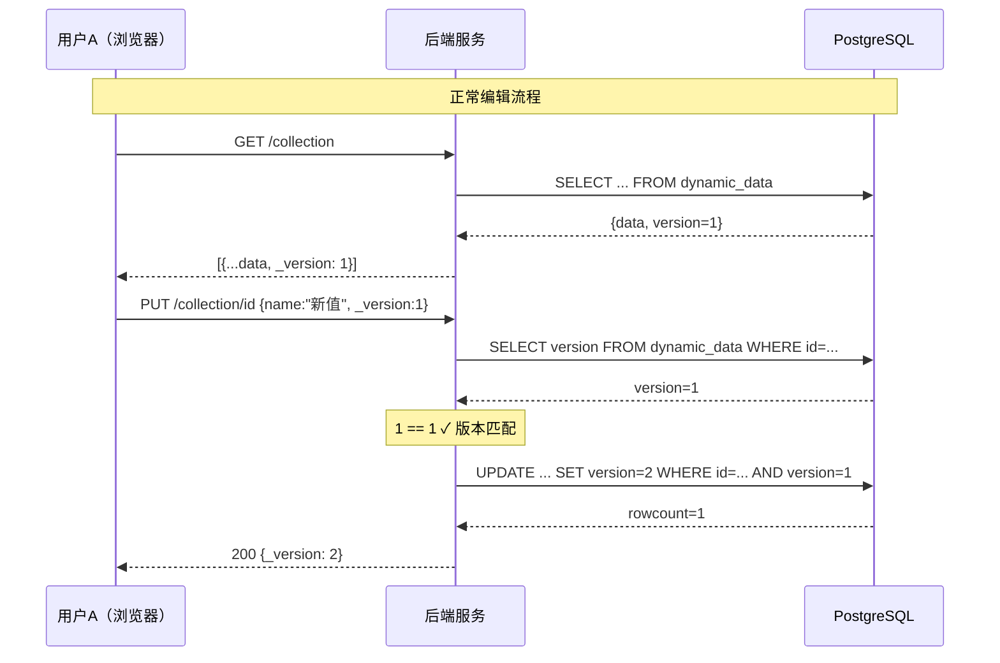
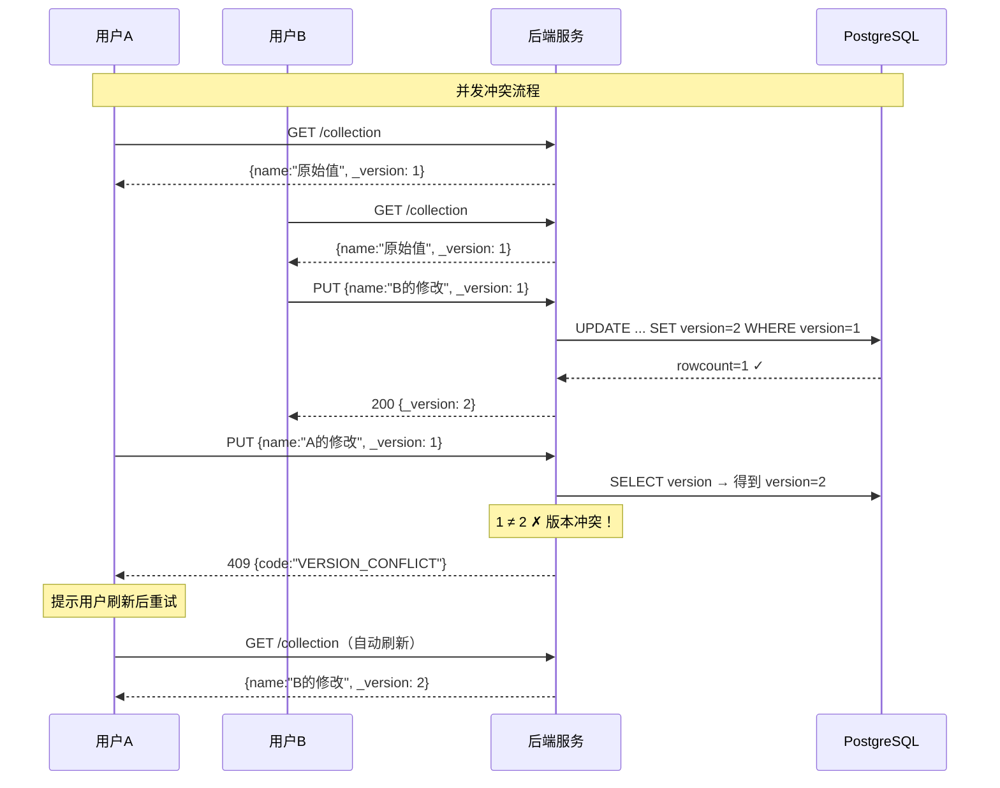
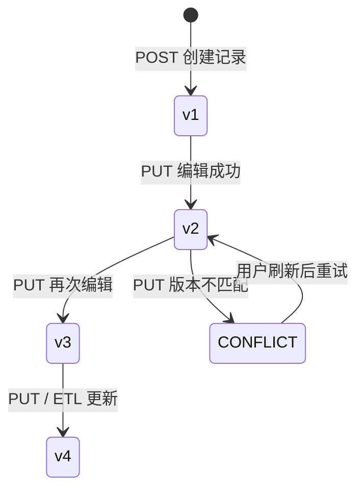
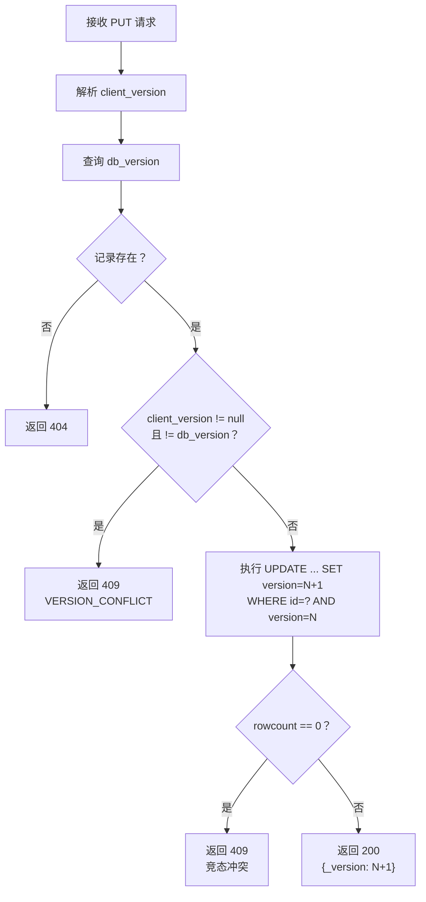
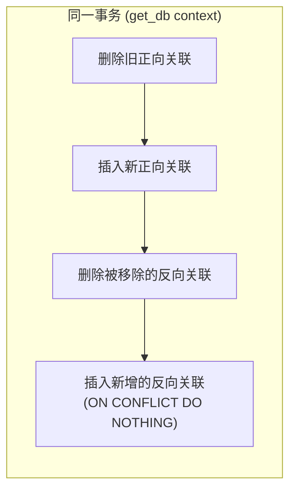
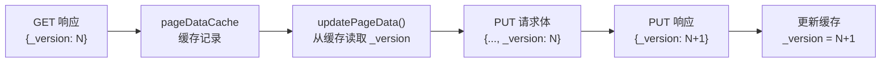

# 数据并发控制设计文档

## 1. 问题背景

系统的业务数据存在丰富的关联关系（双向关联 `relation`、父子引用 `reference`、引用选择 `quoteSelect`），修改一条记录可能触发多条关联记录的同步更新。在多用户同时操作的场景下，如果不做并发控制，会出现**丢失更新**（Lost Update）问题：

```
用户A 读取记录 → 用户B 读取同一记录 → 用户B 保存 → 用户A 保存（覆盖了B的修改）
```

## 2. 方案选型

| 方案 | 原理 | 优点 | 缺点 | 适用场景 |
|------|------|------|------|---------|
| **悲观锁** | 编辑时锁定记录，其他人无法编辑 | 无冲突 | 可能死锁、降低并发度、需处理锁超时 | 冲突频繁的高并发写入 |
| **乐观锁** ✅ | 提交时校验版本号，冲突时拒绝 | 无锁等待、高并发友好 | 冲突时需用户重试 | 冲突少的协作编辑 |
| **最后写入胜出** | 不做控制，后提交覆盖先提交 | 实现简单 | 静默丢失数据 | 不关心数据一致性 |

本系统选择**乐观锁**方案，理由：
- 业务场景为内部管理系统，同时编辑同一记录的概率低
- 用户对数据一致性有强要求（巡检用例、配置数据等）
- 无需引入分布式锁等复杂基础设施

## 3. 整体架构





## 4. 数据库设计

### 4.1 表结构变更

`dynamic_data` 表新增两列：

```sql
ALTER TABLE dynamic_data ADD COLUMN updated_at TIMESTAMPTZ DEFAULT NOW();
ALTER TABLE dynamic_data ADD COLUMN version    INTEGER NOT NULL DEFAULT 1;
```

完整表结构：

| 列名 | 类型 | 说明 |
|------|------|------|
| id | VARCHAR(100) PK | 记录唯一标识 |
| collection | VARCHAR(200) | 所属集合名 |
| data | JSONB | 业务数据 |
| created_at | TIMESTAMPTZ | 创建时间 |
| **updated_at** | TIMESTAMPTZ | 最后修改时间 |
| **version** | INTEGER | 乐观锁版本号，新建为 1，每次修改 +1 |

### 4.2 迁移策略

通过 `init_db.py` 中的 idempotent 迁移自动执行：

```python
cur.execute("""
    SELECT column_name FROM information_schema.columns
    WHERE table_name = 'dynamic_data' AND column_name = 'version'
""")
if not cur.fetchone():
    cur.execute("ALTER TABLE dynamic_data ADD COLUMN updated_at TIMESTAMPTZ DEFAULT NOW()")
    cur.execute("ALTER TABLE dynamic_data ADD COLUMN version INTEGER NOT NULL DEFAULT 1")
```

- 已有记录自动获得 `version = 1`
- 迁移幂等，可重复执行
- 无需停机

## 5. 后端实现

### 5.1 版本号生命周期



### 5.2 创建记录（POST）

新记录的 `version` 由数据库默认值 `1` 自动填充，响应中返回 `_version: 1`：

```python
@dynamic_bp.route('/<collection>', methods=['POST'])
def create_item(collection):
    # ... 校验、插入 ...
    cur.execute(
        'INSERT INTO dynamic_data (id, collection, data, created_at) VALUES (%s,%s,%s,%s)',
        (rid, collection, Json(data), created_at),
    )
    body['_version'] = 1
    return jsonify(body), 201
```

### 5.3 读取记录（GET）

查询扩展为 6 列，`row_to_record` 将 `version` 映射为 `_version` 返回给前端：

```python
def row_to_record(row):
    """(id, collection, data, created_at, updated_at, version) → flat dict"""
    record = {'id': row[0]}
    if row[2]: record.update(row[2])
    if row[3]: record['createdAt'] = format_ts(row[3])
    if row[4]: record['updatedAt'] = format_ts(row[4])
    record['_version'] = row[5] if len(row) > 5 and row[5] is not None else 1
    return record
```

### 5.4 更新记录（PUT）— 核心逻辑

更新操作采用**双重校验**确保一致性：



关键代码：

```python
def update_item(collection, item_id):
    client_version = body.get('_version')
    data = {k: v for k, v in body.items()
            if k not in ('id', 'createdAt', '_version', 'updatedAt')}

    # ① 读取当前版本
    cur.execute('SELECT data, version FROM dynamic_data WHERE ... AND id = %s', ...)
    old_row = cur.fetchone()
    if not old_row:
        return jsonify({"error": "记录不存在"}), 404
    db_version = old_row[1] or 1

    # ② 前置版本校验（快速失败）
    if client_version is not None and int(client_version) != db_version:
        return jsonify({
            "error": "数据已被其他用户修改，请刷新后重试",
            "code": "VERSION_CONFLICT",
            "_version": db_version,
        }), 409

    # ③ 带版本条件的 UPDATE（防竞态）
    new_version = db_version + 1
    cur.execute(
        'UPDATE dynamic_data SET data=%s, updated_at=NOW(), version=%s '
        'WHERE collection=%s AND id=%s AND version=%s',
        (Json(data), new_version, collection, item_id, db_version),
    )

    # ④ 二次校验：UPDATE 影响行数
    if cur.rowcount == 0:
        return jsonify({
            "error": "数据已被其他用户修改，请刷新后重试",
            "code": "VERSION_CONFLICT",
        }), 409

    body['_version'] = new_version
    return jsonify(body)
```

**为什么需要双重校验？**

| 校验层 | 防御场景 | 机制 |
|--------|---------|------|
| ② 前置比较 | 客户端版本明显过期 | `client_version != db_version` → 409 |
| ③ WHERE 条件 | SELECT 和 UPDATE 之间的竞态窗口 | `WHERE version = N` → rowcount=0 → 409 |

单独用 ② 无法防止「校验通过后、UPDATE 之前」其他请求修改了版本的极端并发情况。

### 5.5 ETL 写入

ETL 是服务端批量操作（管理员手动触发），不需要客户端版本校验，但仍需递增版本以保持一致性：

```python
# upsert / update 模式
cur.execute(
    'UPDATE dynamic_data SET data = %s, updated_at = NOW(), version = version + 1 WHERE id = %s',
    (Json(record_data), existing[0]),
)
```

### 5.6 关联关系同步

关联关系（`data_relations` 表）的双向同步在单个数据库事务内完成，不涉及版本号：



事务保证了关联操作的原子性 — 要么全部成功，要么全部回滚。

## 6. 前端实现

### 6.1 版本号传递链路



`pageConfig.ts` 中的 `updatePageData` 方法：

```typescript
async function updatePageData(pageId, recordId, record) {
  const updateData = { ...record, id: recordId, updatedAt: now }

  // 从缓存中提取当前版本号
  const cached = pageDataCache.value[pageId]?.find((r) => r.id === recordId)
  if (cached?._version !== undefined) {
    updateData._version = cached._version
  }

  const updated = await put(`/${endpoint}/${recordId}`, updateData)

  // 更新缓存（包含新版本号）
  pageDataCache.value[pageId][index] = updated
  return updated
}
```

### 6.2 冲突处理 UI

```mermaid
flowchart TD
    A[用户点击保存] --> B[submitFormData]
    B --> C{请求成功？}
    C -- 是 --> D[提示"更新成功"<br/>关闭对话框<br/>刷新列表]
    C -- 否 --> E{错误类型？}
    E -- VERSION_CONFLICT --> F["提示"数据已被其他用户修改，<br/>请刷新后重试""]
    F --> G[自动关闭编辑对话框]
    G --> H[自动刷新页面数据]
    E -- validationErrors --> I[显示校验错误]
    E -- 其他 --> J[显示通用错误信息]
```

`DynamicPage.vue` 中的冲突处理：

```typescript
catch (error: any) {
  const resp = error.response?.data
  if (resp?.code === 'VERSION_CONFLICT') {
    ElMessage.error('数据已被其他用户修改，请刷新后重试')
    dialogVisible.value = false   // 关闭编辑框
    await loadPageData()          // 自动刷新获取最新数据
  }
}
```

### 6.3 防止重复提示

HTTP 响应拦截器对 `VERSION_CONFLICT` 类型的 409 跳过自动提示，避免与业务层重复弹窗：

```typescript
// request.ts 响应拦截器
case 409:
  if (error.response?.data?.code !== 'VERSION_CONFLICT') {
    ElMessage.error(message)  // 仅非版本冲突的 409 自动提示
  }
  break
```

## 7. 场景分析

### 场景一：正常单人编辑

```
时间线：
  T1  用户A 加载数据 → 获得 {name:"原始值", _version: 3}
  T2  用户A 修改并保存 → PUT {name:"新值", _version: 3}
  T3  后端校验 3 == 3 ✓ → UPDATE SET version=4 WHERE version=3
  T4  返回 200 {_version: 4}

结果：正常保存，版本号递增为 4
```

### 场景二：两人先后编辑（无冲突）

```
时间线：
  T1  用户A 加载数据 → {_version: 1}
  T2  用户A 保存修改 → PUT {_version: 1} → 成功，版本变为 2
  T3  用户B 加载数据 → {_version: 2}（获取到A的修改）
  T4  用户B 保存修改 → PUT {_version: 2} → 成功，版本变为 3

结果：两人的修改都保留，无数据丢失
```

### 场景三：两人同时编辑（有冲突）

```
时间线：
  T1  用户A 加载数据 → {name:"原始", _version: 1}
  T2  用户B 加载数据 → {name:"原始", _version: 1}
  T3  用户B 保存 → PUT {name:"B改", _version: 1} → 成功，version → 2
  T4  用户A 保存 → PUT {name:"A改", _version: 1}
      后端：client_version=1 ≠ db_version=2 → 409 VERSION_CONFLICT
  T5  用户A 看到提示"数据已被其他用户修改，请刷新后重试"
  T6  页面自动刷新 → {name:"B改", _version: 2}
  T7  用户A 重新编辑并保存 → PUT {name:"A改", _version: 2} → 成功

结果：B 的修改不会被 A 静默覆盖，A 在知悉 B 的修改后重新操作
```

### 场景四：极端竞态条件

```
时间线：
  T1  用户A、B 同时加载 → 都获得 {_version: 5}
  T2  用户A 发送 PUT {_version: 5}
      后端校验：5 == 5 ✓（前置检查通过）
  T3  用户B 发送 PUT {_version: 5}
      后端校验：5 == 5 ✓（前置检查通过）
  T4  用户A 的 UPDATE 先执行：
      UPDATE ... SET version=6 WHERE version=5 → rowcount=1 ✓ 成功
  T5  用户B 的 UPDATE 执行：
      UPDATE ... SET version=6 WHERE version=5 → rowcount=0 ✗
      → 409 VERSION_CONFLICT

结果：即使前置检查同时通过，WHERE version=N 的数据库级约束仍能捕获冲突
```

### 场景五：批量导入（无冲突）

```
时间线：
  T1  用户上传 Excel → 逐条 POST 创建新记录
  T2  每条记录自动获得 version=1
  T3  无需版本校验（新增操作不存在覆盖问题）

结果：批量导入不受乐观锁影响
```

### 场景六：ETL 写入与用户编辑交叉

```
时间线：
  T1  用户A 加载记录 → {_version: 3}
  T2  管理员执行 ETL（upsert 模式）→ 匹配到该记录
      UPDATE ... SET version = version + 1 → version 变为 4
  T3  用户A 保存 → PUT {_version: 3}
      后端：3 ≠ 4 → 409 VERSION_CONFLICT

结果：ETL 写入也参与版本递增，不会被用户操作覆盖
```

### 场景七：关联关系编辑

```
时间线：
  T1  用户A 编辑记录，修改了关联关系字段
  T2  前端分两步提交：
      ① PUT /collection/id {普通字段, _version: 2} → version 变为 3
      ② PUT /relations/collection/id/fieldName {ids: [...]}
  T3  关联同步在单事务内完成（正向 + 反向），不涉及 version

结果：普通字段受乐观锁保护，关联操作受事务原子性保护
```

### 场景八：老版本客户端（向后兼容）

```
时间线：
  T1  旧版前端（不发送 _version）发起 PUT 请求
  T2  后端：client_version = None
      → 跳过前置版本比较
      → 仍执行 WHERE version=N 的 UPDATE
      → rowcount=1 → 成功

结果：不携带 _version 的请求仍然可以正常工作，
      但无法享受前置冲突检测（仅依赖数据库级 WHERE 条件）
```

## 8. 错误响应格式

### 版本冲突 — 409

```json
{
  "error": "数据已被其他用户修改，请刷新后重试",
  "code": "VERSION_CONFLICT",
  "_version": 5
}
```

| 字段 | 说明 |
|------|------|
| `error` | 用户可见的中文提示 |
| `code` | 机器可读的错误码，前端据此判断冲突类型 |
| `_version` | 当前数据库中的版本号（仅前置检查时返回） |

### 与其他 409 的区分

| 409 类型 | code 字段 | 触发条件 |
|---------|----------|---------|
| 版本冲突 | `VERSION_CONFLICT` | 编辑时版本不匹配 |
| 主键重复 | _(无)_ | 新增/编辑时主键值已存在 |
| 引用依赖 | _(无)_ | 删除被引用的记录 |

## 9. 备份与还原

备份文件中包含 `version` 字段，还原后版本号保持备份时的状态：

```python
# backup.py
BACKUP_TABLES = [
    ...
    ('dynamic_data', ['id', 'collection', 'data', 'created_at', 'updated_at', 'version'], {2}),
    ...
]
```

还原后所有客户端需刷新页面以获取正确的版本号。

## 10. 设计决策记录

| 决策 | 选择 | 理由 |
|------|------|------|
| 锁策略 | 乐观锁 | 冲突概率低，无锁等待开销 |
| 版本号类型 | 单调递增整数 | 简单可靠，比时间戳更精确 |
| 版本号存储 | 数据库列 | 无需额外的版本表，查询高效 |
| 冲突响应码 | 409 Conflict | HTTP 语义准确 |
| 冲突后行为 | 自动刷新 | 用户体验优于手动刷新 |
| ETL 写入 | 跳过客户端校验 | 服务端批量操作，无并发竞争 |
| 关联关系 | 不参与版本校验 | 关联存储在独立表，靠事务保证 |
| 删除操作 | 不校验版本 | 删除有引用依赖保护，无覆盖风险 |
| 向后兼容 | _version 可选 | 不携带时跳过前置检查，保持兼容 |
