# 项目管理功能设计文档（已归档）

> 📦 **本文档已归档。** 其内容已分散吸收进多个业务域：看板/工作流 → [`../03-动态数据核心.md`](../03-动态数据核心.md)
> 与跨页工作流引擎（见 [`../10-数据并发控制.md`](../10-数据并发控制.md) §7 及 `docs/workflow-engine-guide.md`）；
> 数据联动 → [`../06-开放集成.md`](../06-开放集成.md)；通知/仪表盘 → [`../08-运维监控.md`](../08-运维监控.md)。本文保留详细设计备查。

## 1. 整体架构

系统遵循 **配置驱动** 原则，所有新功能通过扩展 PageConfig / FieldConfig 实现，不为每个业务场景编写独立代码。

### 1.1 功能全景

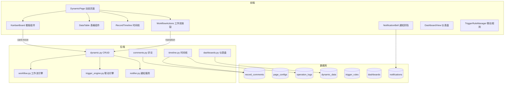

### 1.2 功能优先级

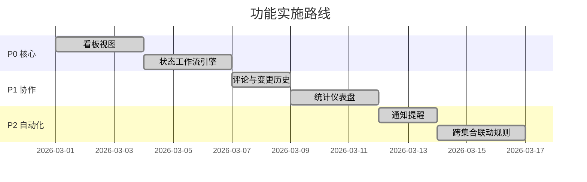

---

## 2. 数据库设计

### 2.1 ER 关系图

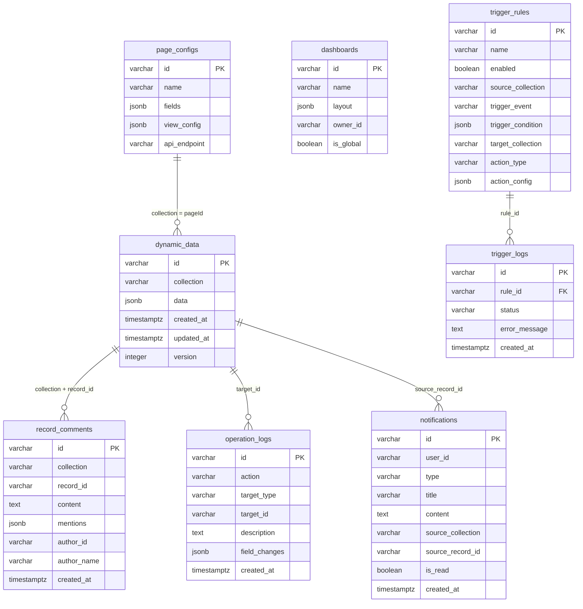

### 2.2 新增/变更表说明

| 表 | 变更类型 | 说明 |
|----|----------|------|
| `page_configs` | 新增列 `view_config` | 存储看板视图配置 (JSONB) |
| `operation_logs` | 新增列 `field_changes` | 字段级变更差异 (JSONB) |
| `record_comments` | 新增表 | 记录级评论 |
| `dashboards` | 新增表 | 仪表盘配置 |
| `notifications` | 新增表 | 用户通知 |
| `reminders` | 新增表 | 定时提醒（预留） |
| `trigger_rules` | 新增表 | 联动触发规则 |
| `trigger_logs` | 新增表 | 联动执行日志 |

---

## 3. 看板视图

### 3.1 数据流

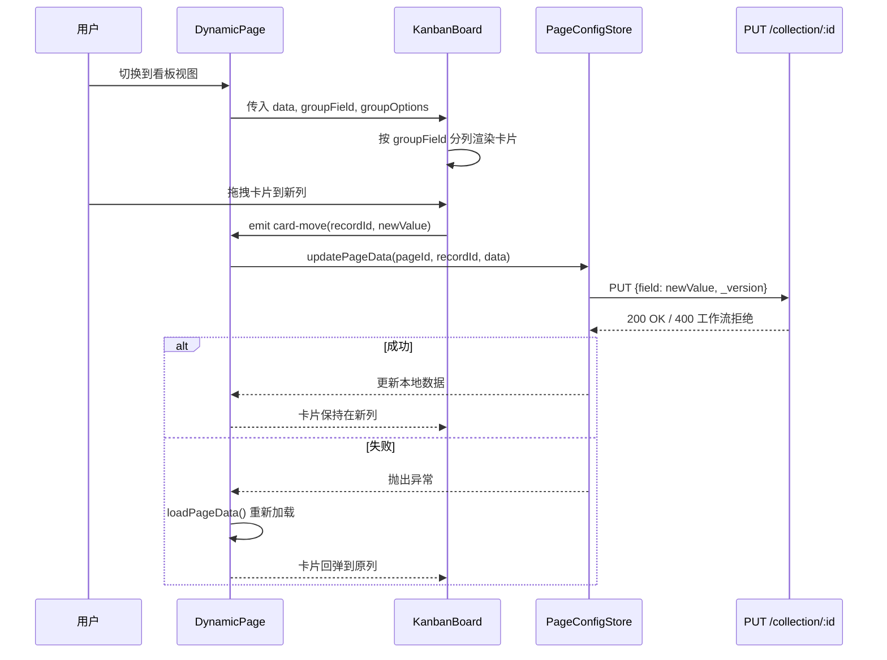

### 3.2 view_config 数据结构

```json
{
  "defaultView": "table | kanban",
  "kanban": {
    "groupField": "status",
    "cardTitle": "taskName",
    "cardFields": ["assignee", "priority", "dueDate"],
    "columnOrder": ["todo", "inProgress", "done"],
    "cardColorField": "priority"
  }
}
```

### 3.3 组件设计

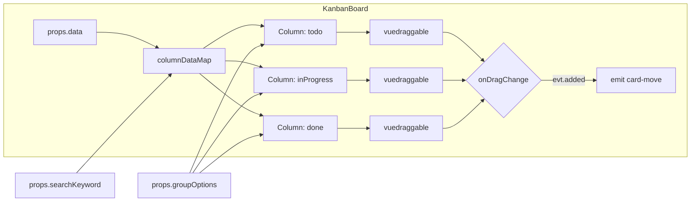

- 使用 `vuedraggable` 的 `group="kanban"` 实现跨列拖拽
- 每列维护独立的可变数组 `columnDataMap`，在 `data` 或 `searchKeyword` 变更时重建
- 卡片颜色映射：`high/urgent/紧急` → 红色, `medium/中` → 橙色, `low/低` → 绿色

---

## 4. 状态工作流引擎

### 4.1 校验流程

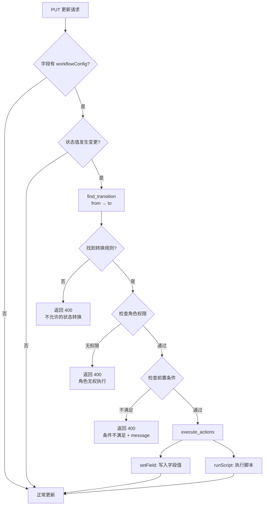

### 4.2 workflowConfig 数据结构

```json
{
  "enabled": true,
  "transitions": [
    {
      "from": "todo",
      "to": "inProgress",
      "label": "开始处理",
      "roles": ["admin", "developer"],
      "conditions": [
        { "field": "assignee", "rule": "notEmpty", "message": "请先指派负责人" }
      ],
      "actions": [
        { "type": "setField", "field": "startTime", "value": "$NOW" }
      ]
    }
  ]
}
```

### 4.3 多端一致性校验

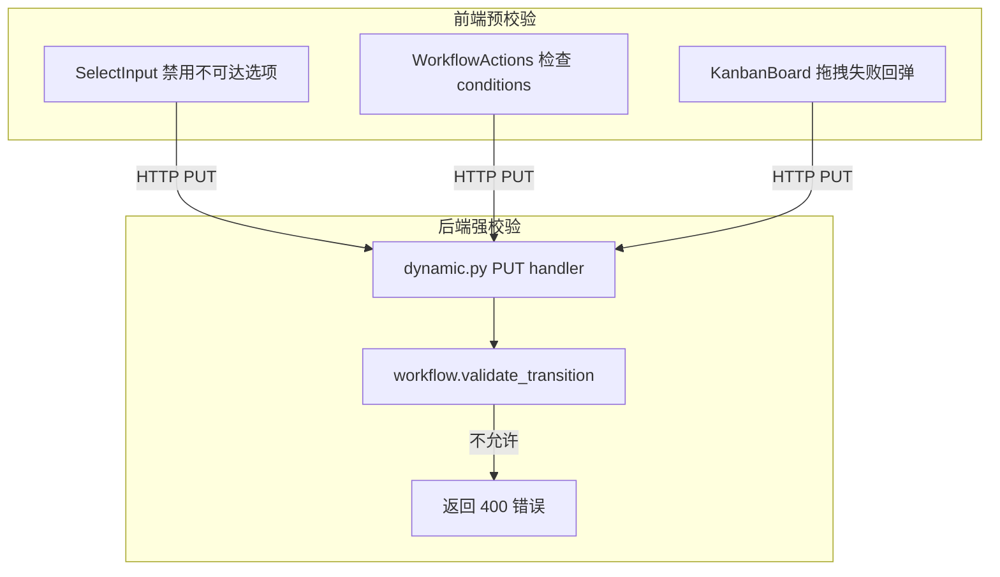

前端校验提升用户体验（禁用不合法选项、条件提示），后端校验保证数据一致性。

---

## 5. 评论与变更历史

### 5.1 时间线合并逻辑

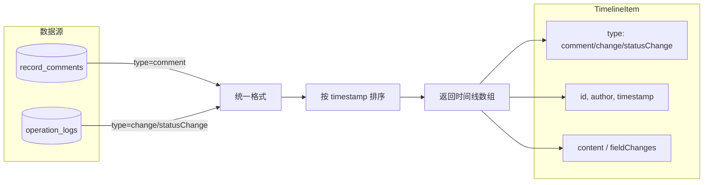

### 5.2 字段变更追踪

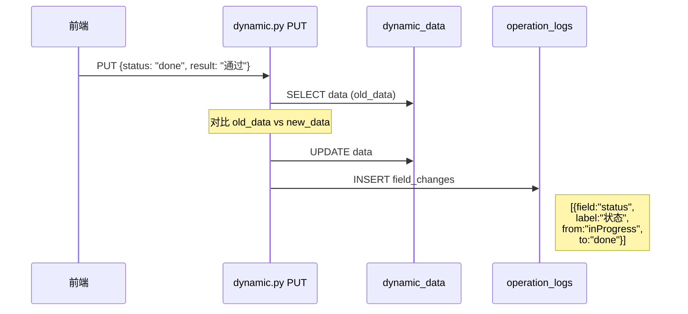

变更记录在 PUT 处理器中自动生成，对比每个字段的新旧值，将有差异的字段写入 `operation_logs.field_changes`。

---

## 6. 统计仪表盘

### 6.1 聚合查询架构

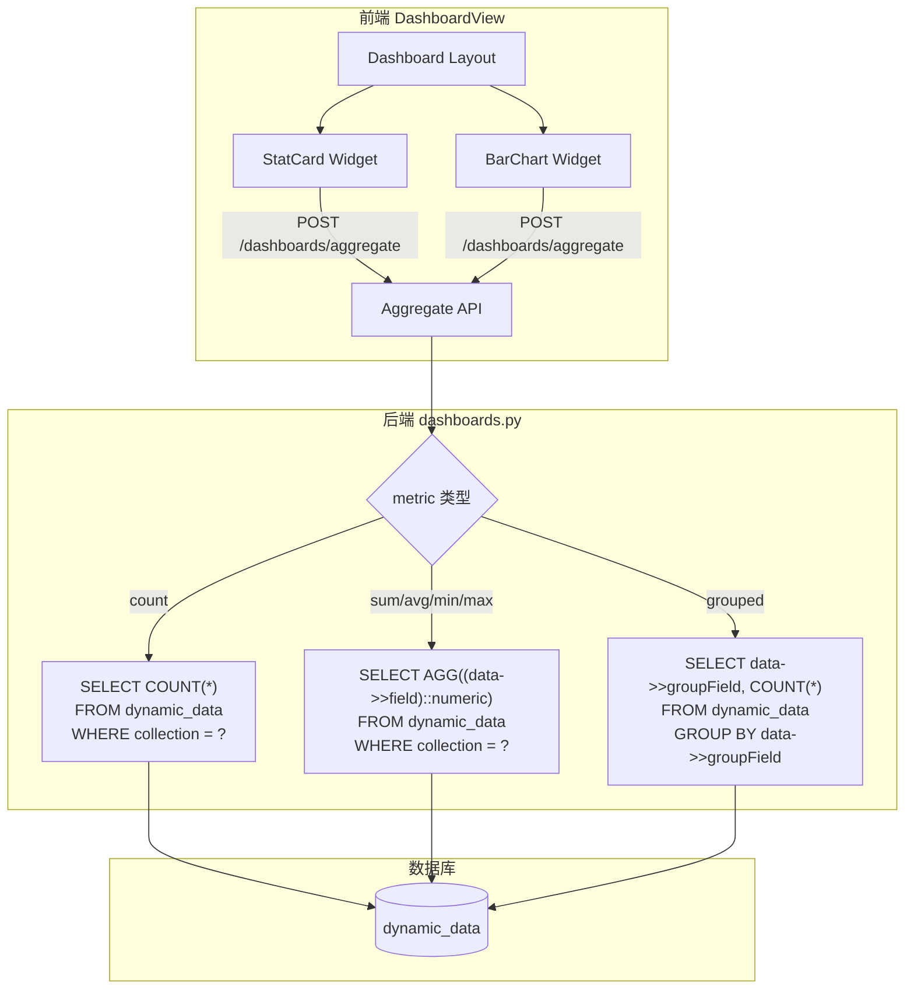

### 6.2 Widget 配置结构

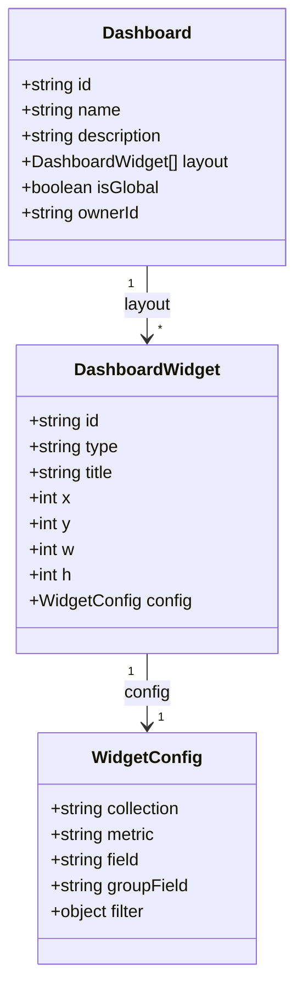

### 6.3 支持的指标

| metric | SQL 函数 | 说明 | 需要 field |
|--------|----------|------|-----------|
| `count` | `COUNT(*)` | 记录数 | 否 |
| `sum` | `SUM((data->>field)::numeric)` | 求和 | 是 |
| `avg` | `AVG((data->>field)::numeric)` | 平均 | 是 |
| `min` | `MIN((data->>field)::numeric)` | 最小值 | 是 |
| `max` | `MAX((data->>field)::numeric)` | 最大值 | 是 |

---

## 7. 通知系统

### 7.1 通知触发链路

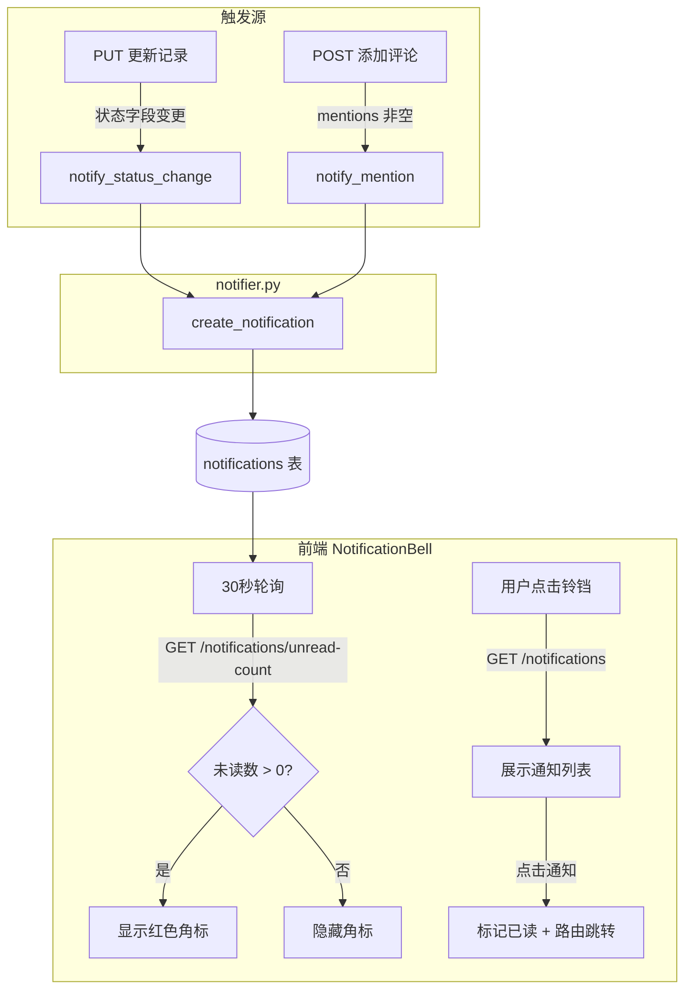

### 7.2 通知类型

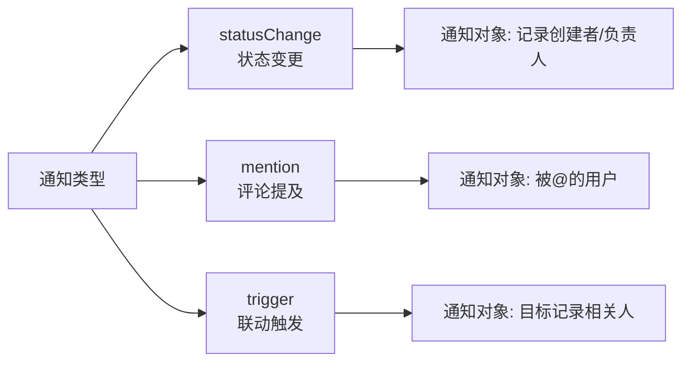

### 7.3 设计要点

- 通知创建封装在 `try/except` 中，**永远不阻塞主操作**
- 前端 30 秒轮询，点击通知自动跳转到源记录页面
- 通知记录包含 `source_collection` 和 `source_record_id`，支持精准定位

---

## 8. 跨集合联动规则

### 8.1 触发执行流程

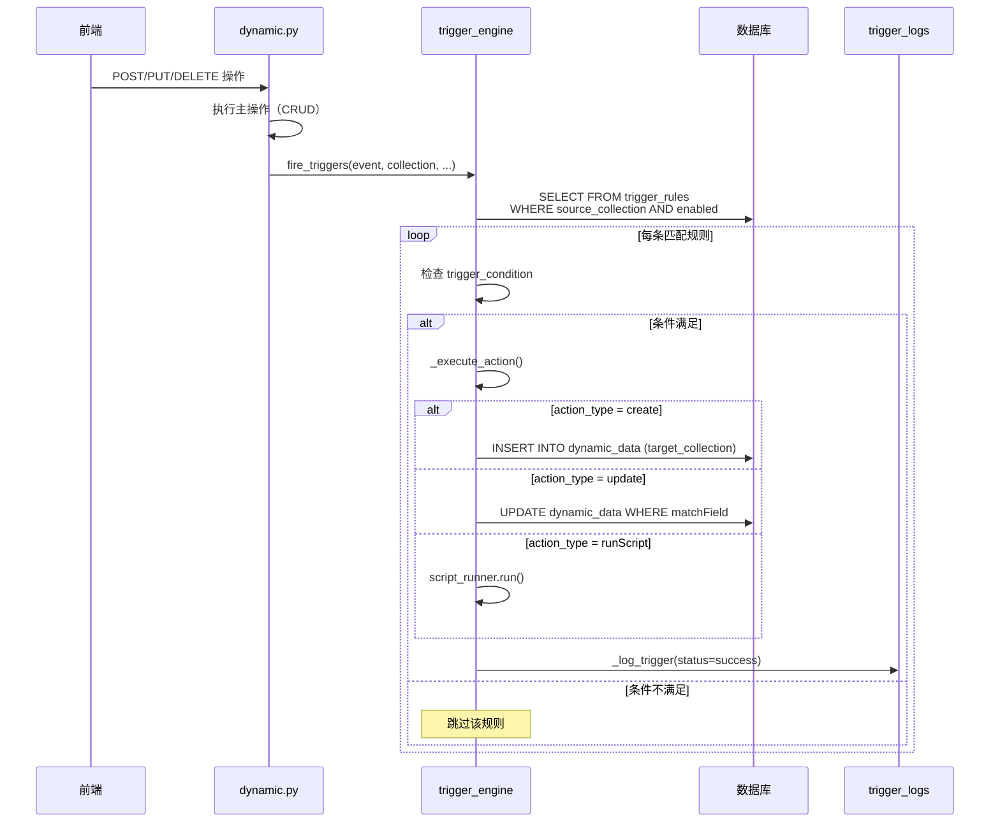

### 8.2 表达式解析

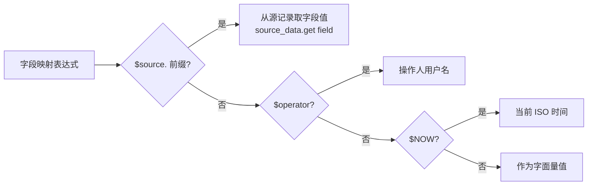

### 8.3 action_config 示例

**创建记录：**
```json
{
  "fieldMapping": {
    "taskName": "$source.title",
    "status": "pending",
    "sourceRef": "$source.id",
    "createdBy": "$operator",
    "createdTime": "$NOW"
  }
}
```

**更新记录：**
```json
{
  "matchField": "sourceRef",
  "matchValue": "$source.id",
  "updateFields": {
    "status": "$source.status"
  }
}
```

---

## 9. 后端路由注册

### 9.1 Blueprint 注册顺序

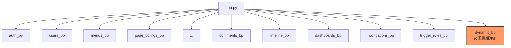

`dynamic_bp` 使用 `/<collection>` 作为 catch-all 路由，**必须最后注册**，否则会拦截其他 Blueprint 的路由。新增 Blueprint 在 `RESERVED` 集合中声明保留路径：

```python
RESERVED = {
    'menus', 'pageConfigs', 'auth', 'users', ...,
    'comments', 'timeline', 'dashboards',
    'notifications', 'triggerRules'
}
```

### 9.2 API 端点总览

| 路由 | 方法 | 功能 | 权限 |
|------|------|------|------|
| `/comments/<coll>/<rid>` | GET | 获取评论列表 | 登录 |
| `/comments/<coll>/<rid>` | POST | 添加评论 | 写入 |
| `/comments/<cid>` | PUT/DELETE | 编辑/删除评论 | 作者或管理员 |
| `/timeline/<coll>/<rid>` | GET | 获取合并时间线 | 登录 |
| `/dashboards` | GET/POST | 列表/创建仪表盘 | 登录/管理员 |
| `/dashboards/<id>` | GET/PUT/DELETE | 详情/更新/删除 | 登录/管理员 |
| `/dashboards/aggregate` | POST | 聚合查询 | 登录 |
| `/notifications` | GET | 获取通知列表 | 登录 |
| `/notifications/unread-count` | GET | 未读数量 | 登录 |
| `/notifications/<id>/read` | PUT | 标记已读 | 登录 |
| `/notifications/read-all` | PUT | 全部已读 | 登录 |
| `/triggerRules` | GET/POST | 列表/创建规则 | 登录/管理员 |
| `/triggerRules/<id>` | GET/PUT/DELETE | 详情/更新/删除 | 管理员 |
| `/triggerRules/<id>/logs` | GET | 执行日志 | 登录 |

---

## 10. 前端组件关系

### 10.1 DynamicPage 集成图

```mermaid
graph TB
    subgraph DynamicPage.vue
        direction TB
        Header[页面头部<br/>视图切换 · 搜索 · 操作]

        subgraph 视图层
            Table[DataTable<br/>表格视图]
            Kanban[KanbanBoard<br/>看板视图]
        end

        subgraph 弹窗层
            ViewDialog[查看弹窗]
            EditDialog[编辑弹窗]
        end

        Header -->|viewMode=table| Table
        Header -->|viewMode=kanban| Kanban
        Table -->|@view| ViewDialog
        Kanban -->|@card-click| ViewDialog
        Table -->|@edit| EditDialog
    end

    subgraph ViewDialog 内部
        Descriptions[el-descriptions<br/>字段详情]
        WF[WorkflowActions<br/>工作流快捷按钮]
        TL[RecordTimeline<br/>评论与变更历史]
    end

    ViewDialog --> Descriptions
    ViewDialog --> WF
    ViewDialog --> TL
```

### 10.2 管理端配置

```mermaid
graph TB
    subgraph PageConfigManager.vue
        PageForm[页面基本信息表单]
        KanbanCfg[看板视图配置<br/>分组字段 · 卡片标题 · 摘要 · 颜色]
        FieldEditor[FieldConfigEditor]
    end

    subgraph FieldConfigEditor.vue
        FieldList[字段列表 · 拖拽排序]
        FieldDialog[字段编辑弹窗]
        WorkflowCfg[工作流配置<br/>转换规则 · 角色 · 条件]
    end

    PageForm --> KanbanCfg
    FieldEditor --> FieldList
    FieldList -->|编辑| FieldDialog
    FieldDialog -->|select 类型| WorkflowCfg

    KanbanCfg -->|保存| A[(page_configs.view_config)]
    WorkflowCfg -->|保存| B[(page_configs.fields[].workflowConfig)]
```

---

## 11. 关键设计决策

| 决策 | 选择 | 理由 |
|------|------|------|
| 工作流配置存储位置 | `FieldConfig.workflowConfig` | 跟随字段定义，不新增表，配置即代码 |
| 看板配置存储位置 | `page_configs.view_config` | 页面级配置，不影响字段结构 |
| 联动规则独立表 | `trigger_rules` | 规则可跨集合，不适合嵌入单个 PageConfig |
| 通知不阻塞主操作 | `try/except` 包裹 | 通知是辅助功能，不能影响核心 CRUD 可靠性 |
| 前后端双重校验 | 前端禁用 + 后端拒绝 | 用户体验 + 数据一致性并重 |
| 时间线合并查询 | 运行时 UNION 排序 | 避免冗余存储，评论和日志各自独立维护 |
| 仪表盘聚合 | PostgreSQL JSONB 查询 | 复用现有 dynamic_data 单表，无需额外 ETL |
| 乐观锁 + 工作流 | 先版本检查再工作流校验 | 防止并发冲突导致的非法状态转换 |
