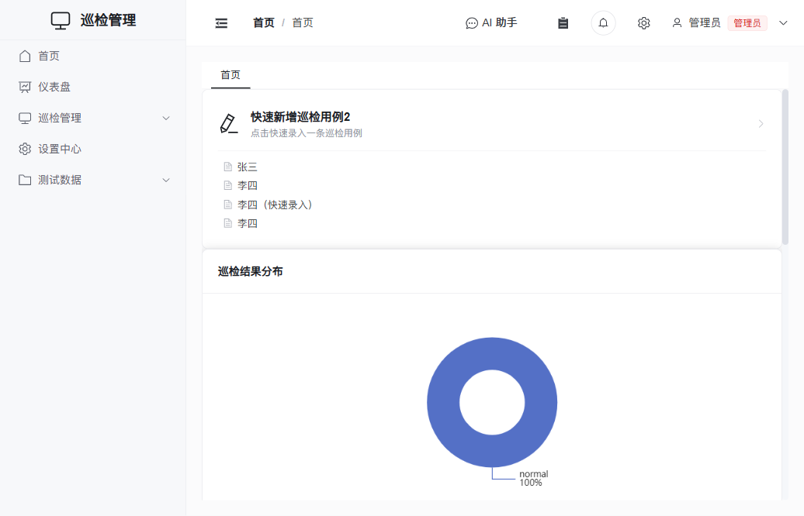

# 系统设置（品牌与登录页文案）

在 **设置中心 → 通用设置 → 基本设置** 中可定制系统的品牌信息与登录页文案，需要 `admin.system_config` 权限。修改保存后即时生效（登录页在下次打开时读取，无需重新部署）。

## 基本品牌

| 项 | 说明 | 用途 |
|----|------|------|
| 系统名称 | 完整名称 | 浏览器标题、首页标题、登录页默认标题 |
| 系统简称 | 短名称 | 侧边栏 Logo 区域 |
| Logo 图片 | 图片 URL（可选） | 自定义 Logo |

## 登录页文案

登录页的文案可单独定制（无需改代码）：

| 项 | 说明 |
|----|------|
| **登录页标题** | 登录框顶部主标题。**留空则自动使用「系统名称」** |
| **登录页副标题** | 标题下方的欢迎语 / 提示，可选；支持换行 |
| **登录页页脚** | 登录框底部文案（如版权、备案号），可选；支持换行 |

> 登录页在未登录状态下通过**公开只读接口** `GET /system-config` 获取这些文案，因此无需登录即可展示自定义内容。

### 配置步骤

1. 进入 **设置中心 → 通用设置**。
2. 在「基本设置」中填写 **登录页标题 / 副标题 / 页脚**。
3. 点击 **保存设置**。
4. 打开（或刷新）登录页即可看到效果。

### 示例

- 登录页标题：`运维巡检平台`
- 登录页副标题：`欢迎登录 · 请使用您的账号密码`
- 登录页页脚：`© 2026 XX科技 · 京ICP备12345678号`

## 首页配置 · 区块类型

在 **设置中心 → 通用设置 → 首页配置** 中点击「**新增区块**」可添加以下区块（支持拖拽排序、按角色可见、启用/停用）：

| 区块 | 用途 | 主要配置 |
|------|------|----------|
| **Markdown 区块** | 自定义富文本说明 | Markdown 正文 |
| **数据卡片** | 展示某数据页的统计数 / 列表 / 表格 | 数据页、显示类型、字段 |
| **快速录入表单** | 首页直接录入 + 展示最近记录 | 见下方专节 |
| **图表区块** | 把某数据页按字段分组计数，渲染柱状/饼/折线图 | 数据页、分组字段、图表类型、分组上限 |
| **我的待办** | 展示当前用户的工作流待办，点击跳转到对应记录 | 显示条数 |
| **最近动态** | 展示最近的操作日志（谁在何时改了什么） | 显示条数 |
| **公告** | 高亮通知横幅：标题 + Markdown 正文 + 级别配色，可设为可关闭 | 标题、级别、正文、可关闭 |

> **图表区块**：按分组字段的**原始存储值**分组统计（与仪表盘一致）。
> **最近动态**：操作日志接口需要 `admin.operation_logs` 权限，无该权限的角色会看到空状态——建议把此区块的「可见角色」限定为管理员。
> **公告**：勾选「可关闭」后用户可关掉公告，关闭状态记在浏览器本地；公告正文更新后会重新出现。

## 首页配置 · 快速录入表单

在 **设置中心 → 通用设置 → 首页配置** 中可添加首页区块。其中「**快速录入**」区块在首页放一个入口，点击后弹出某个数据页的录入表单，提交即新增一条记录；区块内还会**展示该数据页最近 5 条记录**（提交后自动刷新）。

> **启用开关 vs 删除**：每个区块前的开关控制它**是否显示在首页**。关闭开关只是**停用**——区块仍保留在「首页配置」列表中（开关呈关闭态），刷新后依然可见，随时可重新打开；只有点击「删除」才会真正移除该区块。

**图标**：「图标」改为**可视化选择器**——可搜索并直接选中 Element Plus 任一图标（带预览，可清空=用默认图标），无需手填图标名。

**指定要录入的字段**：编辑「快速录入」区块时，除按钮文字、说明、图标、**关联数据页**外，还可在「**录入字段**」中：

- **多选**该数据页的字段，弹出的录入表单将**只包含**这些字段；
- 字段**按选择先后顺序**展示；
- **留空**则录入该数据页的**全部字段**（自动序列、自动时间戳等自动生成字段始终不出现，无需填写）。

**指定「最近 5 条」展示的字段**：在「**显示字段**」中可选择该数据页的任一字段（含自动序列、合成文本等），区块内「最近 5 条」列表每行就展示该字段的内容。**留空**则自动取该数据页第一个文本类字段（找不到时回退为记录 ID）。

**点击行跳转**：区块内「最近 5 条」的每一行均可点击，点击后会**跳转到对应数据页并自动定位、高亮**该条记录（必要时自动翻到其所在页）。

切换关联数据页时，已选录入字段与显示字段会自动清空（避免残留上一个数据页的字段）。

