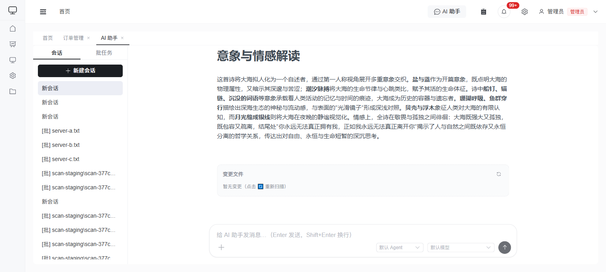

# AI 助手

AI 助手是一个类 Claude 的对话抽屉，接入 **OpenCode** 智能体运行时，可调用平台能力（经独立 MCP Server，受同样的 RBAC 权限约束）协助脚本开发、自测与业务数据问答。入口为顶部导航栏的 **「AI 助手」** 按钮。

> AI 助手界面（左侧会话/批任务列表，右侧对话与变更文件，底部 Agent / 模型选择）：
>
> 

## 开始对话

1. 点击顶部 **AI 助手** 打开右侧抽屉。
2. 在底部输入框输入问题，回车发送。
3. 助手以流式（SSE）逐字返回；工具调用会以气泡形式展示。
   - **执行计划（待办清单）**：当助手使用待办工具（`todowrite`/`todoread`）规划多步任务时，会渲染成一个**「执行计划」清单**，每一步带状态图标（✓ 已完成 / ⟳ 进行中 / 🕘 待办 / 划线 已取消），**进行中的步骤高亮**，标题右侧显示完成进度（如 `2/5`）——这样你能随时看清助手执行到了哪一步。

## @ 子智能体

在输入框中键入 `@`，弹出**子智能体补全菜单**，可将消息定向给指定的 subagent 处理（如专门的脚本开发助手）。

## 模型选择

在抽屉顶部可切换本次会话使用的**模型**（如 Claude / 其它已配置的 Provider）。

## 会话与历史

- 每个会话有独立的隔离工作区；消息持久化保存，可在会话列表中切换回看。
- 抽屉内可在 **「会话 / 批任务」** 标签间切换；批任务用法见 [AI 批任务](./batch-tasks.md)。

## 平台能力

通过给 OpenCode 增加 skill，助手即可获得新能力（前端零改动）。助手访问平台数据时经 MCP Server 校验令牌并推导用户身份，因此**只能访问你有权限的数据**。

## 产出文件与变更文件

右侧抽屉提供两个文件面板，覆盖范围不同：

- **产出文件**：列出助手**生成**的真实文件——递归扫描整个工作区，既包括写入 `outputs/` 的文件，也包括写在工作区根目录或**任意普通子目录**下的文件（如 `report.md`、`reports/q1/jan.md`）。每个文件都可**预览**（在侧边抽屉里查看文本内容，二进制文件提示下载）或下载。产出文件**按所在目录分组**，每个目录是一个**可折叠分组**（点击目录名左侧箭头收起/展开，默认展开；根目录文件归入「根目录」分组），文件多时可把不关心的目录折叠起来。以下不在此列出：你上传的输入文件（`uploads/`）、噪声目录（`node_modules/`、`.venv/` 等），以及**通过 git clone 得到的仓库**——克隆仓库里的改动属于「变更文件」面板。
- **变更文件**：基于工作区内 git 仓库的 `git status`，展示**新增/修改**的文件及其 diff（删除的文件不在此列出）。`uploads/`、`outputs/` 被忽略，不在此面板出现。该面板在每轮对话结束后自动刷新；若助手写出的文件未被自动捕获，可点击 🔄 手动重新扫描。
  - **拉取的代码仓 = 初始状态（基线）**：助手拉下来的代码仓，其内容是**基线**，不会被算成「新增」——面板只记录你/助手在它之上**真正新建或修改**的文件。正常 `git clone`（保留 `.git` 历史）天然如此：仓库自己的提交就是基线。对于**没有提交历史**的拉取内容（克隆后被剥掉 `.git`、或解压的源码后 `git init` 却未提交），系统会**自动为该代码仓建立一次基线提交**，使其等同于一个带历史的克隆——之后只显示真实改动，而不是把整仓文件铺成「新增」。（工作区**根目录**那个用于跟踪的 git 仓库不会被自动提交，因此助手直接写在工作区里的产出文件仍会照常显示为新增。）
  - **大目录折叠**：对于**不是 git 仓库**的大批新文件（如解压到普通子目录的内容），若文件很多则**折叠为一条「目录/ (N 个新文件)」**，避免几百个文件淹没你真正关心的改动；**点击该折叠条目即可就地展开**，查看里面的全部文件（可预览/下载）。文件较少的目录仍逐个列出。
  - **数量上限 500**，超出时按优先级保留：**源码文件的新增/修改最优先，依赖/产物文件（锁文件、`dist/`、`node_modules/`、`.min.js`、`.map` 等）的新增/修改靠后**。这样即使有大量自动生成的文件，你真正修改的源码也不会被挤出列表。

> 简言之：助手「产出」的文件看**产出文件**面板；对已有代码/文件的「改动」看**变更文件**面板。

> ⚠️ **拉取远端代码的注意事项**：工作区根目录本身已是一个用于变更跟踪的 git 仓库。助手拉取远端代码时应 **`git clone` 到子目录**（保留其自己的 `.git`），在子目录里的改动会被「变更文件」正确显示。若强行在工作区**根目录**做 git 操作（init/clone/reset/替换根 `.git`），会破坏变更跟踪、可能让 `git status` 把所有文件误报为「已删除」。系统已通过工作区内的 `AGENTS.md` 和每轮提示引导助手遵守此规则。

## 会话治理与审计

### 关闭、重开、清空、删除

对自己的会话有三种操作：

- **关闭（可逆）**：会话在列表中**灰显**、实时流停止；点击「重开」即可恢复对话（若底层运行时会话已失效，系统自动重建上下文）。历史保留。
- **清空（原地重置）**：会话**保留在列表中并可立即继续使用**，但会**清空对话历史**和**工作区内的全部文件**，并重置底层运行时上下文（重新签发令牌、新建运行时会话）。相当于把会话「恢复出厂」，适合复用同一个会话开始一段全新的任务。⚠️ 历史与文件不可恢复。
- **删除（不可逆）**：从列表中移除、令牌作废、底层运行时会话与工作区清理，**不可重开**。会话行与消息在后台保留以供审计溯源，但你不再可见。

三种操作都会写入操作日志（按 `target_type='ai_chat_session'` 可审计）。

### 归档（管理员操作）

拥有 `admin.ai_chat_admin` 能力的管理员（内置 `admin` 超级用户默认拥有）可列出**所有用户**的会话并执行「归档」（当前经治理接口 `GET /ai/chat/admin/sessions`、`POST /ai/chat/sessions/<id>/archive` 提供，独立的管理页为后续增强）。归档后的会话个人**不可**重开，仅供只读查阅。

### 审计日志

会话生命周期操作（创建、关闭、重开、归档）均记录在系统「操作日志」中。在操作日志页面筛选目标类型为 **AI会话**（`ai_chat_session`）即可按操作人、时间、动作进行审计。

## 管理配置

AI 全局配置位于 **设置中心 → AI 能力（`/admin/ai`）**：模型 Provider、默认 Agent 等。
