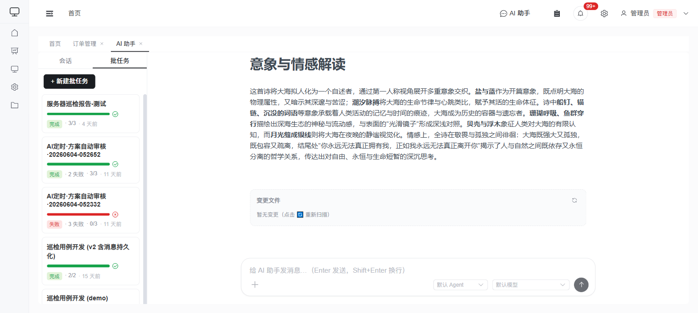

# AI 批任务

批任务让你用**一个 Prompt 批量处理 N 个文件**：选择多个输入文件 + 一段提示词，系统为每个文件开一个隔离的 AI 子会话并发处理（限流 3 个并发）。批任务以**可折叠分组**的形式直接出现在 AI 助手的会话列表中——点击分组标题展开即可查看该批所有子任务，点击子任务可打开其完整对话（含工具调用气泡，与普通会话一致）。

> 批任务分组（每个分组显示进度条、完成/失败状态、子任务计数、Agent/模型，以及追加/重试/删除操作）：
>
> 

## 创建批任务

1. 打开 AI 助手抽屉。
2. 点击 **新建批任务**。
3. 在对话框中：
   - **上传 / 选择输入文件**（每个文件对应一个子会话）；
   - 填写 **Prompt**（可从 Prompt 模板中选用）；
   - 选择 **Agent**（可选，留空用 OpenCode 默认 Agent）；
   - 选择 **模型**（可选，留空用默认模型）。
4. 提交后进入批任务列表，开始排队执行。

> 所选 **Agent / 模型** 会显示在批任务列表与批详情头部（留空显示「默认」），便于核对实际用了哪个 Agent / 模型。

## 执行与监控

- 子任务以 **FIFO** 顺序认领，最多 **3 个并发**，每个子会话超时 30 分钟。
- 分组头部实时显示进度（已完成/总数）、Agent、模型等信息。
- 点击子任务可打开它**完整的对话线程**，包括所有**工具调用气泡**（与普通会话完全一致）。

> **子任务一直「待运行」？** 子任务由后端的**进程内 Worker** 认领执行。若所有批任务都长期停在「待运行」、毫无进展，通常是 Worker 没有运行：
> - 确认后端是用最新代码启动的（Worker 在 `app.py` 启动时随调度器一起拉起）。后端日志（`server/ai-chat.log`）会打印一行 `batch dispatcher started`，可据此确认 Worker 已启动。
> - Worker 的认领循环已做容错：单次数据库抖动等瞬时错误不会再让调度线程退出（否则之后所有批任务都会永久卡在「待运行」），出错会记录日志并自动重试。

## 追加文件

对于**已有批次**，无论其当前状态（运行中、已完成、部分失败、全部失败），都可以**追加更多文件**继续处理：

- 在分组的操作菜单中点击 **追加文件**，选择新的输入文件。
- 新子任务接着已有序号排队执行，批任务状态自动回到运行中，后台 Worker 自动接管。

## 编辑 Agent / 模型

批次分组头部的「**编辑**」图标可随时修改该批次使用的 **Agent** 和 **模型**（留空 = 恢复默认）。改动立即持久化，后续的「重试失败」「重新执行」以及尚未运行的子任务都会使用新的配置。

> **典型场景**：某模型不可用或卡住时，可直接切到可用模型后重跑，无需删除批次重新创建。

## 预置仓库（项目级 Agent / Skill）

创建批任务（或在「编辑」对话框）里可填写**预置仓库**（git URL + 可选分支/ref）。系统会在**每个子会话启动前**把该仓库**浅克隆进子工作区的 `.opencode/`**，使其中的**项目级 Agent / Skill** 对该会话可用——这样就能在批任务里使用「从远端仓库下载的、随仓库更新的」Agent/Skill，而不仅限于全局预置的那些。

- **仓库布局**：仓库根目录即 `.opencode` 的内容（应包含 `agent/`、`skill/`、`command/` 等子目录）。
- **Agent 名可手填**：项目 Agent 在创建时还不在全局列表里，Agent 选择框支持**直接输入**仓库里那个 Agent 的名字。
- **为什么是「预置」而不是运行中加载**：OpenCode 在**发送 prompt 的那一刻**就绑定了 Agent，所以 Agent 定义必须在会话开始前就位；这也是为什么**修改正在执行的 Agent 不会生效**——要应用新的 Agent 定义，请更新仓库后对子任务点**重新执行**（全新会话会重新预置）。（Skill 是按调用时解析的，可在会话运行中热加载。）
- **失败降级**：克隆失败**不会让子任务失败**——会话仍以**全局 Agent / Skill** 继续运行，并在该会话的对话里插入一条 `⚠️ 预置仓库克隆失败，已使用全局 Agent / Skill 继续` 的提示。

## 失败与重试

- 失败的子任务会被**红色标记**，但**不会中断整个批任务**。
- 在分组的操作菜单中点击 **重试失败项**，系统把所有失败的子任务重置为待处理，由后台重新认领执行。
- 展开批次后，**已完成或失败**的子任务行有「**重新执行**」入口——会**清空该子任务的旧对话**并用全新会话从头重跑。与批量「重试失败」不同，后者只重置所有失败项且不清上下文。
- 没有自动重试。

## Prompt 模板

常用提示词可保存为 **Prompt 模板**（按用户维护），在创建批任务时一键选用。

## 相关

- 单条对话见 [AI 助手](./assistant.md)。
- 按计划自动扫描数据页并回写结果，见 [定时 AI 数据流水线](./scan-tasks.md)。
