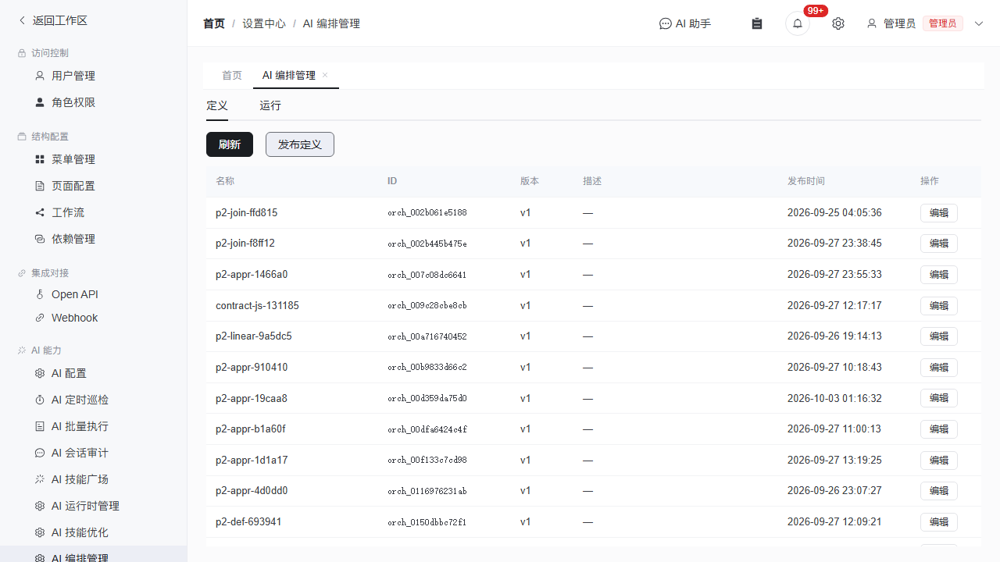
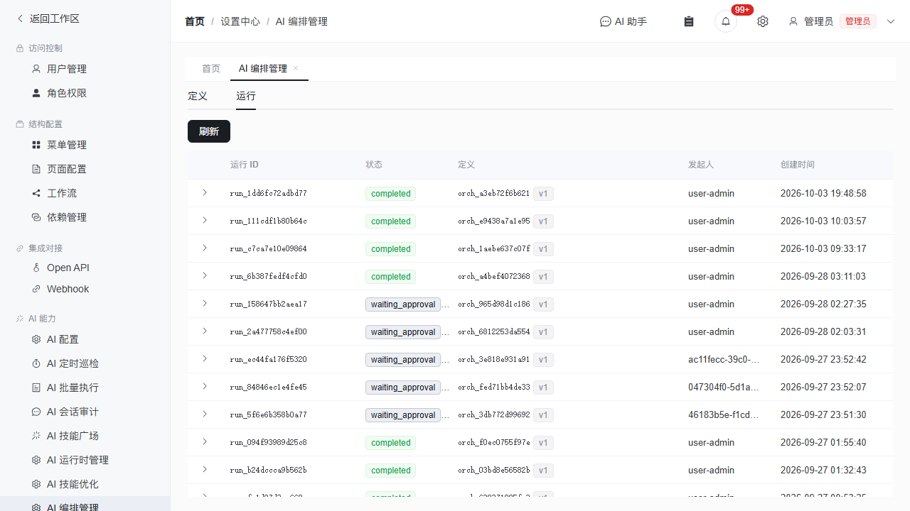
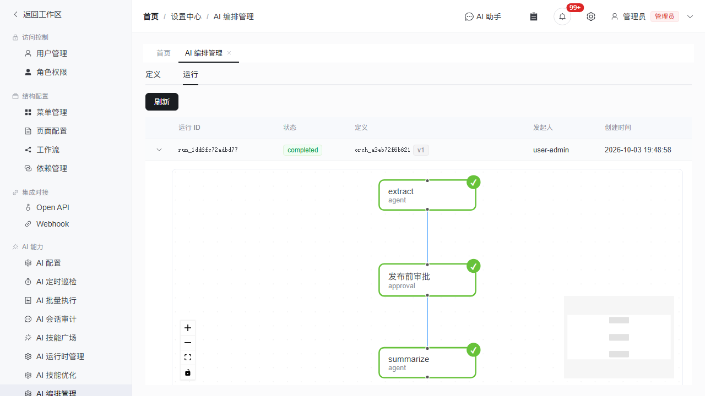

# AI 编排管理使用指南

> **路径**：设置中心 → AI 能力 → AI 编排管理
> **权限**：管理员或被授予 `admin.ai_orchestration_admin` / `admin.ai_chat_admin` 能力键的用户
> **前置**：AI 批任务功能已启用（编排 run 复用批 worker 执行）

---

## 概述

AI 编排管理用于定义和管理**多步骤 AI 工作流**。一个编排（Orchestration）由多个步骤（Step）组成，步骤之间通过依赖关系（DAG）连接，支持：

- **Agent 步骤**：调用 AI 执行任务（写 prompt、选模型/技能）
- **审批步骤**：人工审批节点（通过/拒绝后才继续下游）
- **Join 汇聚节点**：并行分支的汇聚点
- **条件分支**：根据上游输出自动路由到不同下游
- **并行扇出**：一个节点同时触发多个下游

编排定义发布后不可变（每次编辑产生新版本），运行时冻结定义版本保证可追溯。

---

## 页面导航

进入 **设置中心 → AI 能力 → AI 编排管理**，页面分为两个标签页：



- **定义**：编排定义（蓝图）的创建、编辑、发布
- **运行**：编排运行实例的状态查看、DAG 可视化、审批

---

## 定义管理

### 查看定义列表

定义 tab 展示所有已发布的编排定义，每行包含：

| 列 | 说明 |
|---|---|
| 名称 | 定义的人类可读名称 |
| ID | 定义标识（`orch_` 前缀） |
| 版本 | 当前最新版本号（v1、v2…） |
| 描述 | 定义说明文字 |
| 发布时间 | 最近一次发布的 UTC 时间 |
| 操作 | **编辑**按钮——打开拖拽式 DAG 编辑器 |

### 发布新定义

点击 **发布定义** 按钮，在对话框中输入 JSON：

```json
{
  "name": "报告分析流水线",
  "description": "从文件抽取事实→交叉核验→生成报告",
  "nodes": [
    { "id": "extract", "kind": "agent", "name": "抽取事实", "prompt_template": "从 {{inputs.files}} 中抽取关键事实…" },
    { "id": "review", "kind": "agent", "name": "交叉核验", "prompt_template": "核对以下事实：{{steps.extract}}" },
    { "id": "report", "kind": "agent", "name": "生成报告", "prompt_template": "基于 {{steps.review}} 生成最终报告" }
  ],
  "edges": [
    { "source": "extract", "target": "review", "kind": "advance" },
    { "source": "review", "target": "report", "kind": "advance" }
  ]
}
```

后端会自动校验：无环检测、node id 唯一、edge 引用存在、join 有多条入边、审批节点有审批人。

### 编辑定义

点击定义行的 **编辑** 按钮，打开拖拽式 DAG 编辑器：

编辑器布局分三个区域：

| 区域 | 功能 |
|---|---|
| **左侧面板** | 节点类型列表（Agent / Approval / Join），点击添加到画布 |
| **中央画布** | Vue Flow 交互画布——拖拽移动节点、从节点底部圆点拖到另一节点顶部圆点连线、点击选中 |
| **右侧面板** | 选中节点/边的属性编辑器 |

#### 画布操作

| 操作 | 方式 |
|---|---|
| 添加节点 | 点击左侧面板中的节点类型按钮 |
| 移动节点 | 拖拽节点到目标位置 |
| 连线 | 从节点**底部**圆点拖到另一节点**顶部**圆点 |
| 删除节点 | 点击节点选中 → 按 Delete 键（关联边自动删除） |
| 删除边 | 点击边选中 → 按 Delete 键 |
| 缩放 | 鼠标滚轮 / 右下角 Controls |
| 平移 | 拖拽画布空白区域 |

#### 属性编辑

点击画布中的节点，右侧面板显示该节点的属性：

| 字段 | 适用节点类型 | 说明 |
|---|---|---|
| 名称 | 全部 | 步骤的人类可读名称 |
| Prompt 模板 | Agent | 发给 AI 的提示词，支持 `{{steps.<id>}}` 引用上游输出 |
| 模型 | Agent | 覆盖默认模型（留空用全局默认） |
| 超时（秒） | Agent | 步骤最长执行时间，超时自动标 failed |
| Join 策略 | Join | `all_success`（全部成功）或 `any_success`（任一成功） |
| 优先级 | 全部 | 数值越高越先调度 |

点击画布中的**边**，右侧面板切换为条件编辑：

| 字段 | 说明 |
|---|---|
| 字段 | 条件引用的输出字段名（如 `text`） |
| 操作符 | contains / not_contains / == / > / >= / < / <= |
| 值 | 比较目标值 |

条件边只在**源节点成功且有输出**时才做路由判断——源节点未产出前，所有出边目标都是候选（不会被提前 skip）。

#### 保存与版本

点击画布右上角 **保存** 按钮：

1. 前端预校验（空画布 / 自环 / 环检测 DFS）
2. 后端 `validate_definition` 复检
3. 同 id 定义自动 **version + 1**（旧版本保留可追溯）
4. 刷新列表显示新版本号

> **注意**：编辑已发布的定义不会影响正在运行的 run——run 冻结了发布时的定义版本。

---

## 运行管理

### 查看运行列表

运行 tab 展示所有编排运行实例：



| 列 | 说明 |
|---|---|
| 运行 ID | `run_` 前缀的唯一标识（点击展开） |
| 状态 | `pending` / `running` / `waiting_approval` / `completed` / `partial` / `failed` / `needs_review` |
| 定义 | 关联的定义 ID + 版本 |
| 发起人 | 发起运行的用户 |
| 创建时间 | 运行创建时间 |

### 展开运行 DAG

点击运行行首的 **展开箭头**，显示该运行的 **DAG 可视化**：



每个节点代表一个步骤，**按状态着色**：

| 节点颜色 | 徽标 | 状态 | 含义 |
|---|---|---|---|
| 🟢 绿色 | ✓ | succeeded | 步骤成功完成 |
| 🔴 红色 | ✗ | failed | 步骤执行失败 |
| 🔵 蓝色 | ● | running | 正在执行（节点带脉冲动画） |
| 🟠 橙色 | ⏳ | waiting_approval | 等待人工审批 |
| ⚪ 灰色 | ○ | blocked | 依赖未满足 |
| ⬜ 浅灰 | → | skipped | 被跳过（条件不命中或上游失败） |
| 🟣 紫色 | ? | needs_review | 需人工复核（副作用不确定） |

**边的动画**：源节点正在运行时，其出边显示流动动画。

**点击节点**可查看该步骤的详细输出（JSON）、错误信息、尝试次数和耗时。

右下角 **MiniMap** 显示整个 DAG 的缩略图，可快速导航大型流程。

### 审批

当运行中有步骤进入 `waiting_approval` 状态时，具备审批权限的用户可执行：

- **通过**：步骤从 checkpoint 继续
- **拒绝**：步骤标 failed，下游级联 skip
- **编辑后批准**：修改参数后批准

审批操作通过左侧导航 **工作流 → 我的待办** 收件箱或通知中心完成。

---

## 监控与排查

### 常见状态诊断

| 现象 | 可能原因 | 排查方式 |
|---|---|---|
| run 永久 running | 某个 step 卡住（子会话无响应） | 检查 AI 批任务管理页对应子会话状态 |
| step failed + `step timeout` | 超过了定义的 timeout_sec | 增大 timeout 或排查子会话失败原因 |
| run = waiting_approval | 有审批节点待处理 | 前往我的待办处理审批 |
| run = needs_review | 存在结局未知的副作用 | 人工确认后 retry 或 reexecute |
| join 被跳过 | 上游分支全部失败/跳过 | 检查条件分支的 output 是否命中 |

### 与批任务的关系

编排 run 的 agent step 复用批任务的执行基础设施（worker 认领、工作区隔离、effect 账本、事件流）。每个 step 在 AI 批任务管理页表现为一个子会话：

- 在 **AI 批任务管理** 页（设置中心 → AI 能力 → AI 批量执行）可查看子会话的完整对话、工具调用和产物
- 编排子会话的正常发送/命令/压缩被门禁拦截（409），由 worker 独家驱动

---

## API 参考

编排功能也通过 Open API 暴露，供外部系统调用：

| 端点 | 说明 |
|---|---|
| `POST /ai/orchestrations/definitions` | 发布定义（同 id 自动 version +1） |
| `GET /ai/orchestrations/definitions` | 列出定义 |
| `GET /ai/orchestrations/definitions/{id}` | 获取定义详情 |
| `GET /ai/orchestrations/runs` | 列出运行 |
| `GET /ai/orchestrations/runs/{id}` | 获取运行详情（含 steps） |
| `POST /ai/orchestrations/runs` | 发起运行 |

详见 API 参考文档（`docs/user-guide/integration/`）。

---

## 与其他功能的关系

```text
AI 编排
  ├── 使用批 worker 执行（复用工作区隔离/effect 账本/事件流）
  ├── 使用动作门禁核对（终态时验证输出 contract）
  ├── 使用审批收件箱（人工介入）
  ├── 产物写入 Artifact Store（持久化不依赖 workspace）
  └── 事件写入 ai_batch_events（管理面实时展示）
```
