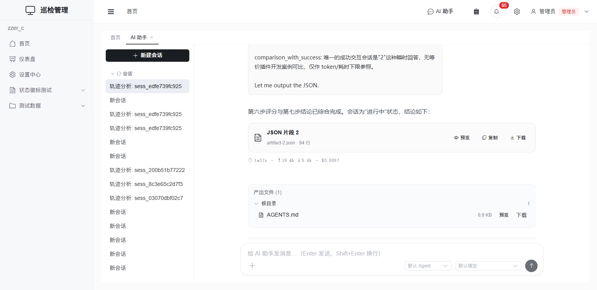

# AI 执行轨迹分析

管理员可以对任意一次 AI 会话执行**轨迹分析**：由 AI 加载 `trace-analyzer` 技能，调用平台 MCP 工具读取该会话的完整执行数据（工具调用序列、推理过程、子代理委托、耗时 / Token / 异常），按六步流程产出一份结构化诊断报告——评分、根因、失败模式与可操作的优化建议。

## 发起分析

1. 进入 **设置中心 → AI 会话管理**（`/admin/ai-sessions`）。
2. 找到目标会话所在行，点「操作」下拉里的 **轨迹分析**（会话详情抽屉里也有同样的按钮）。
3. 系统会自动创建一个「轨迹分析: <会话ID>」的分析会话，并在新标签页打开它。分析由 AI 自主执行，通常需要 1–2 分钟。

分析会话本身就是一个普通 AI 会话：分析过程（每一步工具调用、推理）完整可见，结束后会得到一份 JSON 格式的诊断结论（评分、根因、失败模式、建议、置信度），并保存为工作区里的 artifact 文件，可预览 / 复制 / 下载。分析结果**服务端持久化**——之后随时从会话列表重新打开回看，不依赖当时是否停留在页面上。

> 轨迹分析的最终结论（结构化 JSON artifact + 本轮统计）：
>
> 

## 诊断报告包含什么

| 内容 | 说明 |
|------|------|
| 六步评分 | 任务完成度 / 指令遵循 / 工具效率 / 推理质量 / 资源效率 / 容错恢复，加权总分与等级 |
| 失败模式 | 参照 MAST 分类法标注（如工具选择错误、探索循环、结果不完整），会话正常进行中也会如实标注 |
| 根因分析 | 一句话根因 + 证据摘要（来自真实轨迹数据） |
| 优化建议 | 每条带实施成本（effort）/ 预期收益（impact）/ 是否可自动应用（auto_applicable） |
| 置信度 | 0–1，供人工复核参考 |

## 前置条件与常见错误

轨迹分析的分析引擎运行在 OpenCode 内部，**依赖平台 MCP 服务器**提供 `analyze_trace` / `query_sessions` 工具：

- 开发环境用 `npm run dev:all` 启动时会一并拉起 MCP 服务器；如果只单独启动了前端 / 后端，请补跑 `npm run mcp`。
- MCP 服务器未运行时点「轨迹分析」会**立即失败**并提示：`MCP 服务不可用（http://127.0.0.1:3003）… 请先启动 MCP 服务器（npm run mcp 或 npm run dev:all）后重试`——按提示启动后重试即可。系统不会在缺少工具的情况下静默跑一次降级的假分析。

## 相关文档

- [AI 助手](./assistant.md)：对话、子智能体委托执行轨迹的查看方式
- [AI 批任务](./batch-tasks.md)：管理员跨用户查看批任务对话
