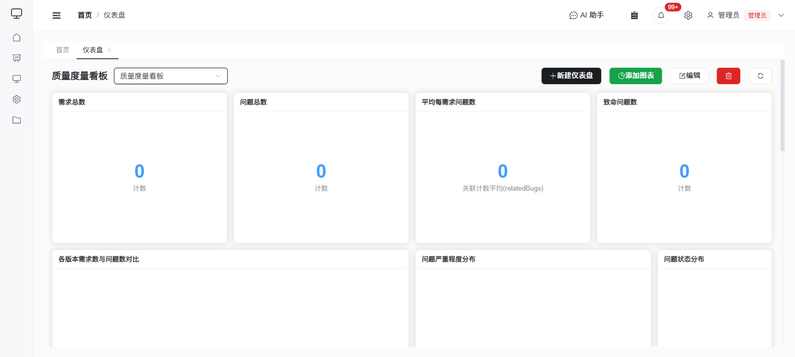

# 仪表盘图表功能使用手册

本文档面向系统使用人员，说明如何在仪表盘中创建、配置、查看和维护图表。

> 仪表盘示例（指标卡 + 多种图表面板）：
>
> 

## 1. 功能概览

仪表盘用于把业务数据以可视化方式集中展示。当前版本支持以下图表组件：

- 指标卡
- 柱状图
- 二维柱形图
- 折线图
- 饼图
- 环形图（新增）
- 面积图
- 仪表盘（新增）
- 雷达图（新增）
- 漏斗图（新增）
- 数据表

图表数据来自系统中已配置的数据集合，统计结果由后端实时聚合生成，不需要额外同步报表数据。

## 2. 入口与权限

### 2.1 访问入口

- 菜单入口：`仪表盘`
- 路由地址：`/dashboard`

### 2.2 权限说明

- 所有已获得仪表盘菜单权限的登录用户都可以进入仪表盘页面并查看图表。
- 仪表盘的新建、编辑、删除，以及图表的新增、修改、删除，后端要求管理员权限。
- 如果普通用户点击了配置类按钮，保存时会因权限不足失败。

### 2.3 可见范围

- 勾选“全局可见”的仪表盘，其他有权限的用户也可以看到。
- 未勾选“全局可见”的仪表盘，仅创建者本人可见。

## 3. 快速开始

### 3.1 新建仪表盘

1. 进入 `仪表盘` 页面。
2. 点击右上角 `新建仪表盘`。
3. 填写以下信息：
   - 名称：必填
   - 描述：选填
   - 全局可见：按需开启
4. 点击 `保存`。

### 3.2 添加图表

1. 打开目标仪表盘。
2. 点击 `添加图表`。
3. 在弹出的编辑窗口中依次配置：
   - 图表类型
   - 数据集合
   - 指标
   - 主分组
   - 次分组/系列拆分
   - 过滤条件
   - 显示选项
4. 右侧预览区域确认结果无误后，点击 `确定`。

### 3.3 刷新数据

- 点击页面右上角 `刷新` 可重新加载当前仪表盘中的全部图表数据。
- 在图表编辑窗口中修改配置后，系统会自动刷新预览；也可以手动点击 `刷新预览`。

## 4. 图表配置说明

### 4.1 图表类型

| 类型 | 适用场景 | 是否支持主分组 | 是否支持次分组 | 特殊配置 |
|------|----------|----------------|----------------|----------|
| 指标卡 | 展示单个统计值，如总数、总金额 | 否 | 否 | - |
| 柱状图 | 对比不同分组的数据量或数值 | 是 | 是 | - |
| 二维柱形图 | 按”主分组 x 次分组”展示多系列柱图 | 是 | 是，必选 | - |
| 折线图 | 展示趋势变化 | 是 | 是 | - |
| 饼图 | 展示占比结构 | 是 | 否 | - |
| 环形图 | 展示占比结构，中心显示总和 | 是 | 否 | - |
| 面积图 | 展示趋势及累计感 | 是 | 是 | - |
| 仪表盘 | 展示单一指标达到目标的进度 | 否 | 否 | 目标值 |
| 雷达图 | 多维度数据对比分析 | 否 | 否 | 多指标+各自过滤 |
| 漏斗图 | 展示转化流程或层级分布 | 是 | 否 | 显示转化率 |
| 数据表 | 明细式展示统计结果 | 是 | 是 | - |

说明：

- 指标卡不支持分组，只显示一个汇总值。
- 二维柱形图必须同时配置主分组和次分组。
- 饼图、环形图、漏斗图支持主分组，但不支持次分组。
- 仪表盘、雷达图不支持分组，只显示汇总值。
- 次分组只有在已开启主分组后才可配置。

### 4.2 数据集合

- 数据集合来自系统中的页面配置。
- 下拉框显示的是页面名称，实际统计的是对应页面绑定的数据集合。
- 切换数据集合后，系统会清空当前已选的指标字段和分组字段，需要重新选择。

### 4.3 指标

当前界面支持以下统计指标：

| 指标 | 说明 | 是否需要选择字段 |
|------|------|------------------|
| 计数 | 统计记录数量 | 否 |
| 求和 | 统计数值字段总和 | 是 |
| 平均值 | 统计数值字段平均值 | 是 |
| 最小值 | 统计数值字段最小值 | 是 |
| 最大值 | 统计数值字段最大值 | 是 |
| 去重计数 | 统计字段去重后的数量 | 是 |
| 数组元素求和 | 统计多选/关联字段元素总数 | 是（数组类字段） |
| 数组元素平均值 | 统计多选/关联字段平均元素数 | 是（数组类字段） |
| 数组元素最大值 | 统计多选/关联字段最大元素数 | 是（数组类字段） |
| 数组元素最小值 | 统计多选/关联字段最小元素数 | 是（数组类字段） |
| 关联计数求和 | 统计关联字段关联记录总数 | 是（关联字段） |
| 关联计数平均值 | 统计关联字段平均关联记录数 | 是（关联字段） |
| 关联计数最大值 | 统计关联字段最大关联记录数 | 是（关联字段） |
| 关联计数最小值 | 统计关联字段最小关联记录数 | 是（关联字段） |

注意：

- 当前图表编辑器中，需要选择字段的指标，只能从数值类字段中选择。
- 数组元素类指标适用于多选、关联、引用选择等数组类型字段。
- 关联计数类指标仅适用于关联类型字段，统计的是关联记录数量而非字段值。
- 如果只需要统计记录条数，请选择 `计数`。

### 4.4 主分组

主分组用于决定图表按什么维度展开。

支持的分组方式如下：

| 分组方式 | 说明 | 典型用法 |
|----------|------|----------|
| 按值分组 | 按字段原值分组 | 按状态、负责人、类型统计 |
| 日期直方图 | 按日/周/月/年聚合 | 按月份查看新增趋势 |
| 数值直方图 | 按固定数值间隔分桶 | 按分数区间统计 |
| 数值区间 | 自定义区间分桶 | 0-10、10-20、20以上 |
| 是否为空 | 统计字段是否有值 | 检查资料是否填写完整 |

使用建议：

- `按值分组` 适合文本、下拉选项、关联显示字段等常规场景。
- `日期直方图` 建议只对日期、时间戳类字段使用。
- `数值直方图` 和 `数值区间` 只适合数值字段。
- `是否为空` 的返回结果为 `empty` 和 `nonEmpty`。

排序与数量限制：

- 支持按值升序、按值降序、按键升序、按键降序排序。
- 前端可选择返回前 `5 / 10 / 20 / 50 / 100` 条分组结果。

### 4.5 次分组 / 系列拆分

次分组用于在主分组基础上进一步拆分系列，例如：

- 主分组：状态
- 次分组：优先级

这样柱状图、折线图、面积图和数据表就可以按“状态 x 优先级”展示二维统计结果。

限制说明：

- 次分组不适用于指标卡和饼图。
- 只有开启主分组后，才可以开启次分组。
- 当前二维交叉统计只支持普通字段，不支持关联、引用、多选引用这类特殊字段作为任一维度。

### 4.6 过滤条件

过滤条件用于限定参与统计的数据范围。

当前界面规则如下：

- 每一条过滤条件都是“字段 = 值”的精确匹配。
- 多条过滤条件之间为“且”关系。
- 仅支持界面中逐条录入，不支持在图表编辑器中直接写复杂查询表达式。

示例：

- `status = 已完成`
- `owner = 张三`

说明：

- 如果字段存储值与显示名称不同，请按实际存储值填写。
- 过滤值按文本提交，建议直接复制业务数据中的实际值，避免因为空格或大小写差异导致结果为空。

### 4.7 显示选项

显示选项包括：

- 图表标题：必填
- 宽度：`2-12`
- 高度：`1-4`

页面采用 12 列网格布局：

- 宽度越大，图表横向占位越宽。
- 高度越大，图表可视区域越高。

当前版本不支持在页面中拖拽调整图表位置，主要通过新增顺序和宽高控制布局效果。

#### 图表类型专属配置

**仪表盘**

- 目标值：设置仪表盘的最大刻度值，默认为 100
- 用途：显示当前值相对于目标值的完成进度
- 示例：致命问题数 6 个，目标值设为 10，仪表盘将显示 60% 的进度

**漏斗图**

- 显示转化率百分比：勾选后，图表标签会显示各层级的占比百分比
- 用途：直观展示转化流程中各阶段的流失情况

**雷达图**

- 自动提示：系统会提示"雷达图将使用所有配置的指标作为维度"
- 配置方式：添加多个指标，每个指标对应一个维度
- 建议：至少配置 3 个指标才能形成有效的雷达图形

**环形图**

- 自动提示：系统会提示"环形图中间显示各分组值的总和"
- 显示方式：中心数字为所有分组值的合计数

## 5. 各图表类型使用建议

### 5.1 指标卡

适合展示：

- 总记录数
- 今日新增数
- 未完成数量
- 总金额

推荐配置：

- 图表类型：指标卡
- 指标：计数 / 求和 / 平均值
- 过滤条件：按业务状态限定范围

### 5.2 柱状图

适合展示：

- 按状态统计数量
- 按部门统计总分
- 按月份统计处理量

推荐配置：

- 主分组：状态、部门、月份
- 次分组：优先级、类型

### 5.3 折线图

适合展示：

- 每日新增趋势
- 每月完成趋势
- 不同系列的时间变化对比

推荐配置：

- 主分组：日期直方图
- 次分组：业务类型、责任人等级

### 5.4 饼图

适合展示：

- 状态占比
- 类型占比
- 问题等级占比

推荐配置：

- 主分组：按值分组
- 不建议分组项过多，否则图例会过长、可读性下降

### 5.5 环形图（新增）

适合展示：

- 状态占比（同时展示总数）
- 类型占比（同时展示合计）
- 适合需要同时关注结构和总量的场景

推荐配置：

- 主分组：按值分组
- 宽度建议：4-6 列
- 中心数字显示所有分组的合计值

与饼图的区别：

- 环形图中心显示总和数值，更适合需要关注总量的场景
- 饼图更简洁，适合纯占比展示

### 5.6 面积图

适合展示：

- 一段时间内的累计变化趋势
- 多系列趋势对比且需要更强面积感知的场景

### 5.7 仪表盘（新增）

适合展示：

- 关键指标完成进度
- KPI 达成率
- 目标追踪
- 单一核心指标监控

推荐配置：

- 图表类型：仪表盘
- 指标：计数（配合过滤条件）
- 目标值：设置业务目标数值
- 宽度建议：3-4 列

典型应用：

- 致命问题数（目标设为可接受上限）
- 本月完成任务数（目标设为计划数）
- 销售额达成进度

### 5.8 雷达图（新增）

适合展示：

- 多维度能力评估
- 多指标对比分析
- 综合评价展示
- 产品/人员多维度评分

推荐配置：

- 图表类型：雷达图
- 配置多个指标，每个指标对应一个维度
- 每个指标可单独设置过滤条件

典型应用：

- Bug 分布雷达：致命数、严重数、一般数、建议数（各指标单独过滤）
- 人员工作量雷达：张三、李四、王五的任务数（按负责人过滤）
- 项目健康度雷达：进度、质量、成本、风险评分

配置技巧：

- 至少需要 3 个指标才能形成有效图形
- 各维度数值范围相近时效果更好
- 建议使用计数指标配合过滤条件实现多维度

### 5.9 漏斗图（新增）

适合展示：

- 转化流程分析
- 层级分布展示
- 销售漏斗
- 问题处理流程

推荐配置：

- 图表类型：漏斗图
- 主分组：流程阶段字段
- 排序：按值降序（自动从大到小排列）
- 显示转化率：按需勾选

典型应用：

- Bug 状态漏斗：新建 → 处理中 → 已解决 → 已关闭
- 销售漏斗：线索 → 初步接触 → 深度沟通 → 成交
- 问题严重程度分布：致命 → 严重 → 一般 → 建议

注意事项：

- 漏斗图会按数值从大到小自动排序
- 分组项建议 3-7 个，过多会降低可读性
- 勾选"显示转化率"可在标签中显示百分比

### 5.10 数据表

适合展示：

- 分组统计结果明细
- 二维交叉统计结果
- 需要同时查看多个指标名称和数值的场景

### 5.11 二维柱形图

适合展示：

- 按状态和优先级统计数量
- 按部门和类型统计金额
- 一个主维度下对比多个系列

推荐配置：

- 主分组：如状态、部门、月份
- 次分组：如优先级、类型、等级

说明：

- 二维柱形图会强制要求同时配置主分组和次分组。
- 如果只需要单维度统计，请使用普通柱状图。

## 6. 常见配置示例

### 6.1 示例一：待处理任务总数

- 图表类型：指标卡
- 数据集合：任务
- 指标：计数
- 过滤条件：`status = 待处理`

### 6.2 示例二：按状态统计任务数量

- 图表类型：柱状图
- 数据集合：任务
- 指标：计数
- 主分组：状态
- 分组方式：按值分组

### 6.3 示例三：按月份查看缺陷新增趋势

- 图表类型：折线图
- 数据集合：缺陷
- 指标：计数
- 主分组：创建时间
- 分组方式：日期直方图
- 时间间隔：按月

### 6.4 示例四：按状态和优先级做二维统计

- 图表类型：二维柱形图
- 数据集合：任务
- 指标：计数
- 主分组：状态
- 次分组：优先级

### 6.5 示例五：按得分区间统计记录数

- 图表类型：柱状图
- 数据集合：考核
- 指标：计数
- 主分组：得分
- 分组方式：数值区间
- 区间示例：
  - `低分`：`to = 60`
  - `中等`：`from = 60`，`to = 80`
  - `高分`：`from = 80`

### 6.6 示例六：问题状态环形图（新增）

- 图表类型：环形图
- 数据集合：问题
- 指标：计数
- 主分组：状态
- 分组方式：按值分组
- 排序：按值降序
- 效果：中心显示问题总数，外围显示各状态占比

### 6.7 示例七：致命问题进度仪表盘（新增）

- 图表类型：仪表盘
- 数据集合：问题
- 指标：计数
- 过滤条件：`severity = 致命`
- 目标值：10
- 效果：显示致命问题数相对于目标的完成进度

### 6.8 示例八：Bug严重程度雷达图（新增）

- 图表类型：雷达图
- 数据集合：Bug
- 指标配置：
  - 指标1：计数，过滤条件 `severity = 致命`，名称：致命
  - 指标2：计数，过滤条件 `severity = 严重`，名称：严重
  - 指标3：计数，过滤条件 `severity = 一般`，名称：一般
  - 指标4：计数，过滤条件 `severity = 建议`，名称：建议
- 效果：四维度雷达图展示各严重程度的问题数量

### 6.9 示例九：问题状态转化漏斗（新增）

- 图表类型：漏斗图
- 数据集合：问题
- 指标：计数
- 主分组：状态
- 分组方式：按值分组
- 排序：按值降序
- 显示转化率：勾选
- 效果：展示新建→处理中→已解决→已关闭的转化漏斗

## 7. 查看与维护

### 7.1 切换仪表盘

- 页面标题右侧下拉框可切换当前查看的仪表盘。

### 7.2 编辑仪表盘

- 点击 `编辑` 可修改名称、描述和全局可见设置。

### 7.3 编辑图表

- 将鼠标移动到图表卡片标题栏右侧，点击编辑按钮即可修改图表配置。

### 7.4 删除图表

- 将鼠标移动到图表卡片标题栏右侧，点击删除按钮。
- 删除后会立即保存到当前仪表盘布局中。

### 7.5 删除仪表盘

- 点击页面右上角删除按钮后确认操作即可。

## 8. 常见问题

### 8.1 为什么图表显示”暂无数据”？

常见原因：

- 过滤条件填写的值与实际存储值不一致
- 当前集合中没有数据
- 分组字段或指标字段选错
- 当前用户在该集合下的分支数据为空

### 8.2 为什么某些字段无法选择为指标字段？

因为当前界面只允许对数值类字段配置求和、平均值、最小值、最大值和去重计数。

### 8.3 为什么次分组不能选择？

可能原因：

- 当前图表类型不支持次分组
- 尚未开启主分组

### 8.4 为什么二维统计保存后失败？

当前二维交叉统计不支持关联、引用、多选引用等特殊字段作为主分组或次分组字段。

### 8.5 为什么普通用户能看到按钮但不能保存？

当前页面按钮未按角色隐藏，但后端接口会校验管理员权限。非管理员用户只能查看和刷新图表，不能保存配置变更。

### 8.6 雷达图为什么显示不正常？（新增）

可能原因：

- 配置的指标少于 3 个，雷达图至少需要 3 个维度
- 各指标的数值范围差异过大，建议调整数据范围相近的指标
- 过滤条件设置错误导致某些维度数据为空

### 8.7 仪表盘为什么刻度不对？（新增）

可能原因：

- 目标值设置不合理，默认为 100
- 当前值超过目标值时，仪表盘指针会超出范围
- 建议根据业务场景设置合适的目标值上限

### 8.8 漏斗图为什么层级顺序不对？（新增）

漏斗图会自动按数值从大到小排列，不是按分组字段的原始顺序。如果需要特定顺序，建议在业务数据中确保数值大小符合预期顺序。

## 9. 使用建议

- 先用指标卡展示总览，再配 1-2 个趋势图和 1 个结构图，仪表盘会更易读。
- 分组项过多时优先限制返回条数，否则柱状图和饼图会过于拥挤。
- 需要交叉分析时优先使用数据表，其次再考虑柱状图。
- 配置日期趋势图时，优先按月或按周统计，避免按日后分类过多。
- 如果图表结果异常，先在不加过滤条件的情况下验证，再逐步增加筛选范围。
- **仪表盘布局建议**：
  - 指标卡、仪表盘适合放顶部，占用 3-4 列宽度
  - 雷达图适合单独一行，占用 4-6 列宽度
  - 漏斗图适合与环形图并列，各占 4-6 列
  - 趋势图（折线、面积图）建议占 6-8 列宽度，便于观察趋势
- **图表组合建议**：
  - 总览页：指标卡 x 4 + 饼图/环形图 x 1 + 趋势图 x 1
  - 问题监控页：仪表盘 x 2 + 雷达图 x 1 + 漏斗图 x 1 + 状态分布环形图 x 1
  - 业绩分析页：柱状图 x 2 + 面积图 x 1 + 数据表 x 1
