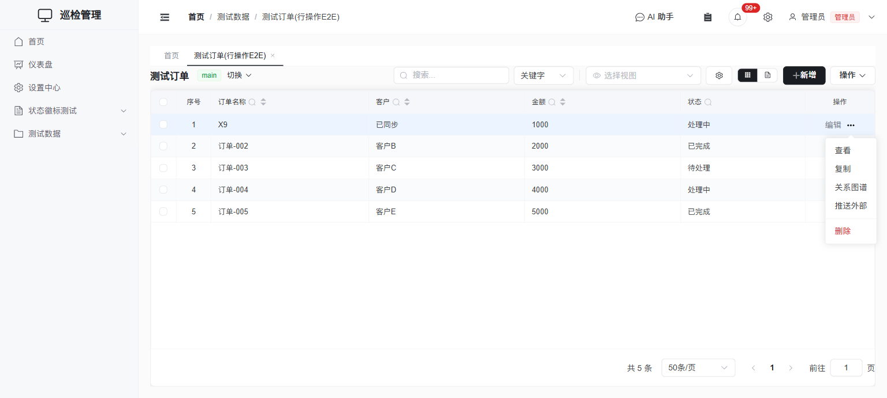
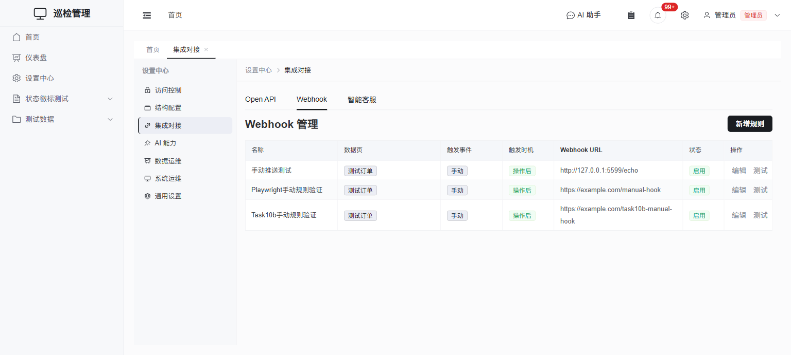
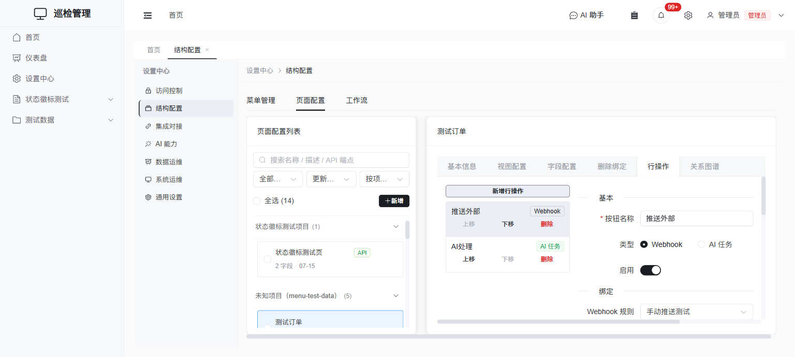
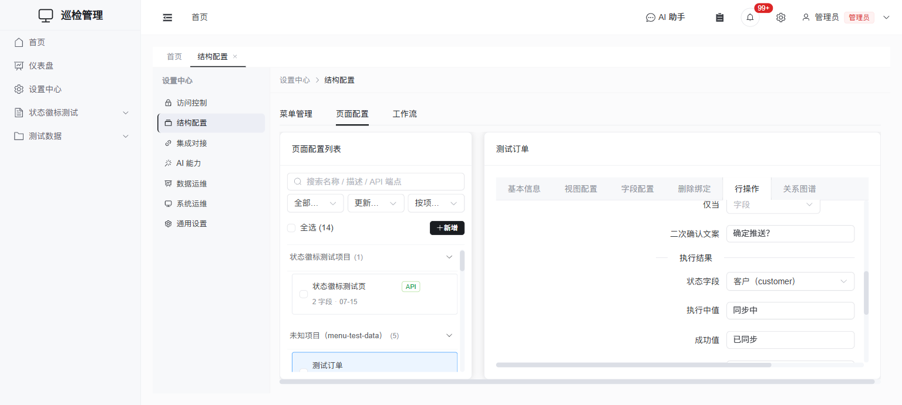
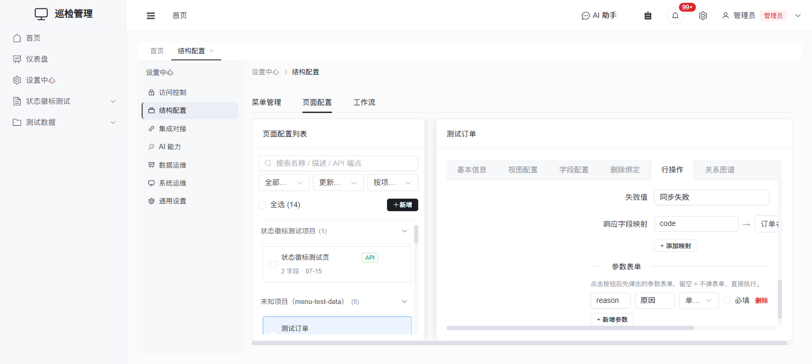
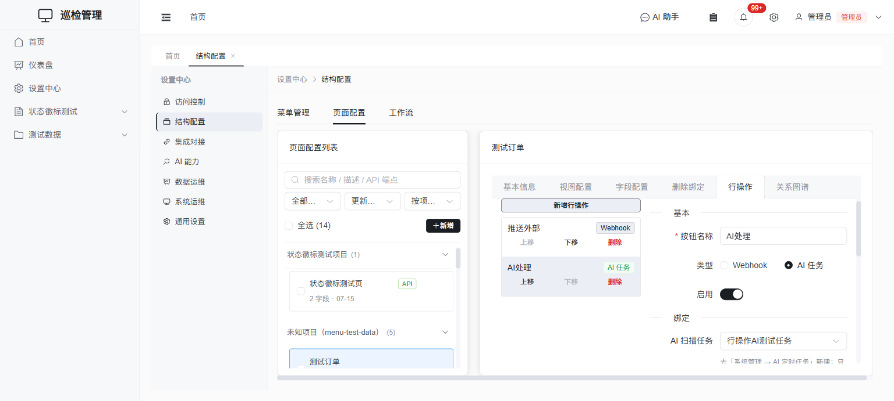

# 行操作（自定义行级操作按钮）

> 配套设计文档：`docs/superpowers/specs/2026-08-09-row-custom-actions-design.md`

## 1. 这是什么

数据页每一行的「⋯」溢出菜单（查看 / 复制 / 关系图谱 / 导出 所在的位置）可以再挂上任意数量的**自定义按钮**。点击按钮会对**这一行**触发一条 **Webhook 规则**或一个 **AI 扫描任务**，异步执行，执行状态与结果回写到该行的字段上。

典型用途：点一下把这条记录推送到外部系统（Webhook）、点一下让 AI 单独处理这一条记录（AI 扫描任务）——不用等定时扫描轮到它，也不用为了处理一条记录去跑整页扫描。

**不支持**：批量执行（勾选多行一起触发，YAGNI，已有定时扫描任务覆盖批量场景）；行内平铺按钮（一律进「⋯」菜单）。

## 2. 先决条件

行操作只是一层**薄绑定**——真正干活的 Webhook 规则、AI 扫描任务仍是全局资源，各有自己的管理页，配按钮之前得先把它们建好。

- **Webhook 类型**：去 **设置中心 → 集成对接 → Webhook**，新建一条**触发事件为「手动」**的规则。手动规则不会被增删改自动触发，只能被行操作按钮点名调用（详见 [webhooks.md](../integration/webhooks.md) 的「手动触发事件」一节）。

  

- **AI 类型**：去 **设置中心 → AI 能力 → AI 定时任务**，新建一个任务，把状态字段、字段映射、提示词配好。如果只想给行操作用、不想让它按调度周期扫整页，把任务本身设为**「未启用」**即可——停用的任务照样能被行操作按钮手动触发（详见 [scan-tasks.md](../ai/scan-tasks.md) 的「手动对单行触发」一节）。

## 3. 配置步骤

入口：**设置中心 → 结构配置 → 页面配置**，选中目标数据页，切到 **「行操作」** 标签页。左侧是按钮列表（可新增/上移/下移/删除，顺序即菜单顺序），右侧是选中按钮的编辑面板，分四组。

### 3.1 基本 + 绑定

| 配置项 | 说明 |
|---|---|
| 按钮名称 | 必填，显示在行「⋯」菜单里的文案 |
| 类型 | `Webhook` 或 `AI 任务`，二选一 |
| 启用 | 关闭后按钮不出现在菜单里 |
| Webhook 规则 / AI 扫描任务 | 按类型下拉选一个执行器；Webhook 下拉**只列出触发事件为「手动」的规则** |

> ⚠️ 类型只有在**真的点击单选按钮**切换时才会清空另一类型专属的配置（见 §5 的说明）；纯粹在左侧列表切换选中的按钮不会误清空当前编辑内容。

### 3.2 显示条件

| 配置项 | 说明 |
|---|---|
| 可见角色 | 多选，留空 = 不限角色；管理员（超管）永远直通，不受此限制 |
| 仅当（`visibleWhen`） | 单条件：`字段` `算子` `值`。算子支持 等于 / 不等于 / 属于 / 不属于 / 为空 / 不为空；「属于/不属于」的值用逗号分隔多个 |
| 二次确认文案 | 留空 = 点击后不弹确认框，直接执行；填了就先弹 `ElMessageBox.confirm` |

**只支持单条件，不支持 and/or 组合**（设计上已确认够用，见限制章节）。条件在前端和后端**各求值一次**：前端决定按钮显不显示，后端在真正执行前复核一遍——前端隐藏不代表后端就放行，绕过 UI 直接调接口一样会被拦（返回 409「当前记录不满足该动作的执行条件」）。

### 3.3 执行结果

仅 **Webhook 类型**显示这组配置（AI 类型见 §6 的特殊规则）：

| 配置项 | 说明 |
|---|---|
| 状态字段 | 留空 = 不写状态（纯触发，见 §5） |
| 执行中值 / 成功值 / 失败值 | 三个状态取值，配了状态字段才需要填 |
| 响应字段映射 | 一行行 `响应 JSON 键 → 目标字段（必填?）`，把 Webhook 端点返回的 JSON 按此映射写回该行 |

### 3.4 参数表单

点击按钮后先弹出的表单，留空 `paramFields` = 不弹表单、直接执行。见 §4。

保存时后端会校验：`label` 非空、`id` 页面内唯一、`actionType` 与绑定的执行器匹配且执行器确实存在、`statusField`/`responseMapping[].column`/`visibleWhen.field` 必须是本页面已定义的字段名、参数表单的控件类型不在禁用名单里——任何一条不满足都会在保存时报中文错误，而不是留到用户点按钮才报错。此外还会校验：

- **状态字段的三个值必须同填**：一旦选了「状态字段」，「执行中值」「成功值」「失败值」缺一不可——留空不等于"成功/失败就别动这个字段"，引擎会把留空的那项写成空字符串，静默清空该字段的原值。
- **状态字段 / 显示条件字段 / 响应映射目标字段不能是"非标量"控件**：多选下拉、复选框、文件、图片（存的是数组）以及关联、引用、引用选择（根本不落在这行的 `data` 里）都不能选进这三处——配置界面的下拉本身就不会列出这些控件，绕过 UI 直接调接口一样会被后端拦下。
- **绑定的 Webhook 规则必须是「手动」触发**：即便绕开下拉过滤直接改配置，后端也会拒绝绑定非 `manual` 事件的规则，避免一条规则既被增删改自动触发、又被按钮手动触发。
- **绑定的 AI 扫描任务必须作用于本页面所在的集合**：任务和页面的集合对不上，保存时直接报错，而不是留到用户点按钮才看到一句无法定位原因的「记录不存在」。

## 4. 参数表单

`paramFields` 复用了字段配置的 `FieldConfig`，所以参数表单直接用现成的 `DynamicForm` 渲染，不需要新控件；点击按钮时若配了参数字段就先弹一个对话框收集值，随「提交」一起带上后端。

**支持的控件**：字段配置里的绝大多数控件（文本 / 多行文本 / 富文本 / Markdown / 数字 / 下拉 / 多选 / 单选 / 复选 / 日期 / 日期时间 / 文件 / 图片 / 组合文本……）。

**不支持**：`relation`（关联）、`reference`（引用）、`quoteSelect`（引用选择）、`autoSequence`（自动编号）。原因是这四种控件的语义都建立在「有一条真实落库的记录」之上——关联/引用要能选中一个已存在的目标记录，自动编号要在插入时原子分配序号——参数表单只是「点击时临时收集的一次性输入」，从不落库成一行记录，这几种控件放进去没有对应的语义。配置界面的控件类型下拉本身就不列这四项，保存时后端也会再挡一次。

## 5. 状态回写怎么工作

配了「状态字段」的按钮，点击后：

1. 后端立即把该行状态字段写成**执行中值**，接口返回 `status: 'running'`，前端 toast「已提交」并刷新一次列表（能看到「执行中」）。
2. 前端随后**每 5 秒轮询一次**，直到该行状态字段不再等于执行中值，或**轮询满 5 分钟**为止（AI 动作常跑几十秒到数分钟，比 Webhook 更慢）。超时会提示「执行时间较长，请稍后手动刷新查看」，不算错误，只是停止自动轮询，后台任务本身继续跑。
3. 执行完成后由后台把状态字段写成**成功值**或**失败值**：
   - Webhook 成功且配了响应字段映射 → 按映射把响应 JSON 的值写回，再落成功值；映射里标了「必填」的键在响应里缺失/为空 → 判失败，不写任何映射值，只落失败值。
   - Webhook 请求失败（超时/网络错误/非 2xx）→ 落失败值。
   - AI 动作的成功/失败判定和回写完全由所绑扫描任务的引擎完成（见 §6）。

**不配「状态字段」**：接口返回 `status: 'submitted'`，前端只弹一次 toast「已提交」，**不轮询**、行上也没有可观测的状态——这种配置适合「点了就发出去，不关心结果」的场景（比如纯通知类 Webhook）。

## 6. ⚠️ AI 类型的特殊规则（务必注意）

**AI 动作一律使用所绑「AI 扫描任务」自己的状态字段配置。** 行操作按钮自己的「状态字段」「执行中值/成功值/失败值」「响应字段映射」这五项**只对 Webhook 类型生效**——切到「AI 任务」类型时，配置界面会**隐藏并清空**这五项，改为显示一条提示：

> AI 类动作的执行状态与结果回写，一律使用所绑「AI 扫描任务」里的状态字段配置，此处无需重复设置。

**为什么这么设计**：AI 动作的终态回写（成功解析 JSON 写入字段 / 失败）是由 AI 扫描任务自己的引擎（`ai_scan_engine.on_child_finished`）完成的，它只认扫描任务的状态字段配置。如果行操作再叠一套自己的状态字段，会出现两套逻辑各写各的、谁都不认识对方的字段名，最终留下一个**永远卡在「执行中」、没有引擎真正负责回写终态**的字段。所以从产品设计上直接把这五项收窄成「AI 动作没有自己的执行结果配置」，从根上排除这个坑。

## 7. AI 手动触发与定时扫描的差别

同一个 AI 扫描任务，被行操作按钮手动点一次，和被调度器按周期扫描整页，行为不完全一样：

| | 定时扫描 | 行操作手动触发 |
|---|---|---|
| 认领谓词 | 只挑「待处理」状态的行（`claim_records`） | **不看**「待处理」状态，任意状态的行都能认领（`claim_one`），**已处理的行也能重跑** |
| 触发范围 | 整页批量 | 单行 |
| 参数 | 无 | 参数表单填的值以「## 本次执行参数」段落追加进给 AI 的上下文文件（`record.md`），而不是拼进共享的提示词——提示词是任务级共享的，参数是这一次点击独有的 |
| 批任务命名 | 任务名 + 时间戳 | `行操作·<按钮名>·<时间戳>` |

其余（上下文目录组装、提示词拼接、JSON 输出契约、结构化回写、状态字段）与定时扫描完全一致，因为走的是同一套引擎。

## 8. 在哪看执行详情

行上的状态字段只回答「现在怎么样」；「当时到底发生了什么」要去各自的执行痕迹里看——**本功能刻意不建独立的执行记录表**：

- **Webhook 动作**：去 **设置中心 → 集成对接 → Webhook**，找到对应规则，点「日志」，能看到每次调用的请求/响应/是否成功/重试情况。
- **AI 动作**：去 **AI 助手** 侧边栏，行操作产生的批任务会以 `行操作·<按钮名>·<时间戳>` 命名出现在批任务列表里，点进去能看该次 AI 处理的完整对话（含工具调用）。

## 9. 常见问题

**按钮不显示在「⋯」菜单里？**
按以下顺序排查：该按钮是否处于「启用」状态；当前用户角色是否在「可见角色」白名单里（留空表示不限，管理员永远直通）；「仅当」条件当前行是否满足。这三项任意一项不满足按钮就不会出现，前端和后端各判断一次，绕过前端直接调接口一样会被后端拦下。

**点击后提示「该行有正在执行的动作，请稍后再试」（409）？**
说明该行的状态字段当前正等于执行中值，有一次执行还没结束。等它跑完（前端会自动轮询直到终态）。如果确信是进程崩溃导致卡死：
- **Webhook 动作**：卡住的执行中状态超过一个陈旧阈值（该规则的 `超时 × (重试次数 + 1)`，不低于 5 分钟）后会自动放行重新触发，直接再点一次按钮即可。
- **AI 动作**：不按时间放行（AI 常规跑几十秒到数分钟，按时间放行会给同一条记录并发出第二个子会话）。真正的孤儿恢复由所绑 AI 扫描任务共用的孤儿清扫逻辑负责，它在后端进程（重）启动时执行一次，把「执行中但没有存活子会话」的行重置回待处理/未处理状态；之后再点按钮即可重新触发。

**Webhook 回写没生效？**
检查响应字段映射：目标端点返回的必须是合法的 JSON **对象**（不是数组/纯文本/HTML），且响应体的键名要和「响应 JSON 键」完全一致。标了「必填」的映射键在响应 JSON 里缺失或值为空（`null`/`''`）会被判定为整体失败，落失败值、**不写入任何映射字段**——不是「能写的先写上」，是全部不写。没有配任何必填映射时，即使响应体解析不出 JSON 对象，也仍然算成功（只是没有可映射的值）。同理，非必填的映射键如果响应里显式是 `null`，也不会写——不会用空值覆盖掉该字段的现有内容。

**点击 AI 类型的按钮提示"该动作绑定的 AI 任务作用于 XX 分支，请切换分支后再执行"（409）？**
说明你当前所在的项目分支和这个 AI 扫描任务绑定的分支不是同一个。行数据在分支复制后每个分支各有一份同 id 的记录，AI 扫描任务只认它自己绑定的那个分支——按提示切到对应分支后再点按钮即可。这是有意的保护：如果没有这层拦截，点击会静默地认领、修改另一个分支上你看不到的那条记录，而你面前这一行会一直卡在轮询、什么变化都等不到。

**保存页面配置时提示某个行操作配置不合法（比如"响应字段映射目标字段不能是非标量控件"之类）？**
说明这个页面已有的某条行操作配置不满足 §3.4 列的校验规则（常见于校验规则本身是后加的，历史配置在当时是合法的）。页面配置的其它标签页（改名称、加字段、删除绑定标签页等）都会一起提交 `rowActions`，所以只要这个页面上还挂着一条不合规的行操作，任何一次保存都会连带被拒。处理办法：切到「行操作」标签页，按错误信息里点名的具体动作和字段，把违规项改成合法字段（下拉重新选一个标量字段，或清空后再选）或者直接删掉这条动作，改完再保存即可——错误信息会精确指出是第几个动作、哪一项不合法，不需要逐条排查。

## 10. 限制

- **不支持批量执行**：一次只能对一行触发，没有勾选多行统一触发的入口。需要批量场景请用「AI 定时任务」的整页扫描，或直接调用 Webhook 规则的事件触发。
- **显示条件只支持单条**：`visibleWhen` 是 `{字段, 算子, 值}` 三元组，不支持 and/or 组合出复杂条件。
- **不建执行记录表**：行操作本身没有独立的「执行历史」列表，要查历史得分别去 Webhook 日志或 AI 批任务面板（见 §8）。
