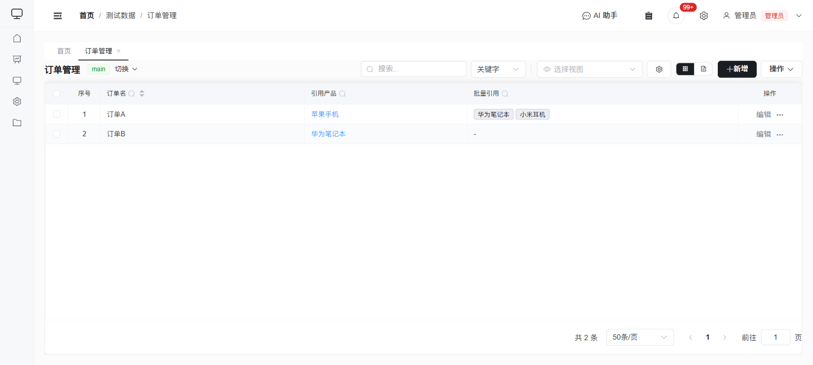

# 项目管理功能使用说明

本文档介绍系统新增的项目管理相关功能，包括看板视图、日历视图、甘特图、状态工作流、评论与变更历史、统计仪表盘、通知提醒、跨集合联动规则。

> 数据页表格视图（含搜索、视图切换、关联字段展示）：
>
> 

---

## 1. 看板视图

看板视图以卡片列的形式展示数据，适用于任务跟踪、状态管理等场景。

### 1.1 配置看板

1. 进入 **系统配置 > 页面配置**
2. 在左侧列表选中目标页面（该页面需至少有一个 `select` 类型字段作为分组依据）
3. 在右侧找到 **看板视图配置** 区域，填写：
   - **默认视图**：选择页面打开时默认显示「表格视图」还是「看板视图」
   - **分组字段**：选择一个 `select` 类型字段（如「状态」），看板将按该字段的选项值分列
   - **卡片标题**：选择卡片上显示的标题字段（如「任务名称」）
   - **卡片摘要**：多选卡片上额外显示的字段（如「负责人」「优先级」「截止日期」）
   - **颜色字段**（可选）：选择一个 `select` 类型字段，卡片左侧会根据该字段值显示不同颜色标记
4. 点击 **保存基本信息**

### 1.2 使用看板

1. 打开已配置看板的数据页面，表格上方会出现视图切换按钮（表格/看板）
2. 切换到看板视图后：
   - 每列对应分组字段的一个选项值，列头显示选项名和当前卡片数量
   - 卡片展示标题、摘要字段和颜色标记
   - **拖拽卡片**到其他列可直接更新该记录的分组字段值（如将任务从「待处理」拖到「进行中」）
   - **点击卡片**打开记录详情弹窗
3. 搜索关键字同时作用于表格和看板，可在两种视图间自由切换

### 1.3 注意事项

- 拖拽移动卡片等同于修改记录数据，需要写入权限
- 如果该字段配置了工作流规则（见第 2 节），拖拽时会自动校验状态转换是否合法，不合法则回弹并提示错误

---

## 2. 状态工作流

工作流功能为 `select` 类型字段定义状态转换规则，控制哪些状态之间可以流转、谁有权限操作、流转前需满足什么条件、流转后自动执行什么动作。

### 2.1 配置工作流

1. 进入 **系统配置 > 页面配置**
2. 选中目标页面，在右侧字段配置区域点击某个 `select` 类型字段的 **编辑** 按钮
3. 在字段编辑弹窗底部找到 **工作流** 区域
4. 打开 **启用工作流** 开关
5. 添加转换规则，每条规则包含：
   - **源状态**：从哪个状态出发（选择「任意(*)」表示从任何状态都可触发）
   - **目标状态**：转换到哪个状态
   - **按钮名**：在详情弹窗中显示的快捷操作按钮文字（如「开始处理」「完成」）
   - **角色**：允许执行此转换的角色（留空表示所有角色均可）
6. 点击 **确定** 保存字段配置，再点击 **保存配置**

### 2.2 工作流生效方式

工作流配置后，以下场景会自动校验：

- **编辑表单中的下拉框**：不允许的目标状态会被置灰，无法选择
- **看板拖拽**：拖拽到不允许的状态列会被拒绝并回弹
- **详情弹窗快捷按钮**：弹窗底部左侧会显示当前可用的状态转换按钮，点击即可快速变更状态
- **后端二次校验**：即使绕过前端，后端 PUT 接口也会验证转换合法性

### 2.3 转换条件与自动动作（高级）

工作流还支持在转换规则中配置前置条件和后置动作（需通过 API 或直接编辑字段 JSON 配置）：

**前置条件（conditions）：**
- `notEmpty`：指定字段不能为空（如转为「完成」前必须填写「处理结果」）
- `equals` / `notEquals`：指定字段值必须等于/不等于某个值

**后置动作（actions）：**
- `setField`：自动设置某个字段的值，支持 `$NOW`（当前时间）等变量
- `runScript`：自动执行一个校验脚本

---

## 3. 评论与变更历史

每条记录都支持评论和变更追踪，方便团队协作。

### 3.1 查看时间线

1. 在数据页面点击某条记录的 **查看** 按钮，打开详情弹窗
2. 弹窗下方「评论 / 变更历史」区域以时间线形式展示：
   - **评论**（蓝色标记）：显示评论内容、作者、时间
   - **变更记录**（黄色标记）：显示谁在什么时间修改了哪些字段，包含字段级 diff（旧值 → 新值）

### 3.2 添加评论

1. 在时间线底部的输入框中输入评论内容
2. 点击 **发送** 按钮
3. 评论即时出现在时间线中

### 3.3 编辑和删除评论

- 自己发表的评论右侧会显示 **编辑** 和 **删除** 按钮
- 管理员可以编辑和删除所有人的评论
- 点击编辑后在原位展开编辑框，修改后点击保存

### 3.4 变更记录自动生成

- 每次通过表单编辑记录时，系统自动对比修改前后的字段值
- 变更记录显示字段名称、旧值（红色删除线）和新值（绿色高亮）
- 无需手动操作，完全自动记录

---

## 4. 统计仪表盘

仪表盘提供可配置的数据统计视图，支持数字卡片和图表展示。

### 4.1 创建仪表盘

1. 通过路由 `/dashboard` 访问仪表盘页面（需管理员权限）
2. 点击 **新建仪表盘**，输入名称
3. 创建后在右上角点击 **编辑布局** 进入配置模式

### 4.2 添加统计组件

在编辑模式下点击 **添加组件**，填写 JSON 格式的组件配置：

```json
{
  "id": "widget-1",
  "type": "statCard",
  "title": "待处理任务",
  "x": 0, "y": 0, "w": 3, "h": 1,
  "config": {
    "collection": "tasks",
    "metric": "count",
    "filter": { "status": "todo" }
  }
}
```

**组件类型（type）：**

| 类型 | 说明 |
|------|------|
| `statCard` | 数字统计卡片，显示单个指标值 |
| `barChart` | 柱状图，按某个字段分组统计 |

**统计指标（metric）：**

| 指标 | 说明 |
|------|------|
| `count` | 记录数量 |
| `sum` | 数值字段求和 |
| `avg` | 数值字段平均值 |
| `min` | 数值字段最小值 |
| `max` | 数值字段最大值 |

**布局参数：**
- `x`, `y`：组件在 12 列网格中的起始位置
- `w`：宽度（1-12 列）
- `h`：高度（单位行）

### 4.3 配置示例

**按状态分组的柱状图：**
```json
{
  "id": "widget-2",
  "type": "barChart",
  "title": "任务状态分布",
  "x": 3, "y": 0, "w": 5, "h": 2,
  "config": {
    "collection": "tasks",
    "metric": "count",
    "groupField": "status"
  }
}
```

**带过滤条件的统计卡片：**
```json
{
  "id": "widget-3",
  "type": "statCard",
  "title": "本月新增",
  "x": 8, "y": 0, "w": 4, "h": 1,
  "config": {
    "collection": "tasks",
    "metric": "count",
    "filter": { "createdAt": { "$gte": "2026-03-01" } }
  }
}
```

---

## 5. 通知提醒

系统内置通知功能，在状态变更和评论@提及时自动发送通知。

### 5.1 查看通知

- 页面右上角的铃铛图标显示未读通知数量（红色角标）
- 点击铃铛图标展开通知面板，显示最近 30 条通知
- 每条通知显示标题、内容摘要和时间

### 5.2 通知触发场景

| 场景 | 通知对象 | 通知内容 |
|------|----------|----------|
| 状态变更 | 记录创建者、负责人 | 「XX 将 [字段名] 从 [旧值] 变更为 [新值]」 |
| 评论@提及 | 被@的用户 | 「XX 在 [集合] 中提到了你」 |

### 5.3 通知操作

- **标记已读**：点击某条通知自动标记为已读
- **全部已读**：点击通知面板右上角的「全部已读」按钮
- **跳转到记录**：点击通知自动导航到对应的数据记录页面
- 系统每 30 秒自动轮询一次未读通知数量

---

## 6. 跨集合联动规则

联动规则可以在一个集合的数据发生变更时，自动在另一个集合中创建或更新记录。

### 6.1 进入管理页面

通过路由 `/admin/trigger-rules` 访问联动规则管理页面（需管理员权限）。

### 6.2 创建联动规则

点击 **新增规则**，填写：

- **规则名称**：描述性名称（如「任务完成时自动创建验收记录」）
- **描述**：规则说明
- **源集合**：触发规则的数据集合
- **触发事件**：`create`（新增）、`update`（更新）、`delete`（删除）、`fieldChange`（字段变更）
- **触发条件**（JSON）：满足该条件时才触发

  ```json
  { "field": "status", "value": "done" }
  ```

- **目标集合**：规则执行的目标数据集合
- **动作类型**：`create`（创建记录）、`update`（更新记录）、`runScript`（执行脚本）
- **动作配置**（JSON）：

  **创建记录示例：**
  ```json
  {
    "fieldMapping": {
      "taskName": "$source.title",
      "status": "pending",
      "sourceRef": "$source.id",
      "createdBy": "$operator"
    }
  }
  ```

  **更新记录示例：**
  ```json
  {
    "matchField": "sourceRef",
    "matchValue": "$source.id",
    "updateFields": {
      "status": "$source.status"
    }
  }
  ```

### 6.3 变量说明

| 变量 | 说明 |
|------|------|
| `$source.字段名` | 源记录中对应字段的值 |
| `$source.id` | 源记录的 ID |
| `$operator` | 执行操作的用户名 |
| `$NOW` | 当前时间（ISO 格式） |

### 6.4 启用/停用

- 规则列表中每条规则右侧有启用/停用开关
- 停用的规则不会被触发执行

### 6.5 查看执行日志

点击规则列表中的 **日志** 按钮，可以查看该规则的历次执行记录，包括：
- 执行时间
- 源记录信息
- 目标记录信息
- 执行结果（成功/失败）
- 错误信息（如有）

---

## 7. 日历视图

日历视图以日历形式展示带日期字段的数据，适用于任务安排、会议管理、里程碑跟踪等场景。

### 7.1 配置日历视图

1. 进入 **系统配置 > 页面配置**
2. 在左侧列表选中目标页面（该页面需至少有一个 `date` 或 `datetime` 类型字段）
3. 在右侧找到 **视图配置** 区域，选择 **日历** 标签页
4. 填写以下配置项：

| 配置项 | 是否必填 | 说明 |
|--------|----------|------|
| 日期字段 | 必填 | 选择一个 date/datetime 类型字段作为日历时间轴 |
| 结束日期 | 选填 | 选择另一个日期字段支持跨天事件，启用后可拖拽边缘调整时长 |
| 卡片标题 | 必填 | 选择日历卡片上显示的标题字段 |
| 颜色字段 | 选填 | 选择一个 select 类型字段，卡片左侧边框会根据值显示不同颜色 |
| 默认模式 | 选填 | 月视图或周视图，决定页面打开时的默认显示方式 |

5. 在 **默认视图** 下拉框中选择 **日历视图**，使页面打开时直接显示日历
6. 点击 **保存配置**

### 7.2 使用日历视图

1. 打开已配置日历的数据页面，表格上方会出现视图切换按钮
2. 切换到日历视图后：
   - **月视图**：每个日期格子显示当天的事件卡片
   - **周视图**：以时间轴形式展示一周内的事件分布
   - 卡片左侧显示颜色标记条（按配置的颜色字段）
   - 卡片内容显示标题字段值

**交互操作：**

- **点击卡片**：打开记录详情弹窗
- **拖拽卡片**：移动到其他日期，自动更新记录的日期字段值
- **拖拽卡片边缘**（仅配置了结束日期时可用）：调整事件时长
- **点击空白日期**：触发新建记录事件（需在父组件中处理）
- **切换视图**：点击工具栏的「月」「周」按钮切换显示模式

### 7.3 颜色标记规则

系统预设的颜色映射：

| 字段值 | 卡片颜色 |
|--------|----------|
| 待处理 / pending | 橙色 |
| 进行中 / progress | 蓝色 |
| 已完成 / done | 绿色 |
| 阻塞 / blocked | 红色 |
| 高 / 高优先级 / 紧急 | 红色 |
| 中 / 一般 | 橙色 |
| 低 / 低优先级 | 绿色 |

其他值默认显示蓝色。

### 7.4 注意事项

- 必须配置日期字段才能启用日历视图
- 拖拽移动卡片需要写入权限
- 拖拽更新会同步修改开始日期和结束日期（如已配置）
- 今日日期格子会有浅蓝色背景高亮

---

## 8. 甘特图视图

甘特图以时间轴条形图展示任务的时间安排和依赖关系，适用于项目进度跟踪、任务规划、资源调度等场景。

### 8.1 配置甘特图

1. 进入 **系统配置 > 页面配置**
2. 在左侧列表选中目标页面
3. 在右侧找到 **视图配置** 区域，选择 **甘特图** 标签页
4. 填写以下配置项：

| 配置项 | 是否必填 | 说明 |
|--------|----------|------|
| 开始日期 | 必填 | 选择 date/datetime 类型字段作为任务开始时间 |
| 结束日期 | 必填 | 选择 date/datetime 类型字段作为任务结束时间 |
| 标题字段 | 必填 | 选择任务名称字段，显示在 Y 轴左侧 |
| 进度字段 | 选填 | 选择 number 类型字段（0-100），显示任务完成百分比 |
| 颜色字段 | 选填 | 选择 select 类型字段，按状态/优先级为任务条着色 |
| 依赖字段 | 选填 | 选择 multiSelect 类型字段，存储依赖任务 ID 数组 |

5. 在 **默认视图** 下拉框中选择 **甘特图**，使页面打开时直接显示甘特图
6. 点击 **保存配置**

### 8.2 使用甘特图

甘特图由以下部分组成：

- **时间轴头部**：显示月份标记，便于定位时间范围
- **Y 轴（左侧）**：显示任务名称，按开始时间升序排列
- **任务条**：横向显示任务的时间跨度
  - 浅色背景表示总时长
  - 深色填充表示已完成进度（如配置了进度字段）
- **今日标记线**：红色竖线标记当前日期
- **依赖连线**：虚线箭头表示任务间的前后依赖关系（如配置了依赖字段）

**交互操作：**

- **悬停任务条**：显示详细信息（名称、开始日期、结束日期、天数、进度）
- **点击任务条**：打开记录详情弹窗
- **缩放时间轴**：拖动底部滑块或使用鼠标滚轮缩放查看范围
- **平移时间轴**：拖动滑块或按住鼠标移动查看不同时间段

### 8.3 依赖关系展示

如配置了依赖字段：

- 依赖字段应存储前置任务的 ID 数组
- 系统会自动绘制从前置任务结束到当前任务开始的连线箭头
- 连线以灰色虚线显示，表示任务间的先后关系

示例配置：

```
依赖字段: dependencies（多选类型）
任务 A 的 dependencies: []（无依赖）
任务 B 的 dependencies: ["task-a-id"]（依赖任务 A）
任务 C 的 dependencies: ["task-a-id", "task-b-id"]（依赖任务 A 和 B）
```

### 8.4 进度可视化

如配置了进度字段：

- 进度值为 0-100 的数字
- 任务条显示双层效果：
  - 外层浅色：任务总时长
  - 内层深色：已完成部分（按进度百分比填充）
- 悬停时显示具体进度百分比

### 8.5 颜色标记规则

与日历视图相同，系统预设的颜色映射：

| 字段值 | 任务条颜色 |
|--------|------------|
| 待处理 / pending | 橙色 |
| 进行中 / progress | 蓝色 |
| 已完成 / done | 绿色 |
| 阻塞 / blocked | 红色 |
| 高优先级 / 紧急 | 红色 |

其他值默认显示蓝色。

### 8.6 注意事项

- 必须同时配置开始日期和结束日期才能启用甘特图
- 缺少日期的记录会被自动过滤，不显示在甘特图中
- 任务按开始时间自动排序
- 时间轴范围自动扩展，包含所有任务并前后各留 7 天缓冲
- 依赖连线只绘制存在于当前数据中的有效依赖关系

---

## 附：功能与角色权限对照

| 功能 | 管理员 | 开发者 | 访客 |
|------|--------|--------|------|
| 看板视图查看 | ✅ | ✅ | ✅ |
| 看板拖拽移动 | ✅ | ✅ | ❌ |
| 日历视图查看 | ✅ | ✅ | ✅ |
| 日历拖拽移动 | ✅ | ✅ | ❌ |
| 日历拖拽调整时长 | ✅ | ✅ | ❌ |
| 甘特图查看 | ✅ | ✅ | ✅ |
| 甘特图点击详情 | ✅ | ✅ | ✅ |
| 工作流快捷操作 | ✅ | ✅（受规则限制） | ❌ |
| 查看评论/历史 | ✅ | ✅ | ✅ |
| 添加评论 | ✅ | ✅ | ❌ |
| 编辑/删除评论 | 全部 | 仅自己 | ❌ |
| 查看通知 | ✅ | ✅ | ✅ |
| 仪表盘查看 | ✅ | ✅ | ✅ |
| 仪表盘配置 | ✅ | ❌ | ❌ |
| 联动规则管理 | ✅ | ❌ | ❌ |
| 看板/工作流配置 | ✅ | ❌ | ❌ |
| 日历/甘特图配置 | ✅ | ❌ | ❌ |
