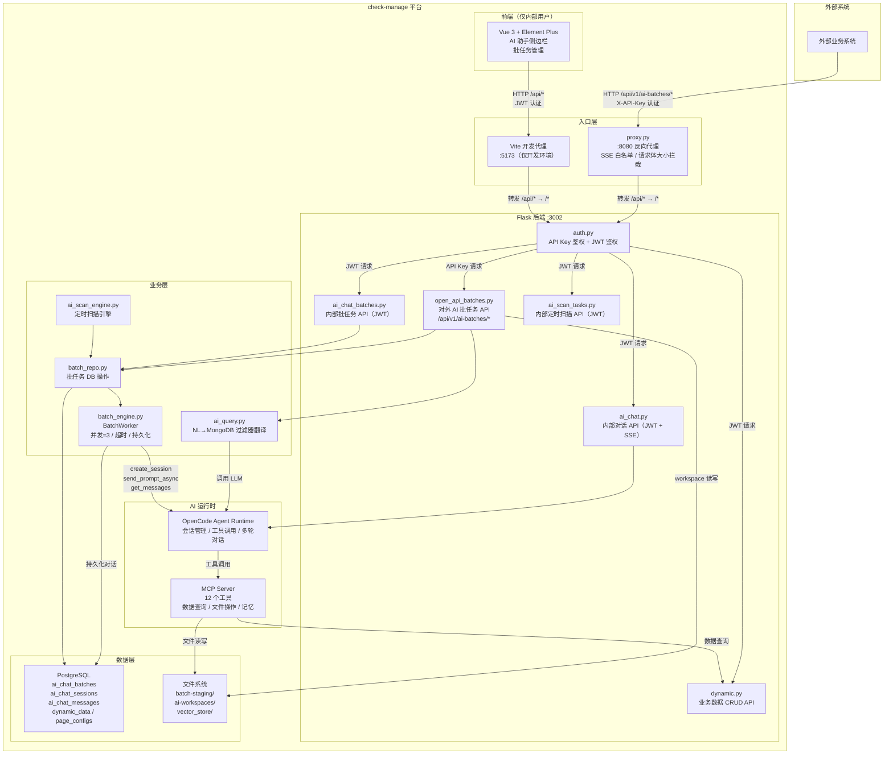
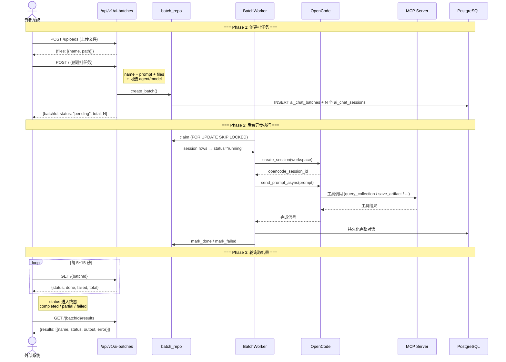
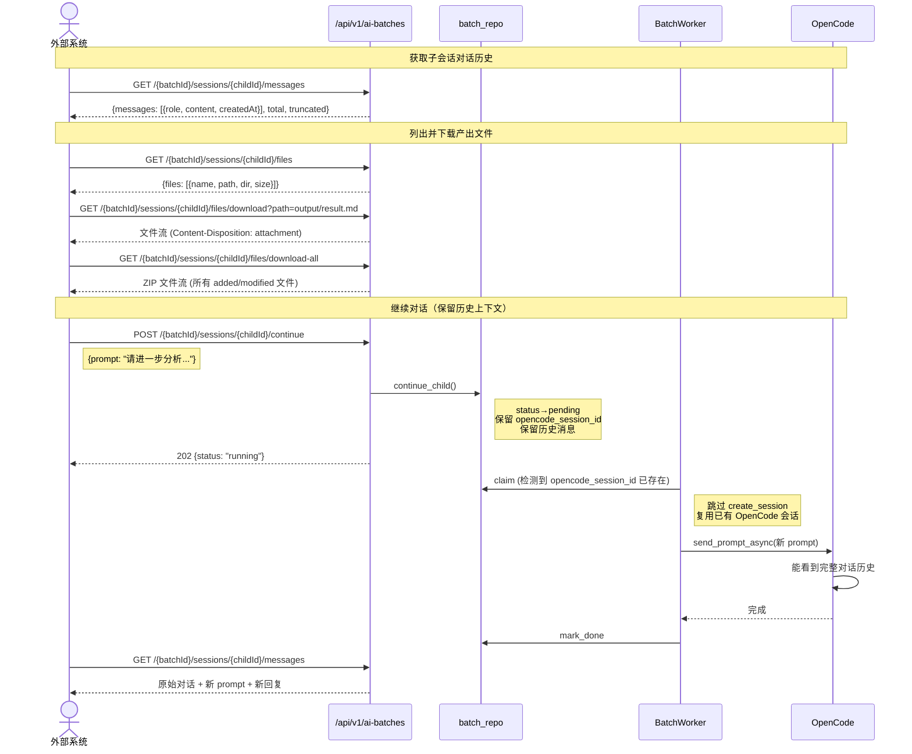
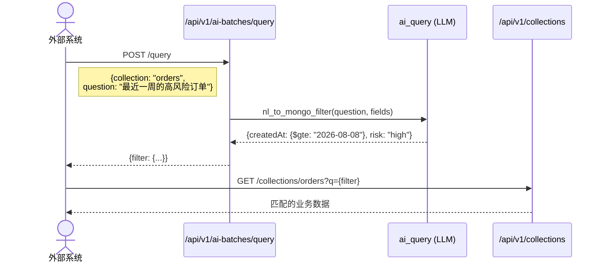
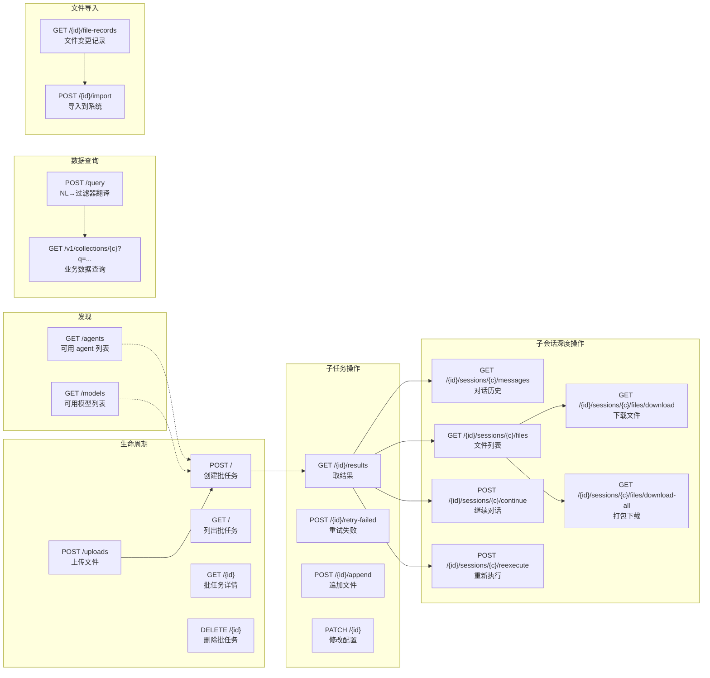
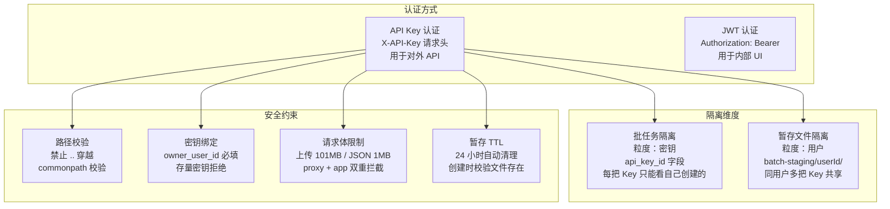

# 外部系统 AI 能力对接 — 系统架构与交互流程

## 1. 系统架构图

## 2. 外部系统对接交互流程

### 2.1 标准批任务流程（最常用）

### 2.2 子会话深度操作流程

### 2.3 查询翻译流程

## 3. 外部 API 端点全景

## 4. 认证与隔离模型

## 5. 端点暴露状态总览

| 能力 | 对外 API Key | 内部 JWT | Admin | MCP |
|------|:---:|:---:|:---:|:---:|
| 列出 agents | ✅ | ✅ | — | — |
| 列出 models | ✅ | ✅ | — | — |
| NL 查询翻译 | ✅ | ✅ | — | — |
| 创建/列出/详情/删除 批任务 | ✅ | ✅ | ✅ | — |
| 取结果 / 重试 / 追加 / 修改配置 | ✅ | ✅ | — | — |
| 子会话 对话/文件/下载/ZIP | ✅ | — | ✅ | — |
| 子会话 继续/重执行 | ✅ | ✅ | ✅ | — |
| 导入文件到系统 | ✅ | — | ✅ | — |
| 交互式对话 + SSE | — | ✅ | — | — |
| 定时扫描任务 | — | — | ✅ | — |
| 数据查询 / 文件操作 | — | — | — | ✅ |
| 记忆管理 | — | ✅ | — | ✅ |
