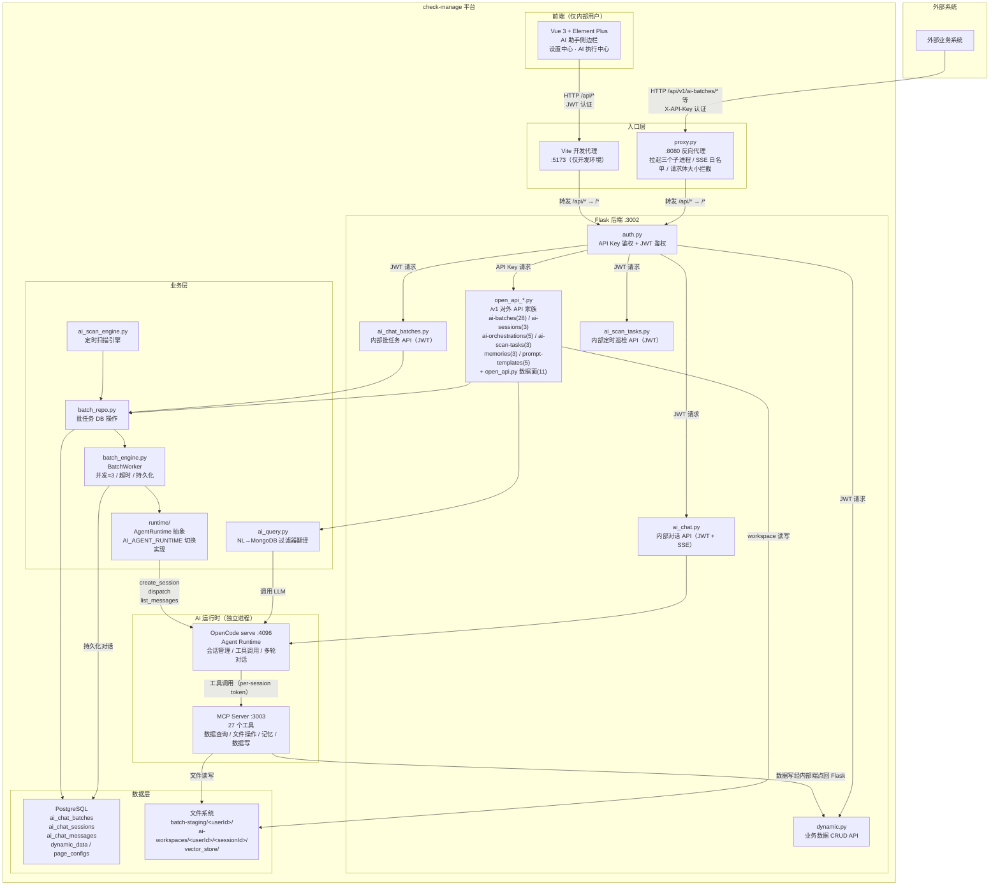
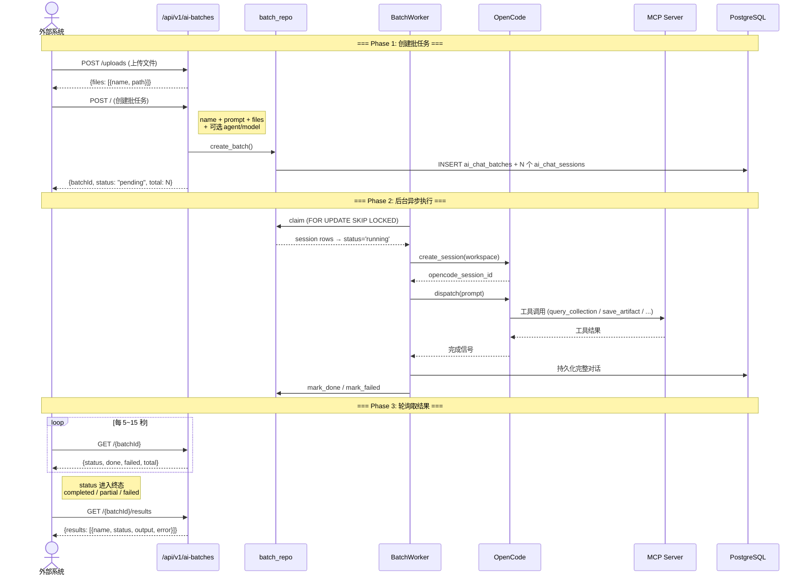
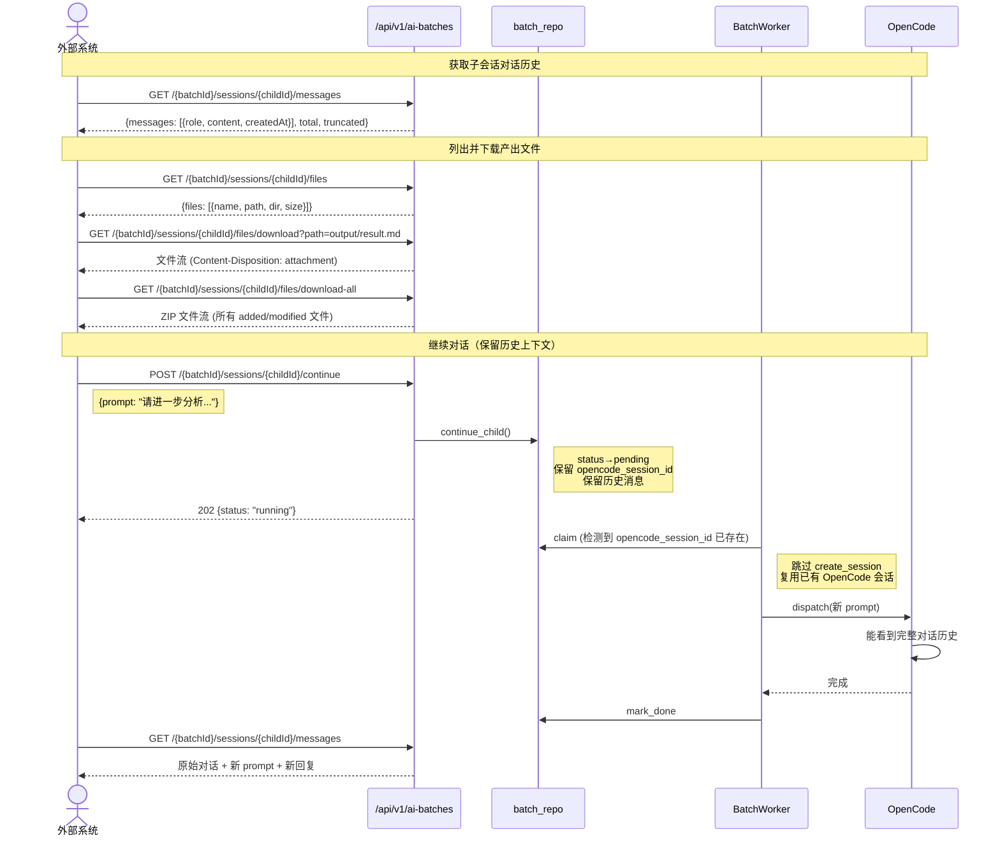
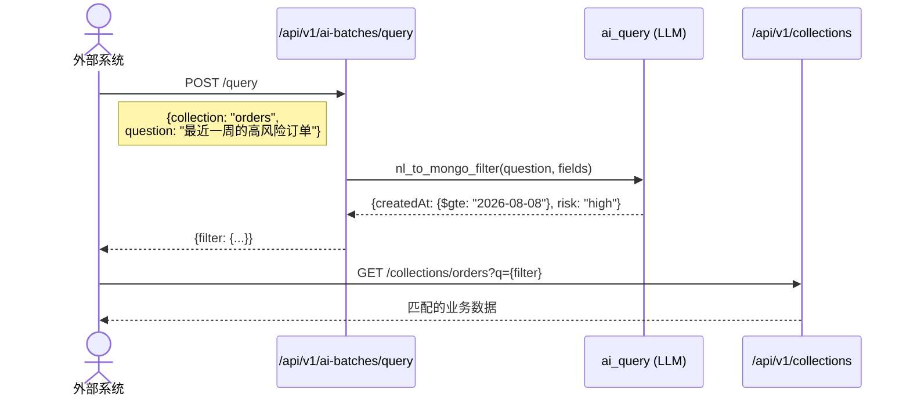
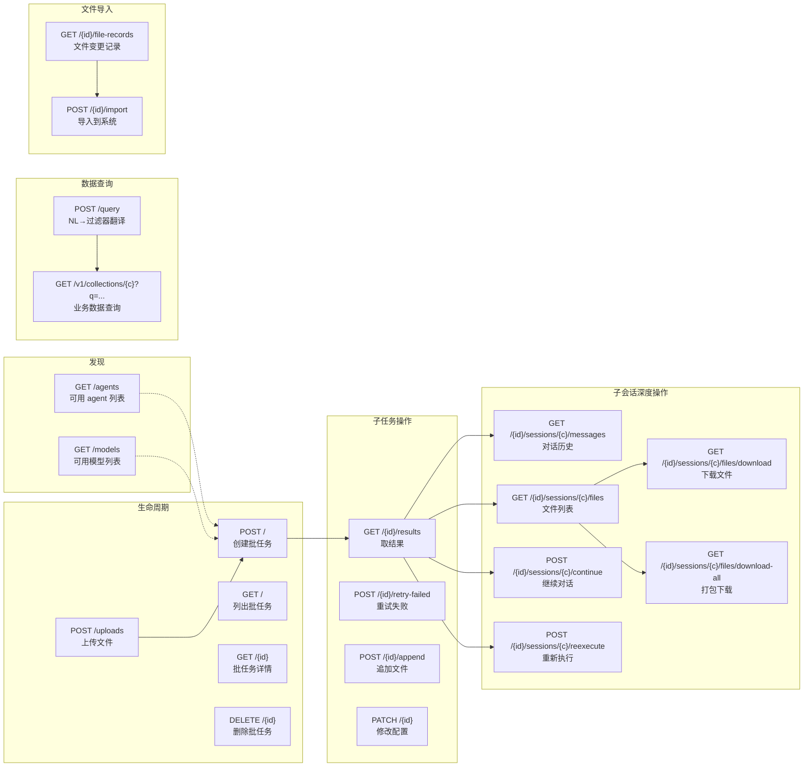
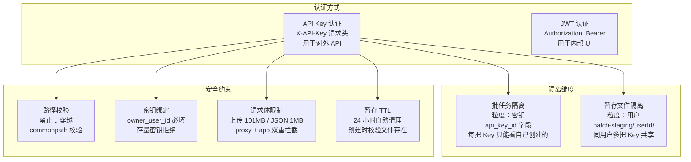

# 外部系统 AI 能力对接 — 系统架构与交互流程

## 1. 系统架构图

AI 能力由**三个独立进程**组成（口径同 AI 设计分册 01《总体架构与运行时》）：
**Flask 后端**（默认 `:3002`，AI 能力的唯一网关与 SSE 代理）、**OpenCode serve**
（默认 `:4096`，Agent 运行时：会话/工具调用/SSE 事件流的真正生产者）、
**MCP Server**（默认 `:3003`，平台工具面，27 个 MCP 工具）。生产入口 `proxy.py`
（默认 `:8080`）按序拉起三个子进程并把 `/api/*` 反代到 Flask；**浏览器与外部系统
只与 proxy/Flask 通信**，不直连 OpenCode 或 MCP。

```mermaid
graph TB
    subgraph 外部系统
        EXT[外部业务系统]
    end

    subgraph "check-manage 平台"
        subgraph "入口层"
            PROXY["proxy.py<br/>:8080 反向代理<br/>拉起三个子进程 / SSE 白名单 / 请求体大小拦截"]
            VITE["Vite 开发代理<br/>:5173（仅开发环境）"]
        end

        subgraph "Flask 后端 :3002"
            AUTH["auth.py<br/>API Key 鉴权 + JWT 鉴权"]
            OPEN_API["open_api_*.py<br/>/v1 对外 API 家族<br/>ai-batches(28) / ai-sessions(3)<br/>ai-orchestrations(5) / ai-scan-tasks(3)<br/>memories(3) / prompt-templates(5)<br/>+ open_api.py 数据面(11)"]
            INT_BATCH["ai_chat_batches.py<br/>内部批任务 API（JWT）"]
            INT_CHAT["ai_chat.py<br/>内部对话 API（JWT + SSE）"]
            INT_SCAN["ai_scan_tasks.py<br/>内部定时巡检 API（JWT）"]
            DYNAMIC["dynamic.py<br/>业务数据 CRUD API"]
        end

        subgraph "业务层"
            REPO["batch_repo.py<br/>批任务 DB 操作"]
            ENGINE["batch_engine.py<br/>BatchWorker<br/>并发=3 / 超时 / 持久化"]
            SCAN_ENGINE["ai_scan_engine.py<br/>定时扫描引擎"]
            QUERY["ai_query.py<br/>NL→MongoDB 过滤器翻译"]
            RUNTIME["runtime/<br/>AgentRuntime 抽象<br/>AI_AGENT_RUNTIME 切换实现"]
        end

        subgraph "AI 运行时（独立进程）"
            OC["OpenCode serve :4096<br/>Agent Runtime<br/>会话管理 / 工具调用 / 多轮对话"]
            MCP["MCP Server :3003<br/>27 个工具<br/>数据查询 / 文件操作 / 记忆 / 数据写"]
        end

        subgraph "数据层"
            PG["PostgreSQL<br/>ai_chat_batches<br/>ai_chat_sessions<br/>ai_chat_messages<br/>dynamic_data / page_configs"]
            FS["文件系统<br/>batch-staging/&lt;userId&gt;/<br/>ai-workspaces/&lt;userId&gt;/&lt;sessionId&gt;/<br/>vector_store/"]
        end

        subgraph "前端（仅内部用户）"
            UI["Vue 3 + Element Plus<br/>AI 助手侧边栏<br/>设置中心 · AI 执行中心"]
        end
    end

    EXT -->|"HTTP /api/v1/ai-batches/* 等<br/>X-API-Key 认证"| PROXY
    UI -->|"HTTP /api/*<br/>JWT 认证"| VITE
    PROXY -->|"转发 /api/* → /*"| AUTH
    VITE -->|"转发 /api/* → /*"| AUTH

    AUTH -->|"API Key 请求"| OPEN_API
    AUTH -->|"JWT 请求"| INT_BATCH
    AUTH -->|"JWT 请求"| INT_CHAT
    AUTH -->|"JWT 请求"| INT_SCAN
    AUTH -->|"JWT 请求"| DYNAMIC

    OPEN_API --> REPO
    OPEN_API --> QUERY
    INT_BATCH --> REPO
    INT_CHAT --> OC
    QUERY -->|"调用 LLM"| OC

    REPO --> ENGINE
    ENGINE --> RUNTIME
    RUNTIME -->|"create_session<br/>dispatch<br/>list_messages"| OC
    ENGINE -->|"持久化对话"| PG
    SCAN_ENGINE --> REPO

    OC -->|"工具调用（per-session token）"| MCP
    MCP -->|"数据写经内部端点回 Flask"| DYNAMIC
    MCP -->|"文件读写"| FS

    REPO --> PG
    OPEN_API -->|"workspace 读写"| FS
```

**workspace 身份链路**（外部对接方需要理解的一点）：每个 AI 会话有独立的
workspace 目录 `<ai-workspaces>/<userId>/<sessionId>/`（内含 `uploads/` 输入、
`outputs/` 产出、自动 git 仓库）。Flask 在建会话时为它签发**opaque 会话 token**
并写入 workspace 的 `opencode.json`——OpenCode 会话内每次工具调用都带这个 token
连到 MCP Server，MCP 侧查库还原出 `(session_id, user_id, role)` 再按 RBAC 过滤工具面；
token 过期/吊销即断身份。因此**工具调用的权限与创建会话的用户一致**，外部系统
经 API Key 创建的批任务/单会话，其子会话同样运行在密钥绑定用户的身份下。

## 2. 外部系统对接交互流程

### 2.1 标准批任务流程（最常用）

```mermaid
sequenceDiagram
    actor EXT as 外部系统
    participant API as /api/v1/ai-batches
    participant REPO as batch_repo
    participant WORKER as BatchWorker
    participant OC as OpenCode
    participant MCP as MCP Server
    participant DB as PostgreSQL

    Note over EXT,DB: === Phase 1: 创建批任务 ===

    EXT->>API: POST /uploads (上传文件)
    API-->>EXT: {files: [{name, path}]}

    EXT->>API: POST / (创建批任务)
    Note right of API: name + prompt + files<br/>+ 可选 agent/model
    API->>REPO: create_batch()
    REPO->>DB: INSERT ai_chat_batches + N 个 ai_chat_sessions
    API-->>EXT: {batchId, status: "pending", total: N}

    Note over EXT,DB: === Phase 2: 后台异步执行 ===

    WORKER->>REPO: claim (FOR UPDATE SKIP LOCKED)
    REPO-->>WORKER: session rows → status='running'
    WORKER->>OC: create_session(workspace)
    OC-->>WORKER: opencode_session_id
    WORKER->>OC: dispatch(prompt)
    OC->>MCP: 工具调用 (query_collection / save_artifact / ...)
    MCP-->>OC: 工具结果
    OC-->>WORKER: 完成信号
    WORKER->>DB: 持久化完整对话
    WORKER->>REPO: mark_done / mark_failed

    Note over EXT,DB: === Phase 3: 轮询取结果 ===

    loop 每 5~15 秒
        EXT->>API: GET /{batchId}
        API-->>EXT: {status, done, failed, total}
    end

    Note right of EXT: status 进入终态<br/>completed / partial / failed

    EXT->>API: GET /{batchId}/results
    API-->>EXT: {results: [{name, status, output, error}]}
```

### 2.2 子会话深度操作流程

```mermaid
sequenceDiagram
    actor EXT as 外部系统
    participant API as /api/v1/ai-batches
    participant REPO as batch_repo
    participant WORKER as BatchWorker
    participant OC as OpenCode

    Note over EXT,OC: 获取子会话对话历史

    EXT->>API: GET /{batchId}/sessions/{childId}/messages
    API-->>EXT: {messages: [{role, content, createdAt}], total, truncated}

    Note over EXT,OC: 列出并下载产出文件

    EXT->>API: GET /{batchId}/sessions/{childId}/files
    API-->>EXT: {files: [{name, path, dir, size}]}

    EXT->>API: GET /{batchId}/sessions/{childId}/files/download?path=output/result.md
    API-->>EXT: 文件流 (Content-Disposition: attachment)

    EXT->>API: GET /{batchId}/sessions/{childId}/files/download-all
    API-->>EXT: ZIP 文件流 (所有 added/modified 文件)

    Note over EXT,OC: 继续对话（保留历史上下文）

    EXT->>API: POST /{batchId}/sessions/{childId}/continue
    Note right of EXT: {prompt: "请进一步分析..."}
    API->>REPO: continue_child()
    Note right of REPO: status→pending<br/>保留 opencode_session_id<br/>保留历史消息
    API-->>EXT: 202 {status: "running"}

    WORKER->>REPO: claim (检测到 opencode_session_id 已存在)
    Note right of WORKER: 跳过 create_session<br/>复用已有 OpenCode 会话
    WORKER->>OC: dispatch(新 prompt)
    OC->>OC: 能看到完整对话历史
    OC-->>WORKER: 完成
    WORKER->>REPO: mark_done

    EXT->>API: GET /{batchId}/sessions/{childId}/messages
    API-->>EXT: 原始对话 + 新 prompt + 新回复
```

### 2.3 查询翻译流程

```mermaid
sequenceDiagram
    actor EXT as 外部系统
    participant API as /api/v1/ai-batches/query
    participant AIQ as ai_query (LLM)
    participant DATA as /api/v1/collections

    EXT->>API: POST /query
    Note right of EXT: {collection: "orders",<br/>question: "最近一周的高风险订单"}

    API->>AIQ: nl_to_mongo_filter(question, fields)
    AIQ-->>API: {createdAt: {$gte: "2026-08-08"}, risk: "high"}

    API-->>EXT: {filter: {...}}

    EXT->>DATA: GET /collections/orders?q={filter}
    DATA-->>EXT: 匹配的业务数据
```

## 3. 外部 API 端点全景

```mermaid
graph LR
    subgraph "发现"
        A1["GET /agents<br/>可用 agent 列表"]
        A2["GET /models<br/>可用模型列表"]
    end

    subgraph "生命周期"
        B1["POST /uploads<br/>上传文件"]
        B2["POST /<br/>创建批任务"]
        B3["GET /<br/>列出批任务"]
        B4["GET /{id}<br/>批任务详情"]
        B5["DELETE /{id}<br/>删除批任务"]
    end

    subgraph "子任务操作"
        C1["GET /{id}/results<br/>取结果"]
        C2["POST /{id}/retry-failed<br/>重试失败"]
        C3["POST /{id}/append<br/>追加文件"]
        C4["PATCH /{id}<br/>修改配置"]
    end

    subgraph "子会话深度操作"
        D1["GET /{id}/sessions/{c}/messages<br/>对话历史"]
        D2["GET /{id}/sessions/{c}/files<br/>文件列表"]
        D3["GET /{id}/sessions/{c}/files/download<br/>下载文件"]
        D4["GET /{id}/sessions/{c}/files/download-all<br/>打包下载"]
        D5["POST /{id}/sessions/{c}/continue<br/>继续对话"]
        D6["POST /{id}/sessions/{c}/reexecute<br/>重新执行"]
    end

    subgraph "数据查询"
        E1["POST /query<br/>NL→过滤器翻译"]
        E2["GET /v1/collections/{c}?q=...<br/>业务数据查询"]
    end

    subgraph "文件导入"
        F1["GET /{id}/file-records<br/>文件变更记录"]
        F2["POST /{id}/import<br/>导入到系统"]
    end

    A1 -.-> B2
    A2 -.-> B2
    B1 --> B2
    B2 --> C1
    C1 --> D1
    C1 --> D2
    D2 --> D3
    D2 --> D4
    C1 --> D5
    C1 --> D6
    E1 --> E2
    F1 --> F2
```

## 4. 认证与隔离模型

```mermaid
graph TB
    subgraph "认证方式"
        direction LR
        K1["API Key 认证<br/>X-API-Key 请求头<br/>用于对外 API"]
        K2["JWT 认证<br/>Authorization: Bearer<br/>用于内部 UI"]
    end

    subgraph "隔离维度"
        direction LR
        I1["批任务隔离<br/>粒度：密钥<br/>api_key_id 字段<br/>每把 Key 只能看自己创建的"]
        I2["暂存文件隔离<br/>粒度：用户<br/>batch-staging/userId/<br/>同用户多把 Key 共享"]
    end

    subgraph "安全约束"
        direction LR
        S1["路径校验<br/>禁止 .. 穿越<br/>commonpath 校验"]
        S2["密钥绑定<br/>owner_user_id 必填<br/>存量密钥拒绝"]
        S3["请求体限制<br/>上传 101MB / JSON 1MB<br/>proxy + app 双重拦截"]
        S4["暂存 TTL<br/>24 小时自动清理<br/>创建时校验文件存在"]
    end

    K1 --> I1
    K1 --> I2
    K1 --> S1
    K1 --> S2
    K1 --> S3
    K1 --> S4
```

## 5. 端点暴露状态总览

| 能力 | 对外 API Key | 内部 JWT | Admin | MCP |
|------|:---:|:---:|:---:|:---:|
| 列出 agents / models / skills | ✅ | ✅ | — | — |
| NL 查询翻译 | ✅ | ✅ | — | — |
| 创建/列出/详情/删除 批任务 | ✅ | ✅ | ✅ | — |
| 取结果 / 重试 / 追加 / 修改配置 / 暂停恢复 / 命令 / 事件流 | ✅ | ✅ | ✅ | — |
| 子会话 对话/文件/下载/ZIP | ✅ | — | ✅ | — |
| 子会话 继续/重执行/取消 | ✅ | ✅ | ✅ | — |
| 导入文件到系统 | ✅ | — | ✅ | — |
| 单会话（创建/查状态/取消，批引擎驱动） | ✅ | — | — | — |
| 交互式对话 + SSE | — | ✅ | — | — |
| 编排（定义只读 / 发起与查询运行 / 运行事件） | ✅ | ✅ | ✅ | — |
| AI 审批（列表 / 通过 / 拒绝） | — | ✅（管理员看全部，被点名用户看待决） | — | — |
| 定时扫描任务（列表 / 详情 / 立即触发） | ✅ | — | ✅ | — |
| 长期记忆（列表 / 补写 / 删除） | ✅ | ✅ | — | ✅ |
| Prompt 模板（CRUD） | ✅ | ✅ | — | — |
| 数据查询 / 文件操作 / 数据写 | — | — | — | ✅ |

> 对外族的鉴权统一是 `api_key_required`；多数族另挂 `require_bound_key`（密钥必须绑定用户）——编排族当前未挂绑定键校验（已知观测）。
