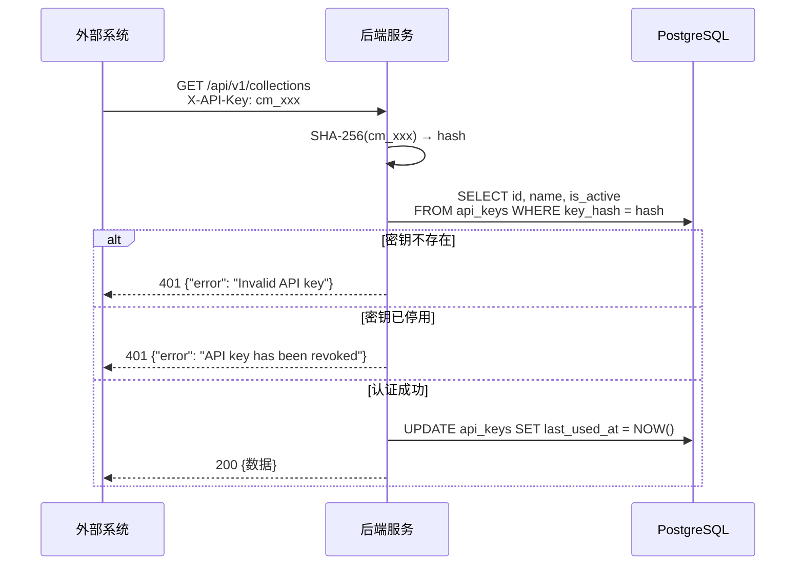
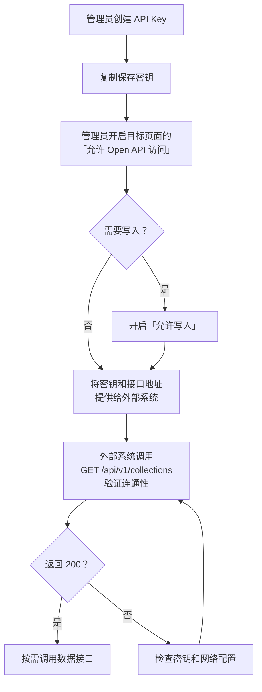

# Open API 接口文档

## 1. 概述

Open API 允许外部系统通过 API Key 认证方式，以 RESTful 接口读取和写入系统中已授权开放的业务数据集合。

**Base URL：**

```
http://<host>:<port>/api/v1
```

默认开发环境为 `http://localhost:7001/api/v1`。

**数据格式：** 所有接口均返回 `application/json`。写入接口的请求体也必须是 `application/json`。

**认证方式：** 通过 `X-API-Key` 请求头传递 API Key。

---

## 2. 认证

### 2.1 认证方式

所有 Open API 接口均需要在请求头中携带有效的 API Key：

```
X-API-Key: cm_xxxxxxxxxxxxxxxxxxxxxxxxxxxxxxxxxxxxxxxx
```

### 2.2 API Key 格式

| 属性 | 说明 |
|------|------|
| 前缀 | `cm_` |
| 长度 | 约 46 个字符 |
| 字符集 | URL 安全的 Base64 字符 |
| 示例 | `cm_A1b2C3d4E5f6G7h8I9j0K1l2M3n4O5p6Q7r8S9t0U1v2` |

### 2.3 认证流程



### 2.4 认证错误响应

| HTTP 状态码 | error | 触发条件 |
|-------------|-------|---------|
| 401 | `Missing API key` | 请求头未携带 `X-API-Key` |
| 401 | `Invalid API key` | API Key 无效（不存在） |
| 401 | `API key has been revoked` | API Key 已被管理员停用 |

---

## 3. 前置条件

调用 Open API 前需满足以下条件：

1. **创建 API Key** — 管理员在「系统配置 → 数据工具 → Open API」中创建
2. **开放数据集合** — 管理员在「页面配置」中勾选「允许 Open API 访问」
3. **开放写入权限**（可选）— 如需通过 API 新增/修改数据，还需在「页面配置」中开启「允许写入」

只有标记为 `api_public = true` 的数据集合才会对 Open API 可见。写入操作还需要 `api_writable = true`。

---

## 4. 接口列表

### 4.1 查询接口（只读）

| 方法 | 路径 | 说明 |
|------|------|------|
| GET | `/api/v1/collections` | 获取所有已开放的集合列表 |
| GET | `/api/v1/branches` | 获取所有可用分支列表 |
| GET | `/api/v1/collections/{collection}` | 获取集合中的数据（分页，支持 branchId 参数） |
| GET | `/api/v1/collections/{collection}/{id}` | 获取单条记录详情（支持 branchId 参数） |
| GET | `/api/v1/collections/{collection}/schema` | 获取集合的字段定义 |
| GET | `/api/v1/files/{fileId}` | 获取文件元数据（名称/类型/大小） |
| GET | `/api/v1/files/{fileId}/download` | 下载 file/image 字段上传的文件 |

### 4.2 写入接口（需开启「允许写入」）

| 方法 | 路径 | 说明 |
|------|------|------|
| POST | `/api/v1/collections/{collection}` | 新增一条记录（支持 branchId 参数） |
| PUT | `/api/v1/collections/{collection}/{id}` | 修改一条记录（支持部分更新，支持 branchId 参数） |
| POST | `/api/v1/files` | 上传文件，返回 `uid` 供写入 file / image 字段 |

---

## 5. 接口详情

### 5.1 获取集合列表

获取所有已开放 Open API 访问的数据集合。

**请求**

```
GET /api/v1/collections
```

**请求头**

| 名称 | 必填 | 说明 |
|------|------|------|
| X-API-Key | 是 | API 密钥 |

**响应 — 200**

```json
{
  "data": [
    {
      "collection": "inspection-cases",
      "name": "巡检用例",
      "description": "巡检用例数据表",
      "writable": false
    },
    {
      "collection": "devices",
      "name": "设备台账",
      "description": "设备基础信息",
      "writable": true
    }
  ]
}
```

**响应字段说明**

| 字段 | 类型 | 说明 |
|------|------|------|
| `data` | array | 集合列表 |
| `data[].collection` | string | 集合标识（用于后续接口的路径参数） |
| `data[].name` | string | 集合显示名称 |
| `data[].description` | string | 集合描述 |
| `data[].writable` | boolean | 是否允许写入（POST/PUT） |

---

### 5.2 获取分支列表

获取所有可用于查询的分支。`main` 分支始终可用，其他分支来自项目版本管理中的活跃分支。

**请求**

```
GET /api/v1/branches
```

**请求头**

| 名称 | 必填 | 说明 |
|------|------|------|
| X-API-Key | 是 | API 密钥 |

**响应 — 200**

```json
{
  "data": [
    {
      "id": "main",
      "name": "main",
      "description": "Default main branch",
      "status": "active"
    },
    {
      "id": "pv-abc123",
      "name": "版本A",
      "description": "测试版本",
      "projectMenuId": "menu-project-1",
      "versionType": "branch",
      "status": "active",
      "createdAt": "2025-12-01T08:30:00.000Z"
    }
  ]
}
```

**响应字段说明**

| 字段 | 类型 | 说明 |
|------|------|------|
| `data` | array | 分支列表 |
| `data[].id` | string | 分支标识（用于后续接口的 branchId 参数） |
| `data[].name` | string | 分支显示名称 |
| `data[].description` | string | 分支描述 |
| `data[].status` | string | 分支状态（仅返回 active 状态的分支） |
| `data[].projectMenuId` | string | 所属项目菜单ID（仅非 main 分支） |
| `data[].versionType` | string | 版本类型（仅非 main 分支） |
| `data[].createdAt` | string | 创建时间（仅非 main 分支） |

---

### 5.3 获取集合数据（分页）

获取指定集合中的所有记录，支持分页和分支选择。

**请求**

```
GET /api/v1/collections/{collection}?page=1&pageSize=20&branchId=main
```

**路径参数**

| 名称 | 类型 | 说明 |
|------|------|------|
| collection | string | 集合标识（来自集合列表接口） |

**查询参数**

| 名称 | 类型 | 默认值 | 说明 |
|------|------|--------|------|
| page | integer | 1 | 页码（从 1 开始） |
| pageSize | integer | 20 | 每页条数（最大 100） |
| branchId | string | main | 分支标识（来自分支列表接口，`main` 或项目版本ID） |

**响应 — 200**

```json
{
  "data": [
    {
      "id": "a1b2c3d4",
      "caseName": "登录功能验证",
      "priority": "high",
      "status": "active",
      "createdAt": "2025-12-01T08:30:00.000Z"
    },
    {
      "id": "e5f6g7h8",
      "caseName": "数据导出测试",
      "priority": "medium",
      "status": "active",
      "createdAt": "2025-12-02T10:15:00.000Z"
    }
  ],
  "pagination": {
    "page": 1,
    "pageSize": 20,
    "total": 128,
    "totalPages": 7
  },
  "branchId": "main"
}
```

**响应字段说明**

| 字段 | 类型 | 说明 |
|------|------|------|
| `data` | array | 记录列表 |
| `data[].id` | string | 记录唯一标识 |
| `data[].*` | any | 业务字段（根据集合配置而定） |
| `data[].createdAt` | string | 创建时间（ISO 8601 UTC） |
| `pagination.page` | integer | 当前页码 |
| `pagination.pageSize` | integer | 每页条数 |
| `pagination.total` | integer | 总记录数 |
| `pagination.totalPages` | integer | 总页数 |
| `branchId` | string | 当前查询使用的分支标识 |

**错误响应**

| HTTP 状态码 | error | 触发条件 |
|-------------|-------|---------|
| 404 | `Collection not found or not public` | 集合不存在或未开放 API 访问 |
| 404 | `Branch not found or not active` | 指定的分支不存在或非活跃状态 |

---

### 5.4 获取单条记录

根据记录 ID 获取单条记录的完整数据，支持分支选择。

**请求**

```
GET /api/v1/collections/{collection}/{id}?branchId=main
```

**路径参数**

| 名称 | 类型 | 说明 |
|------|------|------|
| collection | string | 集合标识 |
| id | string | 记录 ID |

**查询参数**

| 名称 | 类型 | 默认值 | 说明 |
|------|------|--------|------|
| branchId | string | main | 分支标识（来自分支列表接口） |

**响应 — 200**

```json
{
  "data": {
    "id": "a1b2c3d4",
    "caseName": "登录功能验证",
    "priority": "high",
    "status": "active",
    "description": "验证登录功能在各种场景下的行为",
    "tags": ["smoke", "login"],
    "createdAt": "2025-12-01T08:30:00.000Z",
    "branchId": "main"
  }
}
```

**错误响应**

| HTTP 状态码 | error | 触发条件 |
|-------------|-------|---------|
| 404 | `Collection not found or not public` | 集合不存在或未开放 API 访问 |
| 404 | `Record not found` | 记录 ID 不存在 |
| 404 | `Branch not found or not active` | 指定的分支不存在或非活跃状态 |

---

### 5.5 获取集合字段定义

获取指定集合的字段配置信息，用于了解数据结构。

**请求**

```
GET /api/v1/collections/{collection}/schema
```

**路径参数**

| 名称 | 类型 | 说明 |
|------|------|------|
| collection | string | 集合标识 |

**响应 — 200**

```json
{
  "data": {
    "collection": "inspection-cases",
    "name": "巡检用例",
    "description": "巡检用例数据表",
    "writable": true,
    "fields": [
      {
        "fieldName": "caseName",
        "label": "用例名称",
        "type": "text",
        "required": true
      },
      {
        "fieldName": "priority",
        "label": "优先级",
        "type": "select",
        "required": true
      },
      {
        "fieldName": "status",
        "label": "状态",
        "type": "radio",
        "required": false
      },
      {
        "fieldName": "description",
        "label": "描述",
        "type": "textarea",
        "required": false
      },
      {
        "fieldName": "tags",
        "label": "标签",
        "type": "multiSelect",
        "required": false
      }
    ]
  }
}
```

**响应字段说明**

| 字段 | 类型 | 说明 |
|------|------|------|
| `data.collection` | string | 集合标识 |
| `data.name` | string | 集合显示名称 |
| `data.description` | string | 集合描述 |
| `data.writable` | boolean | 是否允许写入 |
| `data.fields` | array | 字段定义列表 |
| `data.fields[].fieldName` | string | 字段名（对应数据中的 key） |
| `data.fields[].label` | string | 字段显示名称 |
| `data.fields[].type` | string | 字段控件类型 |
| `data.fields[].required` | boolean | 是否必填 |

**字段控件类型枚举**

| type 值 | 说明 |
|---------|------|
| `text` | 单行文本 |
| `textarea` | 多行文本 |
| `number` | 数值 |
| `select` | 单选下拉 |
| `multiSelect` | 多选下拉 |
| `radio` | 单选按钮 |
| `checkbox` | 复选框 |
| `date` | 日期 |
| `datetime` | 日期时间 |
| `file` | 文件 |
| `image` | 图片 |
| `relation` | 多对多关联 |
| `reference` | 一对多引用 |
| `quoteSelect` | 引用选择 |
| `autoTimestamp` | 自动时间戳 |
| `autoSequence` | 自增序列 |
| `richtext` | 富文本编辑器 |

**错误响应**

| HTTP 状态码 | error | 触发条件 |
|-------------|-------|---------|
| 404 | `Collection not found or not public` | 集合不存在或未开放 API 访问 |

---

### 5.6 新增记录

向指定集合中新增一条记录。集合必须开启「允许写入」，支持指定分支。

**请求**

```
POST /api/v1/collections/{collection}?branchId=main
Content-Type: application/json
```

**路径参数**

| 名称 | 类型 | 说明 |
|------|------|------|
| collection | string | 集合标识 |

**查询参数**

| 名称 | 类型 | 默认值 | 说明 |
|------|------|--------|------|
| branchId | string | main | 分支标识（来自分支列表接口） |

**请求体**

```json
{
  "caseName": "新增用例",
  "priority": "high",
  "status": "active",
  "description": "通过 API 创建的测试用例"
}
```

| 字段 | 类型 | 必填 | 说明 |
|------|------|------|------|
| `id` | string | 否 | 自定义记录 ID；不传则自动生成 `api-xxxxxxxxxxxx` 格式 |
| `*` | any | 视字段定义 | 业务字段，需符合 schema 中的必填约束 |

> **引用类字段（reference / quoteSelect）的写入与延迟解析**
>
> 这两类字段在记录中以"目标记录的内部 ID"存储：`reference` 存单个 ID，`quoteSelect` 存 ID 数组。
>
> - **推荐**：直接写入目标记录的内部 ID（先 `GET /collections/{目标集合}` 拿到 `id`）。
> - **支持延迟解析（先写原始值，后解析）**：若被引用的数据此刻尚未创建，也可以**先写入目标的主键值或 displayField 值作为原始值**——`reference` 写字符串、`quoteSelect` 写字符串数组（例如 `"quotedProducts": ["苹果手机", "华为笔记本"]`）。系统会**原样保存、不报错**（写入接口不自动解析引用，按原样存 JSONB）。
> - 待被引用数据补齐后，到该数据页点击 **「更多 → 重新解析引用」**，系统会把这些原始值按当前目标数据补全为内部 ID。该操作与数据来源无关，API 写入和文件导入产生的原始值都会被一并解析。
> - 匹配规则：已是内部 ID → 保留；否则按目标的"主键值 / displayField 值"匹配；仍匹配不到则保留原始值，下次再点可继续补全。
> - **不适用 `relation`（多对多）**：关联数据存于独立关联表，需在请求体中用 `_relations` 字段、按内部 ID 写入；「重新解析引用」不处理 relation。
>
> **用原 ID 重建记录可恢复"悬空引用"**：若目标记录被删除、源记录里的 quoteSelect 引用变成悬空，**用相同的 `id` 重新创建该目标记录**，悬空引用会立即恢复（源记录存的那个内部 ID 又有效了）。注意：用全新 ID 重建则无法恢复——源记录手里的旧 ID 既非主键值也非显示值，匹配不回去。

**响应 — 201**

```json
{
  "data": {
    "id": "api-a1b2c3d4e5f6",
    "caseName": "新增用例",
    "priority": "high",
    "status": "active",
    "description": "通过 API 创建的测试用例",
    "createdAt": "2026-03-05T10:30:00.000Z",
    "branchId": "main"
  }
}
```

**错误响应**

| HTTP 状态码 | error | 触发条件 |
|-------------|-------|---------|
| 400 | `Request body is required` | 请求体为空 |
| 400 | `Validation failed` | 必填字段缺失（`details` 数组包含具体字段） |
| 403 | `Collection is read-only` | 集合未开启「允许写入」 |
| 404 | `Collection not found or not public` | 集合不存在或未开放 API 访问 |
| 404 | `Branch not found or not active` | 指定的分支不存在或非活跃状态 |
| 409 | `Record ID already exists` | 自定义 ID 已存在（在同一分支下） |
| 409 | `Primary key conflict` | 主键字段值与已有记录重复 |

---

### 5.7 批量新增记录

一次请求创建多条记录（单次最多 1000 条）。语义上是 5.6 新增记录的批量版本：**create-only，不做 upsert**——批次里任何一条 `id` 已存在（批次内部重复，或数据库里已存在）都算该条失败，不会更新已有记录。

**请求**

```
POST /api/v1/collections/{collection}/batch?branchId=main
Content-Type: application/json
```

**请求体**

```json
{
  "records": [
    { "id": "prod-001", "name": "产品A", "price": 99 },
    { "name": "产品B", "price": 199 }
  ],
  "options": { "continueOnError": true }
}
```

| 字段 | 类型 | 必填 | 说明 |
|------|------|------|------|
| `records` | array | 是 | 待创建的记录数组，单个元素的形状与 5.6 新增记录的请求体完全一致；单次最多 1000 条 |
| `options.continueOnError` | boolean | 否，默认 `false` | `false`：只要有一条记录校验失败，整批返回 400，不写入任何记录；`true`：跳过失败记录，成功的都写入 |

**响应 — 201（全部成功）**

```json
{
  "data": [
    { "id": "prod-001", "name": "产品A", "price": 99, "createdAt": "...", "branchId": "main" },
    { "id": "api-a1b2c3d4e5f6", "name": "产品B", "price": 199, "createdAt": "...", "branchId": "main" }
  ],
  "created": 2,
  "failed": 0
}
```

**响应 — 201（`continueOnError=true` 且部分失败：`data` 只包含成功创建的记录）**

```json
{
  "data": [ { "id": "api-a1b2c3d4e5f6", "name": "产品B", "price": 199, "createdAt": "...", "branchId": "main" } ],
  "created": 1,
  "failed": 1,
  "errors": [ { "index": 0, "error": "Record ID already exists", "record": { "id": "prod-001", "name": "产品A", "price": 99 } } ]
}
```

**响应 — 400（`continueOnError=false` 且存在失败记录：不写入任何记录）**

```json
{
  "error": "Validation failed for one or more records",
  "failed": 1,
  "errors": [ { "index": 0, "error": "Record ID already exists", "record": { "id": "prod-001", "name": "产品A", "price": 99 } } ]
}
```

**错误响应**

| HTTP 状态码 | error | 触发条件 |
|-------------|-------|---------|
| 400 | `Request body is required` | 请求体为空 |
| 400 | `records is required` | `records` 为空数组或缺失 |
| 400 | `Batch size exceeds maximum of 1000 records` | 单次请求记录数超过 1000 |
| 400 | `Validation failed for one or more records` | `continueOnError=false` 且至少一条记录校验失败（`errors` 数组列出每条失败记录的 `index`/`error`/`record`） |
| 403 | `Collection is read-only` | 集合未开启「允许写入」 |
| 404 | `Collection not found or not public` | 集合不存在或未开放 API 访问 |
| 404 | `Branch not found or not active` | 指定的分支不存在或非活跃状态 |

单条记录失败时，`errors[].error` 可能是以下两种不同的 ID 冲突之一（不要混淆）：

| `errors[].error` | 触发条件 |
|-------------------|---------|
| `Record ID already exists` | 该记录的 `id` 已存在于数据库中——注意 `id` 在同一分支下**跨集合全局唯一**（`dynamic_data` 的主键是 `(id, branch_id)`，不含 collection），即便冲突的记录属于另一个集合也会命中此错误 |
| `Duplicate ID in batch` | 该 `id` 是本次请求 `records` 数组内部重复出现的值（与数据库里已有数据无关），重复的每个下标都会各算一条失败记录 |

---

### 5.8 修改记录

修改指定集合中的一条记录。支持**部分更新**：只传需要修改的字段即可，未传的字段保持原值，支持指定分支。

**请求**

```
PUT /api/v1/collections/{collection}/{id}?branchId=main
Content-Type: application/json
```

**路径参数**

| 名称 | 类型 | 说明 |
|------|------|------|
| collection | string | 集合标识 |
| id | string | 记录 ID |

**查询参数**

| 名称 | 类型 | 默认值 | 说明 |
|------|------|--------|------|
| branchId | string | main | 分支标识（来自分支列表接口） |

**请求体**

```json
{
  "status": "inactive",
  "description": "已通过 API 更新"
}
```

| 字段 | 类型 | 必填 | 说明 |
|------|------|------|------|
| `_version` | integer | 否 | 乐观锁版本号；传入时进行并发冲突检测 |
| `*` | any | 否 | 需要更新的业务字段（部分更新） |

**响应 — 200**

```json
{
  "data": {
    "id": "a1b2c3d4",
    "caseName": "登录功能验证",
    "priority": "high",
    "status": "inactive",
    "description": "已通过 API 更新",
    "createdAt": "2025-12-01T08:30:00.000Z",
    "_version": 2,
    "branchId": "main"
  }
}
```

**错误响应**

| HTTP 状态码 | error | 触发条件 |
|-------------|-------|---------|
| 400 | `Request body is required` | 请求体为空 |
| 400 | `Validation failed` | 更新后必填字段为空（`details` 数组包含具体字段） |
| 403 | `Collection is read-only` | 集合未开启「允许写入」 |
| 404 | `Collection not found or not public` | 集合不存在或未开放 API 访问 |
| 404 | `Record not found` | 记录 ID 不存在（或在该分支下不存在） |
| 404 | `Branch not found or not active` | 指定的分支不存在或非活跃状态 |
| 409 | `Record has been modified...` | 乐观锁冲突（`code: "VERSION_CONFLICT"`） |
| 409 | `Primary key conflict` | 主键字段值与已有记录重复 |

---

### 5.9 上传文件（写入 file / image 字段）

外部系统可通过 API 直接上传文件，拿到 `uid` 后写入记录的 `file` / `image` 字段。

**请求**（`multipart/form-data`）：

```
POST /api/v1/files
X-API-Key: cm_xxx
Content-Type: multipart/form-data

file        = <要上传的文件>            # 必填
collection  = <目标数据页>             # 必填，须为「公开且允许写入」的集合
fieldName   = <目标 file/image 字段名>  # 选填
```

**响应**：

```json
{
  "data": {
    "uid": "8f3c...e21",
    "name": "report.pdf",
    "size": 20480,
    "mimeType": "application/pdf",
    "downloadUrl": "/api/v1/files/8f3c...e21/download"
  }
}
```

**写入文件字段**：拿到 `uid` 后，在新增 / 修改记录时把如下对象数组写入该 file / image 字段：

```json
{
  "名称": "外部记录1",
  "附件": [
    {
      "uid": "8f3c...e21",
      "name": "report.pdf",
      "size": 20480,
      "type": "application/pdf",
      "url": "/api/data-files/8f3c...e21/download"
    }
  ]
}
```

> - 鉴权与写记录一致：只能向**公开且允许写入**的集合上传（否则 404 / 403）。
> - 支持中文文件名；单文件大小上限同网页端（`DATA_FILE_MAX_MB`）。
> - 缺 `collection` → 400；非公开集合 → 404。
> - 传了 `fieldName` 时，会按该字段在管理端「字段配置」里设置的「允许的文件类型」做校验（与网页端上传走同一份约束，见字段类型说明的「文件/图片上传的类型约束」小节）；类型不符返回 400。不传 `fieldName` 则不做类型限制（向后兼容旧调用）。
> - 文件被某条记录引用后，即可经 `GET /api/v1/files/{uid}/download` 下载（见 5.10）。

### 5.10 下载文件（file / image 字段）

数据页的 `file`/`image` 字段保存的是文件对象数组。查询记录时，每个文件对象会附带一个
`apiUrl` 字段，直接用它（带 API Key）即可下载：

```json
{
  "data": {
    "id": "rec-1",
    "attachment": [
      {
        "uid": "8f3c...e21",
        "name": "report.pdf",
        "size": 20480,
        "type": "application/pdf",
        "url": "/api/data-files/8f3c...e21/download",   // 内部 url（走 JWT，外部不可用）
        "apiUrl": "/api/v1/files/8f3c...e21/download"    // ← Open API 用这个
      }
    ]
  }
}
```

**下载文件字节**

```
GET /api/v1/files/{fileId}/download
X-API-Key: cm_xxx
```

返回文件二进制流（`Content-Disposition: attachment`）。

**获取文件元数据**

```
GET /api/v1/files/{fileId}
X-API-Key: cm_xxx
```

```json
{ "data": { "id": "8f3c...e21", "name": "report.pdf", "mimeType": "application/pdf",
            "size": 20480, "uploadedAt": "2026-06-15T...Z",
            "downloadUrl": "/api/v1/files/8f3c...e21/download" } }
```

> **安全边界**：只有被**已开放（api_public）集合**的记录引用的文件才能经 Open API 下载；
> 挂在未开放集合上的文件返回 `404 File not found`。

---

## 6. 使用示例

> **Python 用户推荐直接用官方客户端库**，比手写 `requests` 调用更省事：内置异常分类（无需手动查状态码）、
> 自动分页遍历、以及"上传文件 + 写入 file/image 字段"的一步式方法。见仓库 `python-client/README.md`。
>
> ```bash
> cd python-client && pip install -e .
> ```
> ```python
> from checkmanage_openapi import OpenApiClient
>
> with OpenApiClient(api_key="cm_xxx", base_url=BASE_URL) as client:
>     for record in client.iter_records("inspection-cases"):
>         print(record["id"])
>     client.attach_files("devices", "附件", "./report.pdf", {"名称": "外部记录1"})
> ```
>
> 下面 6.1-6.4 是不依赖该客户端库、直接手写请求的参考实现，适合其他语言或不便安装额外包的场景。

### 6.1 cURL

```bash
# 设置 API Key
API_KEY="cm_A1b2C3d4E5f6G7h8I9j0K1l2M3n4O5p6Q7r8S9t0U1v2"
BASE_URL="http://localhost:7001/api/v1"

# 1. 查看所有已开放的集合
curl -s -H "X-API-Key: $API_KEY" "$BASE_URL/collections" | jq

# 2. 查看所有可用分支
curl -s -H "X-API-Key: $API_KEY" "$BASE_URL/branches" | jq

# 3. 获取第一页数据（默认每页 20 条，默认 main 分支）
curl -s -H "X-API-Key: $API_KEY" "$BASE_URL/collections/inspection-cases" | jq

# 4. 获取第 2 页，每页 50 条
curl -s -H "X-API-Key: $API_KEY" "$BASE_URL/collections/inspection-cases?page=2&pageSize=50" | jq

# 5. 获取指定分支的数据
curl -s -H "X-API-Key: $API_KEY" "$BASE_URL/collections/inspection-cases?branchId=pv-abc123" | jq

# 6. 获取单条记录（指定分支）
curl -s -H "X-API-Key: $API_KEY" "$BASE_URL/collections/inspection-cases/a1b2c3d4?branchId=main" | jq

# 7. 查看集合字段定义
curl -s -H "X-API-Key: $API_KEY" "$BASE_URL/collections/inspection-cases/schema" | jq

# 8. 新增一条记录（指定分支）
curl -s -X POST \
  -H "X-API-Key: $API_KEY" \
  -H "Content-Type: application/json" \
  -d '{"caseName":"API新增用例","priority":"high","status":"active"}' \
  "$BASE_URL/collections/inspection-cases?branchId=main" | jq

# 9. 修改一条记录（部分更新，指定分支）
curl -s -X PUT \
  -H "X-API-Key: $API_KEY" \
  -H "Content-Type: application/json" \
  -d '{"status":"inactive"}' \
  "$BASE_URL/collections/inspection-cases/a1b2c3d4?branchId=main" | jq
```

### 6.2 Python

```python
import requests

API_KEY = "cm_A1b2C3d4E5f6G7h8I9j0K1l2M3n4O5p6Q7r8S9t0U1v2"
BASE_URL = "http://localhost:7001/api/v1"
HEADERS = {"X-API-Key": API_KEY}


def get_collections():
    """获取所有已开放的集合"""
    resp = requests.get(f"{BASE_URL}/collections", headers=HEADERS)
    resp.raise_for_status()
    return resp.json()["data"]


def get_branches():
    """获取所有可用分支"""
    resp = requests.get(f"{BASE_URL}/branches", headers=HEADERS)
    resp.raise_for_status()
    return resp.json()["data"]


def get_all_records(collection, branch_id="main"):
    """遍历分页获取集合中的所有记录（可指定分支）"""
    all_records = []
    page = 1
    while True:
        resp = requests.get(
            f"{BASE_URL}/collections/{collection}",
            headers=HEADERS,
            params={"page": page, "pageSize": 100, "branchId": branch_id},
        )
        resp.raise_for_status()
        body = resp.json()
        all_records.extend(body["data"])
        if page >= body["pagination"]["totalPages"]:
            break
        page += 1
    return all_records


def get_record(collection, record_id, branch_id="main"):
    """获取单条记录（可指定分支）"""
    resp = requests.get(
        f"{BASE_URL}/collections/{collection}/{record_id}",
        headers=HEADERS,
        params={"branchId": branch_id},
    )
    resp.raise_for_status()
    return resp.json()["data"]


def get_schema(collection):
    """获取集合字段定义"""
    resp = requests.get(
        f"{BASE_URL}/collections/{collection}/schema",
        headers=HEADERS,
    )
    resp.raise_for_status()
    return resp.json()["data"]


def create_record(collection, data, branch_id="main"):
    """新增一条记录（可指定分支）"""
    resp = requests.post(
        f"{BASE_URL}/collections/{collection}",
        headers={**HEADERS, "Content-Type": "application/json"},
        json=data,
        params={"branchId": branch_id},
    )
    resp.raise_for_status()
    return resp.json()["data"]


def update_record(collection, record_id, data, branch_id="main"):
    """修改一条记录（部分更新，可指定分支）"""
    resp = requests.put(
        f"{BASE_URL}/collections/{collection}/{record_id}",
        headers={**HEADERS, "Content-Type": "application/json"},
        json=data,
        params={"branchId": branch_id},
    )
    resp.raise_for_status()
    return resp.json()["data"]


# ---- 使用示例 ----
if __name__ == "__main__":
    # 列出所有可用集合
    collections = get_collections()
    for c in collections:
        rw = "读写" if c["writable"] else "只读"
        print(f"[{c['collection']}] {c['name']} ({rw})")

    # 列出所有可用分支
    branches = get_branches()
    print("\n可用分支:")
    for b in branches:
        print(f"  {b['id']}: {b['name']}")

    # 获取第一个集合的所有数据（指定分支）
    if collections:
        name = collections[0]["collection"]
        # 获取 main 分支数据
        records = get_all_records(name, branch_id="main")
        print(f"\nmain 分支共 {len(records)} 条记录")
        for r in records[:3]:
            print(f"  {r['id']}: {r}")

        # 也可以获取其他分支数据
        if len(branches) > 1:
            branch_id = branches[1]["id"]
            branch_records = get_all_records(name, branch_id=branch_id)
            print(f"\n{branch_id} 分支共 {len(branch_records)} 条记录")

    # 新增记录（指定分支）
    if collections:
        writable = [c for c in collections if c["writable"]]
        if writable:
            col = writable[0]["collection"]
            new_record = create_record(col, {
                "caseName": "API 新增用例",
                "priority": "medium",
                "status": "active",
            }, branch_id="main")
            print(f"\n新增成功: {new_record['id']} (分支: {new_record['branchId']})")

            # 修改记录（指定分支）
            updated = update_record(col, new_record["id"], {
                "status": "inactive",
            }, branch_id="main")
            print(f"修改成功: status={updated['status']} (分支: {updated['branchId']})")
```

### 6.3 JavaScript / Node.js

```javascript
const API_KEY = "cm_A1b2C3d4E5f6G7h8I9j0K1l2M3n4O5p6Q7r8S9t0U1v2";
const BASE_URL = "http://localhost:7001/api/v1";

async function fetchAPI(path, options = {}) {
  const url = new URL(`${BASE_URL}${path}`);
  if (options.params) {
    Object.entries(options.params).forEach(([k, v]) =>
      url.searchParams.set(k, v)
    );
  }

  const resp = await fetch(url, {
    method: options.method || "GET",
    headers: {
      "X-API-Key": API_KEY,
      ...(options.body ? { "Content-Type": "application/json" } : {}),
    },
    body: options.body ? JSON.stringify(options.body) : undefined,
  });

  if (!resp.ok) {
    const body = await resp.json();
    throw new Error(`${resp.status}: ${body.error}`);
  }
  return resp.json();
}

// 获取所有集合
async function getCollections() {
  const { data } = await fetchAPI("/collections");
  return data;
}

// 获取所有分支
async function getBranches() {
  const { data } = await fetchAPI("/branches");
  return data;
}

// 分页获取数据（可指定分支）
async function getRecords(collection, page = 1, pageSize = 20, branchId = "main") {
  return fetchAPI(`/collections/${collection}`, {
    params: { page, pageSize, branchId },
  });
}

// 获取所有数据（自动遍历分页，可指定分支）
async function getAllRecords(collection, branchId = "main") {
  const all = [];
  let page = 1;
  while (true) {
    const body = await getRecords(collection, page, 100, branchId);
    all.push(...body.data);
    if (page >= body.pagination.totalPages) break;
    page++;
  }
  return all;
}

// 获取单条记录（可指定分支）
async function getRecord(collection, id, branchId = "main") {
  const { data } = await fetchAPI(`/collections/${collection}/${id}`, {
    params: { branchId },
  });
  return data;
}

// 获取字段定义
async function getSchema(collection) {
  const { data } = await fetchAPI(`/collections/${collection}/schema`);
  return data;
}

// 新增记录（可指定分支）
async function createRecord(collection, recordData, branchId = "main") {
  const { data } = await fetchAPI(`/collections/${collection}`, {
    method: "POST",
    body: recordData,
    params: { branchId },
  });
  return data;
}

// 修改记录（部分更新，可指定分支）
async function updateRecord(collection, id, recordData, branchId = "main") {
  const { data } = await fetchAPI(`/collections/${collection}/${id}`, {
    method: "PUT",
    body: recordData,
    params: { branchId },
  });
  return data;
}

// ---- 使用示例 ----
(async () => {
  const collections = await getCollections();
  console.log("可用集合:", collections);

  // 列出所有可用分支
  const branches = await getBranches();
  console.log("可用分支:", branches);

  if (collections.length > 0) {
    const name = collections[0].collection;
    // 获取 main 分支数据
    const records = await getAllRecords(name, "main");
    console.log(`${name} main分支共 ${records.length} 条记录`);

    // 也可以获取其他分支数据
    if (branches.length > 1) {
      const branchId = branches[1].id;
      const branchRecords = await getAllRecords(name, branchId);
      console.log(`${name} ${branchId}分支共 ${branchRecords.length} 条记录`);
    }
  }

  // 新增记录（指定分支）
  const writable = collections.filter((c) => c.writable);
  if (writable.length > 0) {
    const col = writable[0].collection;
    const newRecord = await createRecord(col, {
      caseName: "API 新增用例",
      priority: "medium",
    }, "main");
    console.log("新增:", newRecord.id, "分支:", newRecord.branchId);

    // 修改记录（指定分支）
    const updated = await updateRecord(col, newRecord.id, {
      status: "inactive",
    }, "main");
    console.log("修改:", updated);
  }
})();
```

### 6.4 Java

```java
import java.net.URI;
import java.net.http.*;
import com.google.gson.*;

public class OpenApiClient {
    private static final String API_KEY = "cm_A1b2C3d4E5f6G7h8I9j0K1l2M3n4O5p6Q7r8S9t0U1v2";
    private static final String BASE_URL = "http://localhost:7001/api/v1";
    private static final HttpClient client = HttpClient.newHttpClient();
    private static final Gson gson = new Gson();

    public static String get(String path) throws Exception {
        HttpRequest request = HttpRequest.newBuilder()
            .uri(URI.create(BASE_URL + path))
            .header("X-API-Key", API_KEY)
            .GET()
            .build();
        HttpResponse<String> response = client.send(request,
            HttpResponse.BodyHandlers.ofString());
        if (response.statusCode() != 200) {
            throw new RuntimeException("HTTP " + response.statusCode()
                + ": " + response.body());
        }
        return response.body();
    }

    public static String post(String path, String json) throws Exception {
        HttpRequest request = HttpRequest.newBuilder()
            .uri(URI.create(BASE_URL + path))
            .header("X-API-Key", API_KEY)
            .header("Content-Type", "application/json")
            .POST(HttpRequest.BodyPublishers.ofString(json))
            .build();
        HttpResponse<String> response = client.send(request,
            HttpResponse.BodyHandlers.ofString());
        if (response.statusCode() != 201) {
            throw new RuntimeException("HTTP " + response.statusCode()
                + ": " + response.body());
        }
        return response.body();
    }

    public static String put(String path, String json) throws Exception {
        HttpRequest request = HttpRequest.newBuilder()
            .uri(URI.create(BASE_URL + path))
            .header("X-API-Key", API_KEY)
            .header("Content-Type", "application/json")
            .PUT(HttpRequest.BodyPublishers.ofString(json))
            .build();
        HttpResponse<String> response = client.send(request,
            HttpResponse.BodyHandlers.ofString());
        if (response.statusCode() != 200) {
            throw new RuntimeException("HTTP " + response.statusCode()
                + ": " + response.body());
        }
        return response.body();
    }

    public static void main(String[] args) throws Exception {
        // 获取集合列表
        String collections = get("/collections");
        System.out.println("集合列表: " + collections);

        // 获取数据（第 1 页，每页 20 条）
        String data = get("/collections/inspection-cases?page=1&pageSize=20");
        System.out.println("数据: " + data);

        // 新增记录
        String newRecord = post("/collections/inspection-cases",
            "{\"caseName\":\"Java新增\",\"priority\":\"high\"}");
        System.out.println("新增: " + newRecord);

        // 修改记录
        String updated = put("/collections/inspection-cases/a1b2c3d4",
            "{\"status\":\"inactive\"}");
        System.out.println("修改: " + updated);
    }
}
```

---

## 7. 错误处理

### 7.1 统一错误格式

所有错误响应均为以下 JSON 格式：

```json
{
  "error": "错误描述信息"
}
```

部分校验错误会包含 `details` 数组：

```json
{
  "error": "Validation failed",
  "details": ["名称 is required", "优先级 is required"]
}
```

### 7.2 错误码汇总

| HTTP 状态码 | error | 说明 |
|-------------|-------|------|
| 400 | `Request body is required` | POST/PUT 请求体为空 |
| 400 | `Validation failed` | 必填字段缺失或校验不通过 |
| 401 | `Missing API key` | 请求头缺少 X-API-Key |
| 401 | `Invalid API key` | API Key 不存在 |
| 401 | `API key has been revoked` | API Key 已被停用 |
| 403 | `Collection is read-only` | 集合未开启写入权限 |
| 404 | `Collection not found or not public` | 集合不存在或未开放 API |
| 404 | `Record not found` | 记录不存在（或在该分支下不存在） |
| 404 | `Branch not found or not active` | 分支不存在或非活跃状态 |
| 409 | `Record ID already exists` | 新增时 ID 冲突（在同一分支下） |
| 409 | `Primary key conflict` | 主键字段值重复 |
| 409 | `Record has been modified...` | 乐观锁版本冲突 |

### 7.3 错误处理建议

```python
import requests

def safe_request(method, url, headers, json=None):
    resp = requests.request(method, url, headers=headers, json=json)
    if resp.status_code == 401:
        error = resp.json().get("error", "")
        if "Missing" in error:
            print("错误：未提供 API Key，请检查请求头")
        elif "Invalid" in error:
            print("错误：API Key 无效，请检查密钥是否正确")
        elif "revoked" in error:
            print("错误：API Key 已被停用，请联系管理员")
        return None
    elif resp.status_code == 403:
        print("错误：集合为只读，请联系管理员开启写入权限")
        return None
    elif resp.status_code == 404:
        print("错误：集合或记录不存在，请检查集合是否已开放 API 访问")
        return None
    elif resp.status_code == 409:
        body = resp.json()
        if body.get("code") == "VERSION_CONFLICT":
            print("错误：数据冲突，请重新获取数据后重试")
        else:
            print(f"错误：{body.get('error')}")
        return None
    resp.raise_for_status()
    return resp.json()
```

---

## 8. 接入流程



**步骤详解：**

1. 管理员登录系统，进入「系统配置 → 数据工具 → Open API」
2. 点击「创建 API Key」，输入名称，创建后**立即复制密钥**（仅此一次可见）
3. 进入「系统配置 → 平台管理 → 页面配置」，选择需要开放的页面
4. 在页面基本信息中开启「允许 Open API 访问」并保存
5. 如需外部系统写入数据，还需开启「允许写入」开关
6. 将 API Key 和 Base URL 提供给外部系统开发者
7. 外部系统通过 `X-API-Key` 请求头调用接口

---

## 9. 安全注意事项

| 事项 | 说明 |
|------|------|
| 密钥保管 | API Key 创建后仅显示一次，请妥善保存 |
| 传输安全 | 生产环境务必使用 HTTPS，防止密钥泄露 |
| 最小开放 | 仅对必要的集合开启 Open API，遵循最小权限原则 |
| 写入权限 | 仅对确需外部写入的集合开启「允许写入」，默认只读 |
| 定期轮换 | 建议定期创建新密钥并停用旧密钥 |
| 及时停用 | 不再使用的密钥应立即停用或删除 |
| 速率限制 | 系统记录每个密钥的最后使用时间，管理员可据此监控使用情况 |

---

## 10. 常见问题

**Q: 如何判断哪些集合已开放 API 访问？**

调用 `GET /api/v1/collections` 即可获取所有已开放的集合列表。未开放的集合不会出现在返回结果中。返回结果中 `writable` 字段标识该集合是否允许写入。

**Q: 如何查看有哪些可用的分支？**

调用 `GET /api/v1/branches` 即可获取所有可用分支列表。`main` 分支始终可用，其他分支来自项目版本管理中的活跃分支（`status = 'active'`）。

**Q: 如何查询特定分支的数据？**

在请求中添加 `branchId` 查询参数即可。例如：
```
GET /api/v1/collections/inspection-cases?branchId=pv-abc123
```
默认情况下（不传 `branchId`），查询的是 `main` 分支的数据。

**Q: 能否通过 API 写入数据到特定分支？**

可以。在 POST/PUT 请求中添加 `branchId` 参数即可向指定分支写入数据。注意：写入前需要确保分支存在且处于活跃状态，否则将返回 `404 Branch not found or not active` 错误。

**Q: 能否通过 API 写入数据？**

可以。管理员在「页面配置」中开启「允许写入」后，外部系统可通过 `POST` 新增记录、`PUT` 修改记录。默认情况下集合仅开放只读访问。

**Q: 修改记录时需要传所有字段吗？**

不需要。PUT 接口支持部分更新，只传需要修改的字段即可。未传的字段保持原值不变。

**Q: 如何避免并发修改冲突？**

PUT 请求体中可传入 `_version` 字段，系统会进行乐观锁检测。如果服务端版本号与传入值不一致，将返回 `409 VERSION_CONFLICT` 错误。建议先 GET 获取最新版本号，修改后连同 `_version` 一起提交。

**Q: 分页的最大 pageSize 是多少？**

每页最多返回 100 条记录。超过 100 的 pageSize 值会被自动截断为 100。

**Q: 关联字段和引用字段在 API 中如何返回？**

关联字段（relation）的数据存储在独立的关联表中，Open API 返回的是记录 JSONB 中的原始数据，不包含关联记录的详情。引用字段（reference）返回的是父记录的 ID，引用选择（quoteSelect）返回的是 ID 数组。

**Q: 通过 API 写入引用字段时，被引用的数据还没创建怎么办？**

可以先写原始值、后解析。`reference`/`quoteSelect` 字段除了写内部 ID，也可以先写目标的主键值或 displayField 值作为原始值，系统会原样保存；待被引用数据补齐后，到该数据页点击「更多 → 重新解析引用」即可把原始值补全为内部 ID（详见 5.6 新增记录的「引用类字段写入与延迟解析」说明）。`relation`（多对多）不支持此机制。

**Q: 时间字段的格式是什么？**

所有时间字段统一返回 UTC 时区的 ISO 8601 格式：`2025-12-01T08:30:00.000Z`。

**Q: API Key 泄露了怎么办？**

立即登录系统，在「Open API」管理页面停用该密钥，然后创建一个新密钥分发给外部系统。
